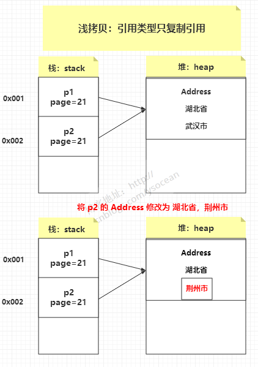
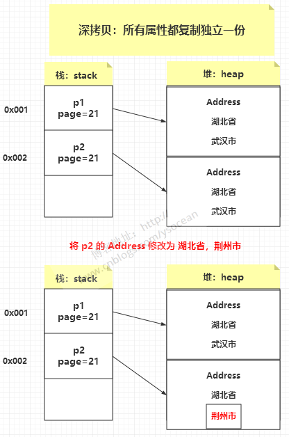

## 浅拷贝：
          浅拷贝只复制对象本身和其基本数据类型字段，对于引用类型的字段，只复制引用而不复制引用的对象。



```java
public class DeepCopy {

    public static void main(String[] args) throws CloneNotSupportedException {
        // 创建一个原始对象
        OriginalObject p1 = new OriginalObject();
        p1.setValue("Year");
        p1.setPerson(new Person("123"));
        
        // 克隆原始对象，进行浅拷贝
        OriginalObject p2 = (OriginalObject) p1.clone();
        
        // 这里可以发现打印出的内存地址不相同，即指向的是栈中的引用地址
        System.out.println("原始对象:" + p1);
        System.out.println("克隆对象:" + p2);
        
        // 修改克隆对象的值
        p2.setValue("New Year");
        p2.getPerson().setValue("456");
        
        // p1没有修改value值，是p2修改的value值。但是这里获取p1的value值发现被修改了
        System.out.println("原始对象String类型的属性值:" + p1.getValue()); // 输出 "Year"
        System.out.println("克隆对象String类型的属性值:" + p2.getValue()); // 输出 "New Year"

        System.out.println("原始对象引用类型的属性值:" + p1.getPerson()); // 输出 "456"
        System.out.println("克隆对象引用类型的属性值:" + p2.getPerson()); // 输出 "456"
    }
}

class OriginalObject implements Cloneable {
    private String value;
    private Person person;

    public String getValue() {
        return value;
    }

    public Person getPerson() {
        return person;
    }

    public void setValue(String value) {
        this.value = value;
    }
    public void setPerson(Person person) {
        this.person = person;
    }

    @Override
    public Object clone() throws CloneNotSupportedException {
        return super.clone();;
    }
}

class Person {
    private String value;

    public void setValue(String value) {
        this.value = value;
    }

    public Person(String value) {
        this.value = value;
    }

    @Override
    public String toString() {
        return "Person{" +
                "value='" + value + '\'' +
                '}';
    }
}
```

## 深拷贝：
          深拷贝会复制对象及其所有引用的对象，创建一个完全独立的副本。



```java
public class DeepCopy {

    public static void main(String[] args) throws CloneNotSupportedException {
        // 创建一个原始对象
        OriginalObject p1 = new OriginalObject();
        p1.setValue("Year");
        p1.setPerson(new Person("123"));
        
        // 克隆原始对象，进行浅拷贝
        OriginalObject p2 = (OriginalObject) p1.clone();
        
        // 这里可以发现打印出的内存地址不相同，即指向的是栈中的引用地址
        System.out.println("原始对象:" + p1);
        System.out.println("克隆对象:" + p2);
        
        // 修改克隆对象的值
        p2.setValue("New Year");
        p2.getPerson().setValue("456");
        
        // p1没有修改value值，是p2修改的value值。但是这里获取p1的value值发现被修改了
        System.out.println("原始对象String类型的属性值:" + p1.getValue()); // 输出 "Year"
        System.out.println("克隆对象String类型的属性值:" + p2.getValue()); // 输出 "New Year"

        System.out.println("原始对象引用类型的属性值:" + p1.getPerson()); // 输出 "123"
        System.out.println("克隆对象引用类型的属性值:" + p2.getPerson()); // 输出 "456"
    }
}

class OriginalObject implements Cloneable {
    private String value;
    private Person person;

    public String getValue() {
        return value;
    }

    public Person getPerson() {
        return person;
    }

    public void setValue(String value) {
        this.value = value;
    }
    public void setPerson(Person person) {
        this.person = person;
    }

    @Override
    public Object clone() throws CloneNotSupportedException {
        // 克隆基本数据类型属性
        OriginalObject clone = (OriginalObject) super.clone();
        // 克隆引用类型属性
        clone.setPerson(this.person.clone());
        return clone;
    }
}

class Person implements Cloneable {
    private String value;

    public void setValue(String value) {
        this.value = value;
    }

    public Person(String value) {
        this.value = value;
    }

    @Override
    public Person clone() throws CloneNotSupportedException {
        return (Person) super.clone();
    }

    @Override
    public String toString() {
        return "Person{" +
                "value='" + value + '\'' +
                '}';
    }
}
```

## String类型在深、浅拷贝中的表现
    String存在于堆内存、常量池；这种比较特殊，本身没有实现Cloneable，传递是引用地址；
    由于本身的final性，每次赋值都是一个新的引用地址，原对象的引用和副本的引用互不影响。
    因此，String就和基本数据类型一样，表现出了"深拷贝"特性。

## 总结
    声明的对象引用是存储在栈内存中的，而实际的对象是存储在堆中的。栈中的对象引用指向堆中的对象。
    浅拷贝就相当于复制了一份原对象引用，且原对象引用和新对象引用都指向的同一个对象。
    深拷贝就相当于既复制了一份原对象，又复制了一份原对象引用，且原对象引用和新对象引用指向的不同的对象。
