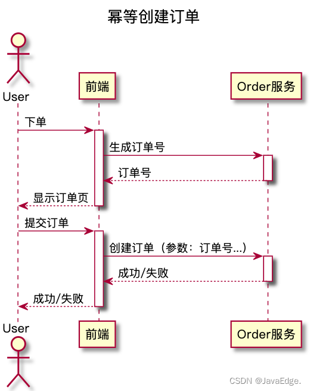
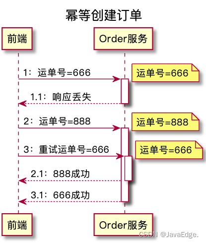

## 一、问题背景
    最简单的：DB 事务。如创建订单时，同时往订单表、订单商品表插数据，这些 Insert 须在同一事务执行。

    Order 服务调用 Pay 服务，刚好网络超时，然后 Order 服务开始重试机制，于是 Pay 服务对同一支付请求，就接收到了两次，
    而且因为轮询负载均衡算法，落在了不同业务节点！所以一个分布式系统接口，须保证幂等性。

## 二、如何避免重复下单
    前端页面也可直接防止用户重复提交表单，但网络错误会导致重传，很多RPC框架、网关都有自动重试机制，所以重复请求在前端侧无法完全避免！
    问题最后还是如何保证服务接口的幂等性。
 
    2.1 如何判断请求是重复的
        插入订单前，先查一下订单表，有无重复订单? 难以用SQL条件定义到底什么是“重复订单”
        订单的用户、商品、价格一样就是重复订单? 万一这用户就是连续下了俩一模一样订单呢？

        所以保证幂等性要做到：
        2.1.1 每个请求须有唯一标识
              比如订单支付请求，得包含订单 id，一个订单 id 最多只能成功支付一次。
  
        2.1.2 每次处理完请求后，须有记录标识该请求已被处理
              在 MySQL 中记录一个状态字段。如支付之前记录一条这个订单的支付流水。
  
        2.1.3 每次接收请求时，判断之前是否处理过
              若有一个订单已支付，就肯定已有一条支付流水。若重复发送这个请求，则此时先插入/支付流水，发现 orderId 已存在，
              唯一约束生效，报错重复 Key。就不会再重复扣款。
  
              在往 DB 插记录时，一般不提供主键，而由 DB 在插入时自动生成。
              重复的请求就会导致插入重复的数据,MySQL 的主键自带唯一性约束，若在一条 INSERT 语句提供主键，且该主键值在表中已存在，
              则该条 INSERT 会执行失败。因此可利用 DB 的“主键唯一约束”，在插数据时带上主键，以此实现创建订单接口的幂等性。
  
  
              给 Order 服务添加一个“orderId 生成”的接口，无参，返回值就是一个【全局唯一】订单号。(分布式ID--UUID、雪花算法、Redis的incr)
              在用户进入创建订单页面时，前端页面先调用该 orderId 生成接口得到一个订单号，在用户提交订单时，在创建订单的请求中携带该订单号。
  
  
              该订单号其实就是订单表的主键，于是，重复请求中带的都是同一订单号。
              订单服务在订单表中插入数据的时候，执行的这些重复 INSERT 语句中的主键，也都是同一个订单号。
              而 DB 唯一约束保证，只有一次 INSERT 执行成功。
  
              实际要结合业务，如使用 Redis，用 orderId 作为唯一K。只有成功插入这个支付流水，才可执行扣款。
  
              要求是支付一个订单，必须插入一条支付流水，order_id 建立一个唯一键。
              你在支付一个订单前，先插入一条支付流水，order_id 就已经传过去了。就能写一个标识到 Redis 中，set order_id payed，
              当重复请求过来时，先查 Redis 的 order_id 对应的 value，若为 payed 说明已支付，就别再重复支付！
  
              然后再重复支付订单时，写尝试插入一条支付流水，DB 会报唯一键冲突，整个事务回滚。
              保存一个是否处理过的标识也可以，服务的不同实例可以一起操作 Redis。

   

    若因重复订单导致插入 t_order 失败，则 Order 服务不要把该错误返给前端页面。
    否则，就可能出现用户点击创建订单按钮后，页面提示创建订单失败，而实际上订单创建成功了。
    正确做法：这种 case，订单服务直接返回订单创建成功。

## 三、解决 ABA

    3.1 什么是 ABA
        如订单支付后，seller 要发货，发货完成后要填个快递单号。
        假设 seller 填个 666，刚填完，发现填错了，赶紧再修改成 888。对订单服务，这就是 2 个更新订单的请求。
        系统异常时 666 请求到了，单号更成 666，接着 888 请求到了，单号又更新成 888，
        但是 666 更新成功的响应丢了，调用方没收到成功响应，自动重试，再次发起 666 请求，单号又被更新成 666了，这数据显然就错了！

   

    3.2 解决方案
        订单主表增加 version 列。每次查询订单时，版本号要随着订单数据返回给页面。
        页面在更新数据的请求中，把这个版本号作为更新请求的参数，带回给订单更新接口。

        订单服务在更新数据的时候，需要比较订单的版本号是否和消息中的一致：
        不一致：拒绝更新数据
        一致：还需再更新数据的同时，将 version + 1。“比较版本号、更新数据和版本号 + 1”的过程须在同一事务执行

        UPDATE orders set tracking_number = 666, version = version + 1 WHERE version = 8;
        在这条 SQL 的 WHERE 条件中，version 值需要页面在更新的时候通过请求传进来。
        通过该版本号，就能保证，从我打开这条订单记录开始，一直到我更新这条订单记录成功，期间没有其他人修改过该订单数据。
        若有，则 DB 中的 version 就会改变，那我的更新操作就会执行失败。我就只能重新查询新版本的订单数据，再尝试更新。

        有了这个版本号，前文的 ABA 即有两个 case：
        把运单号更新为 666 成功，更新为 888 的请求带着旧版本号，就更新失败，页面提示用户更新 888 失败
        666 更新成功后，888 带着新版本号，888 更新成功。
        这时即使重试的 666 请求再来，因为它和上一条 666 请求带相同版本号，上一条请求更新成功后，这个版本号已经变了，所以重试请求的更新必然失败
        无论哪种情况，DB 中的数据与页面上给用户的反馈都是一致的。这就实现了幂等更新且避免 ABA。

   

## 四、总结
    4.1 创建订单服务，可通过预生成订单号，然后利用 DB 的订单号唯一约束，避免重复写入订单，实现创建订单服务的幂等性
    4.2 更新订单服务，通过一个版本号机制，每次更新数据前校验版本号，更新数据同时自增版本号，这样的方式，来解决 ABA 问题，确保更新订单服务的幂等性