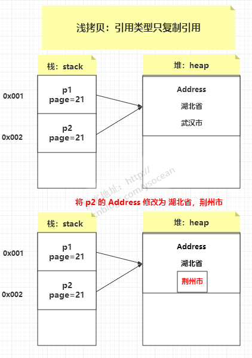
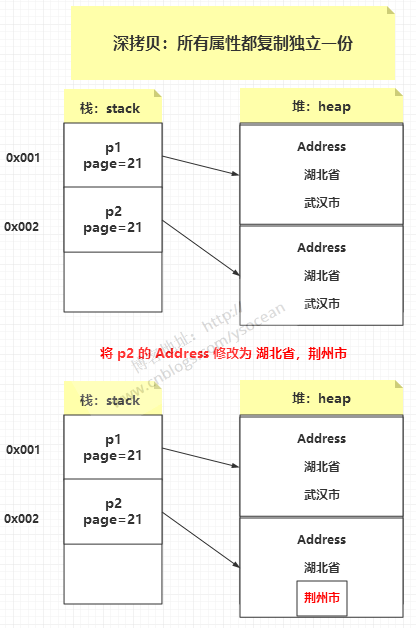

## 浅拷贝：
          创建一个新对象，然后将当前对象的非静态字段复制到该新对象，如果字段是值类型的，那么对该字段执行复制；
          如果该字段是引用类型的话，则复制引用但不复制引用的对象。因此，原始对象及其副本引用同一个对象。



## 深拷贝：
          创建一个新对象，然后将当前对象的非静态字段复制到该新对象，无论该字段是值类型的还是引用类型，都复制独立的一份。
          当你修改其中一个对象的任何内容时，都不会影响另一个对象的内容。



```java
public class DeepCopy {

    public static void main(String[] args) {
        // 创建一个原始对象
        OriginalObject p1 = new OriginalObject();
        originalObject.setValue("Year");
        
        // 克隆原始对象，进行浅拷贝
        Person p2 = (Person) p1.clone();
        
        // 这里可以发现打印出的内存地址不相同，即指向的是栈中的引用地址
        System.out.println("原始对象:" + p1);
        System.out.println("克隆对象:" + p2);
        
        // 修改克隆对象的值
        p2.setValue("New Year");
        
        // p1没有修改value值，是p2修改的value值。但是这里获取p1的value值发现被修改了
        System.out.println("原始对象的属性值:" + p1.getValue()); // 输出 "New Year"
    }
}

class OriginalObject {
    private String value;

    public String getValue() {
        return value;
    }

    public void setValue(String value) {
        this.value = value;
    }
}
```