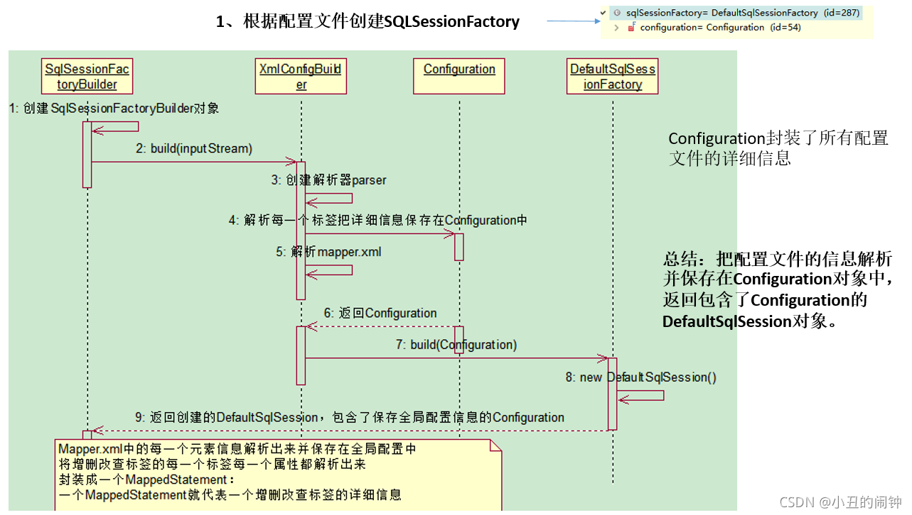
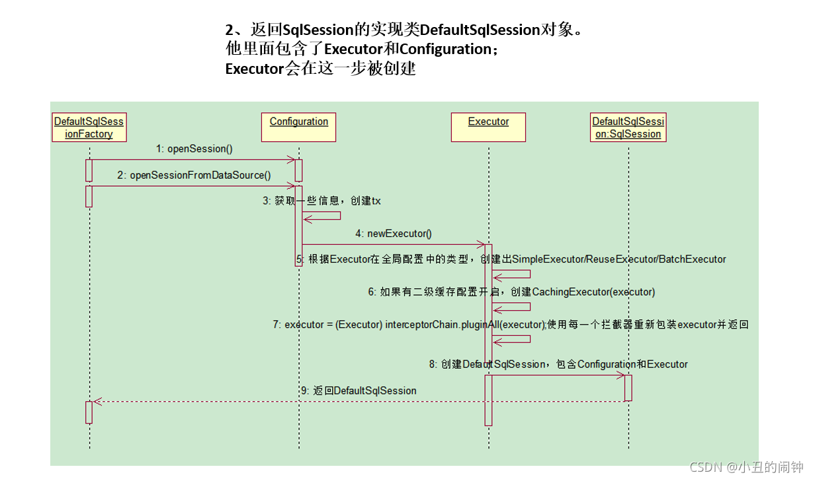
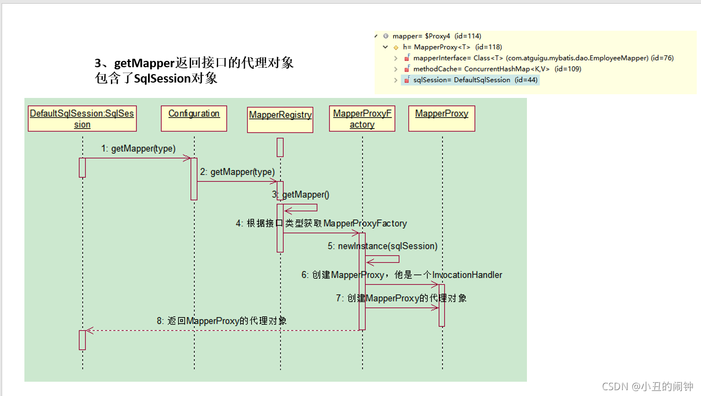
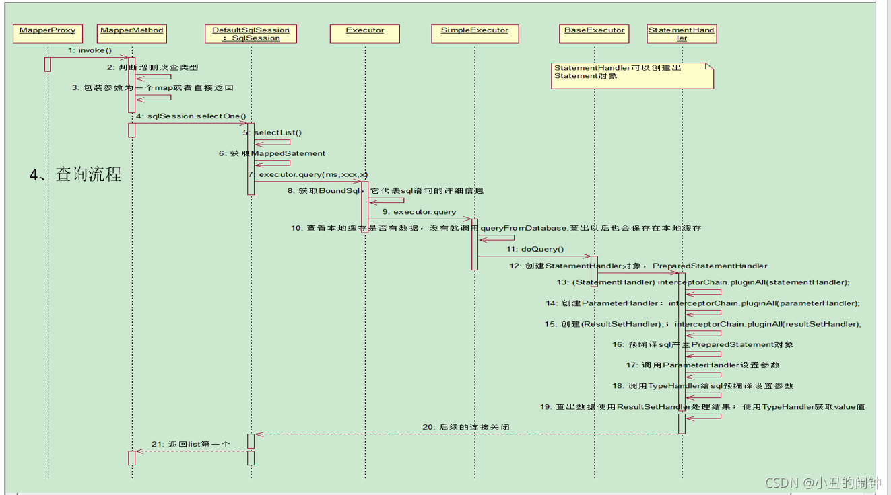

## mybatis重要组件和运行流程图
    Configuration 
           MyBatis所有的配置信息都保存在Configuration对象之中，配置文件中的大部分配置都会存储到该类中
    SqlSession 
           作为MyBatis工作的主要顶层API，表示和数据库交互时的会话，完成必要数据库增删改查功能
    Executor 
           MyBatis执行器，是MyBatis 调度的核心，负责SQL语句的生成和查询缓存的维护
    StatementHandler 
           封装了JDBC Statement操作，负责对JDBC statement 的操作，如设置参数等
    ParameterHandler 
           负责对用户传递的参数转换成JDBC Statement 所对应的数据类型
    ResultSetHandler 
           负责将JDBC返回的ResultSet结果集对象转换成List类型的集合
    TypeHandler 
           负责java数据类型和jdbc数据类型(也可以说是数据表列类型)之间的映射和转换
    MappedStatement 
           MappedStatement维护一条 <select|update|delete|insert> 节点的封装
    SqlSource 
           负责根据用户传递的parameterObject，动态地生成SQL语句，将信息封装到BoundSql对象中，并返回
    BoundSql 
           表示动态生成的SQL语句以及相应的参数信息

## 工作流程总结
    1、获取sqlSessionFactory对象：  new SqlSessionFactoryBuilder().build(in); 

       1）这里的build()方法中会创建一个 XMLConfigBuilder 对象，这个对象的作用就是解析主配置文件用的。
          先说明一下，我们可以看出主配置mybatis.xml文件的最外层节点是<configuration>标签，
          mybatis的初始化会把<configuration>标签以及他的所有子标签进行解析，
          例如：<settings>、<environments>[数据库连接信息]、<mappers>... ，最后把解析好的数据封装在Configuration类中。

       2）将Configuration中得到的mappers循环解析，因为一个mappers节点下面可能会有很多mapper节点。
          在应用中肯定也不止一个mapper.xml，所以遍历每一个mapper节点就相当于遍历每一个mapper.xml。

       3）循环下面是一个if..else判断。它先判断mappers下面的子节点是不是package节点。
          因为在实际开发中我们便于管理，可能会直接写XML的包名 <package name="com.example"/>，这是多文件映射。
          如果不是package节点那肯定就是mapper节点做单文件映射。

       4）然后创建一个 XMLMapperBuilder 对象，作用就是一个mapper的xml文件解析器。先解析namespace、resultMap等等
          再循环解析每一个sql节点，比如select insert update delete ，每一个sql是一个节点。
          并把所有数据通过addMappedStatement这个方法封装在MappedStatement这个对象中。
          这个对象中封装了一条sql所在标签的所有内容，比如这个sql标签的id ，sql语句，入参，出参，等等。
          我们要牢记一个sql的标签对应一个MappedStatement对象。

       5）把解析出来的MapperStatement装到Configuration维护的Map集合中。
          key值是这个sql标签的id值，value值就是我们解析出来的MapperStatement对象。
          其实我们解析xml的目的，就是把每个xml中的每个增删改查的sql标签解析成一个个MapperStatement，
          并把解析出来的这些对象装到Configuration的Map中备用。

       6）返回包含Configuration的DefaultSqlSession；

       注意：【MappedStatement】：代表一个sql节点(<select> <insert> <update> <delete>)的详细信息。
   
    
    2、获取sqlSession对象
       返回一个DefaultSQlSession对象，包含Executor和Configuration;
       这一步会创建Executor对象；
   

    3、获取接口的代理对象（MapperProxy）
       getMapper，使用MapperProxyFactory创建一个MapperProxy的代理对象
       代理对象里面包含了，DefaultSqlSession（Executor）
   

    4、执行增删改查方法
   
    
## 总结
    1、根据配置文件（全局，sql映射）初始化出Configuration对象
    2、创建一个DefaultSqlSession对象，
       他里面包含Configuration以及Executor（根据全局配置文件中的defaultExecutorType创建出对应的Executor）
    3、DefaultSqlSession.getMapper()：拿到Mapper接口对应的MapperProxy；
    4、MapperProxy里面有（DefaultSqlSession）；
    5、执行增删改查方法：
       1）、调用DefaultSqlSession的增删改查（Executor）；
       2）、会创建一个 StatementHandler 对象。同时也会创建出 ParameterHandler 和 ResultSetHandler
       3）、调用 StatementHandler 预编译参数以及设置参数值，使用 ParameterHandler 来给sql设置参数
       4）、调用 StatementHandler 的增删改查方法；
       5）、ResultSetHandler 封装结果
    注意：
    四大对象每个创建的时候都有一个interceptorChain.pluginAll(parameterHandler);