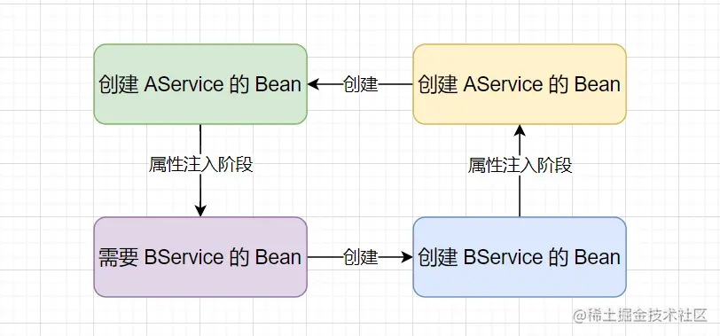
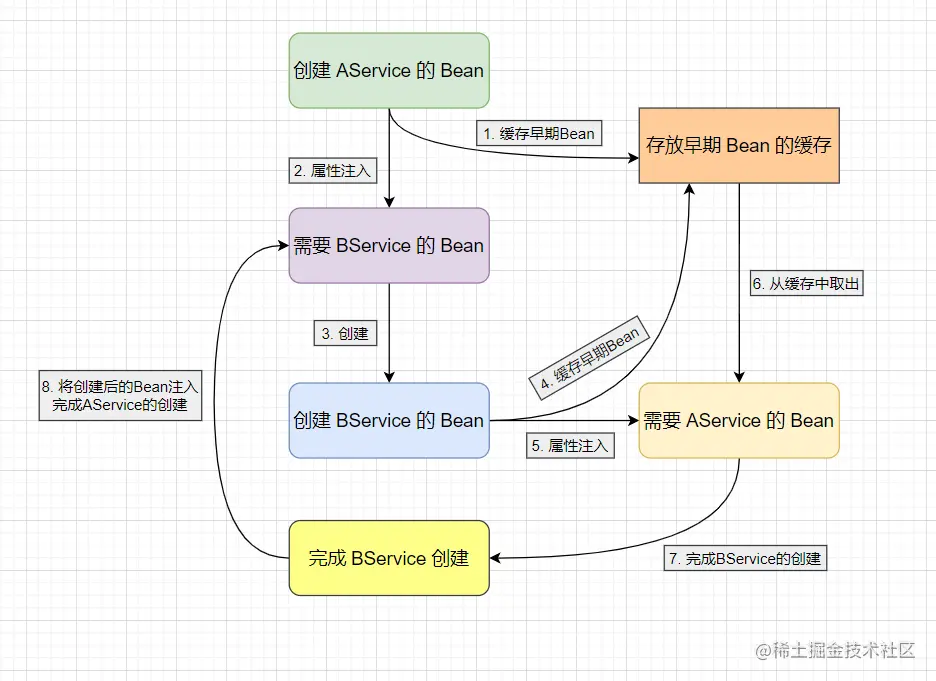
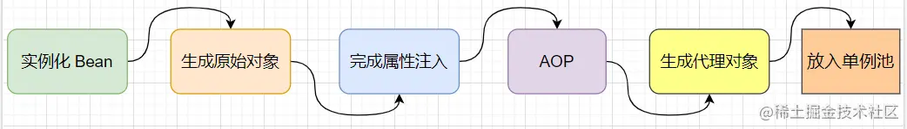
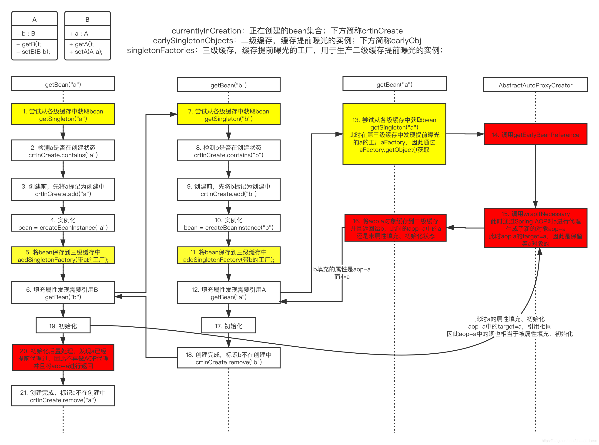

## 一、Spring中单例bean的创建流程：

      1、bean实例化（使用构造器、或者instanceSupplier、或者@Bean方法）
      2、属性赋值（set方法，不同于类实例化中的属性直接赋值）
      3、依赖注入（IOC：set注入或者构造注入）
      4、初始化：
            1>、调用BeanPostProcessor的前置处理方法
            2>、调用init初始化方法：init-method
            3>、调用BeanPostProcessor的后置处理方法（AOP在这里实现）
            4>、获得一个完整的对象，并将对象放入map容器中（通过Context.getBean()可以获取到Bean对象并使用）

## 二、Spring Bean是如何产生循环依赖？

      AService 和 BService 的依赖关系，
      当 AService 创建Bean时，会先对 AService 进行实例化生成一个原始对象，
      然后在进行属性注入时发现了需要 BService 对应的 Bean，此时就会去为 BService 进行创建Bean，
      在 BService 实例化后生成一个原始对象后进行属性注入，此时会发现也需要 AService 对应的 Bean。
      这样就会造成 AService 和 BService 的 Bean 都无法创建，就会产生 循环依赖 问题。



## 三、Spring的一二三级缓存是什么？

   ```
   注意：这里的 创建Bean实例流程 与 类的实例化流程 是有区别的。
   
   /** 第一级缓存，存放可用的成品Bean。缓存的是已经实例化、属性注入、初始化后的 Bean 对象。 */
   private final Map<String, Object> singletonObjects = new ConcurrentHashMap<>(256);

   /** 第二级缓存，存放半成品的Bean。缓存的是实例化后，但未属性注入、初始化的 Bean对象（用于提前暴露 Bean）*/
   private final Map<String, Object> earlySingletonObjects = new ConcurrentHashMap<>(16);

   /** 第三级缓存，存的是Bean工厂对象。缓存的是一个ObjectFactory，主要作用是生成原始对象进行AOP操作后的代理对象(这一级缓存主要用于解决AOP问题)*/
   private final Map<String, ObjectFactory<?>> singletonFactories = new HashMap<>(16);
   ```

## 四、Spring 是如何解决Bean的循环依赖问题？

      上述中可以看到 AService 和 BService 的循环依赖问题是因为 
      AService的创建 需要 BService的注入，
      BService的注入 需要 BService的创建，
      BService的创建 需要 AService的注入，
      AService的注入 需要 AService的创建，从而形成的环形调用。
      想要打破这一环形，只需要增加一个 缓存 来存放 代理对象 即可。

      在创建 AService 的Bean对象时，实例化后将 AService代理对象 存放到缓存中(提早暴露)，然后依赖注入时发现需要 BService，
      然后去创建 BService，实例化后同样将 BService代理对象 存放到缓存中，然后依赖注入时发现需要 AService 便会从缓存中取出并注入，
      这样 BService 就完成了创建，随后 AService 也就能完成属性注入，最后也完成创建。这样就打破了环形调用，避免循环依赖问题。



## 五、Spring 中不能解决 Bean 的循环依赖场景

     单例(Sigleton)作用域下的 构造器注入 出现的循环依赖
        原因：因为 构造器注入 发生在 实例化阶段，而 Spring 解决循环依赖问题依靠的 三级缓存 在 属性注入阶段，
             也就是说调用构造函数时还未能放入三级缓存中，所以无法解决 构造器注入 的循环依赖问题。
        解决：在需要循环注入的属性上添加@Lazy。例如：public A(@Lazy B b) {...}

     原型(Property)作用域下的属性注入出现的循环依赖问题
        原因：因为 Spring 不会缓存 原型作用域的 Bean，而 Spring 依靠 缓存 来解决循环依赖问题，
             所以 Spring 无法解决 原型作用域的 Bean。
        解决：在需要循环注入的属性上添加@Lazy

     @Async增强的Bean的循环依赖
        疑问：Aop代理bean被循环依赖的场景是没有问题的，而@Async标记的类也是Aop代理，怎么就不行了呢？
        原因：正常的Aop代理对象都会提前生成放入二级缓存当中，提供循环依赖的对象用于属性注入。
             但@Async标注的类不会提前生成代理对象

## 六、Spring 如何解决Bean的AOP循环依赖问题？

      问题：
          通过上面的分析可以发现只需要一个存放 代理对象 的缓存就可以解决循环依赖问题。
          也就是说只要二级缓存（earlySingletonObjects）就够了，
          那么为什么 Spring 还设置了三级缓存（singletonFactories）呢？

      假如没有三级缓存分析：
          假设 A 与 B 之间出现循环依赖，C 是 A 的切面编程类。
          那么，正常情况我们还是创建好 A实例化但未属性注入、未初始化的Bean（半成品bean对象a1）
          然后 A 进行属性赋值时发现需要注入 B。于是创建 B实例，并且属性注入A，继而把 半成品bean对象a1 注入到 B 中
          完成A的初始化之后，Spring识别到 C 是 A 的Aop切面类(增强功能类)，基于动态代理实现(JDK和Cglib两种方式)，
          会在 A 属性注入后创建一个A代理对象（代理对象a2），并且把这个 代理对象a2 放入单例池（一级缓存）中，替代原本的目标对象A实例。
          也就是说此时，B 中注入的对象是 半成品bean对象a1，而 A 最终创建的完成后在单例池中是 代理对象a2，
          这样就会导致 B依赖的A 和 容器中能获取到的A 不是同一个对象。造成 B 中执行 A 的方法并不会被切面。

          Tips：出现这个问题主要 AOP 是在 bean属性注入阶段之后、初始化之前才执行的，属性注入后会将代理对象放入一级缓存，
                所以会导致注入的对象有可能和最终的对象不一致。

          问题：为什么使用 Aop 切面操作后，就得使用代理对象来取代原始对象？
          解答：因为动态代理可以在目标类源代码不改变的情况下，增加功能，无需影响业务逻辑代码，实现解耦



    Spring解决带有AOP的循环依赖分析：
        1️⃣、假如 A 和 B 循环依赖，A 和 C 也循环依赖，所以当创建 A 的bean的时候，为避免 B和C 拿到不同的代理对象，
            因此我们需要第二个缓存来存储 B和C 拿到的 A半成品Bean对象，当 C 去拿 A半成品Bean对象 的时候，就可以直接从第二个缓存中拿取了。

        2️⃣、为了实现只有出现循环依赖的时候才实时地创建代理对象这个过程，Spring又引入了第三个缓存，
            第三个缓存的作用是当创建 A实例 的时候，就把自己放入第三个缓存，
            当 B 需要注入 A 的时候就会先去第一级缓存拿，没有就去第二级缓存拿，二级没有的话，就去第三级缓存看看，
            当在第三级缓存发现有 A 的时候，说明此时 A 正在创建中，且未被其他bean引用，此时 B 相当于从三级缓存中拿到了 A半成品Bean对象。
       
        3️⃣、此时 B 为了能从三级缓存中拿到 A半成品Bean对象，就会触发三级缓存的 getEarlyBeanReference() 方法。
            在这个方法中判断当前的 A 是否有Aop切面操作。如果有Aop切面则生成新的代理对象放入二级缓存，否则将 A半成品Bean对象 放入二级缓存。
            因此，B 获取的是二级缓存中的Bean【可能是 A半成品Bean对象，也可能是新的代理对象】，正常实例化 B 之后，注入到 A 当中。

        4️⃣、在 A 属性注入完成之后，按照流程开始进行Aop操作（创建A的代理对象）。但是在这一步执行前会先进行判断：
            是否已经在三级缓存中执行过Aop操作创建了新的代理对象？如果创建了，则无需再执行Aop操作；否则会执行。
            由此，待整个Bean完成创建后会将对象【可能是 A半成品Bean对象，也可能是新的代理对象】从二级缓存中取出放入一级缓存（单例池）

        5️⃣、Spring 利用 三级缓存 巧妙地将出现 循环依赖 时的 AOP切面 操作，提前到了 属性注入 之前，
            这样就不会导致后面生成的代理对象与属性注入时的对象的不一致，从而解决了带有AOP的循环依赖。


