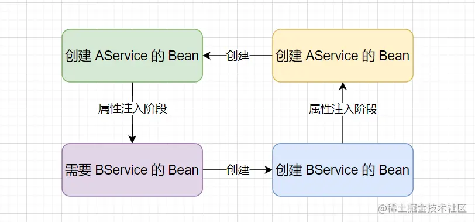
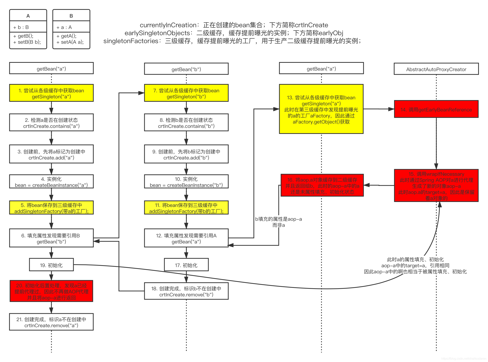

## 一、Spring Bean产生循环依赖
      AService 和 BService 的依赖关系，
      当 AService 创建时，会先对 AService 进行实例化生成一个原始对象，
      然后在进行属性注入时发现了需要 BService 对应的 Bean，此时就会去为 BService 进行创建，
      在 BService 实例化后生成一个原始对象后进行属性注入，此时会发现也需要 AService 对应的 Bean。
      这样就会造成 AService 和 BService 的 Bean 都无法创建，就会产生 循环依赖 问题。
   

## 二、三级缓存是什么？
   ```
   /** Cache of singleton objects: bean name to bean instance. */
   private final Map<String, Object> singletonObjects = new ConcurrentHashMap<>(256);
   
   /** Cache of singleton factories: bean name to ObjectFactory. */
   private final Map<String, ObjectFactory<?>> singletonFactories = new HashMap<>(16);
   
   /** Cache of early singleton objects: bean name to bean instance. */
   private final Map<String, Object> earlySingletonObjects = new HashMap<>(16);
   ```

    三级缓存分为：
    
    一级缓存（singletonObjects）：缓存的是已经实例化、属性注入、初始化后的 Bean 对象。
    二级缓存（earlySingletonObjects）：缓存的是实例化后，但未属性注入、初始化的 Bean对象（用于提前暴露 Bean）。
    三级缓存（singletonFactories）：缓存的是一个ObjectFactory，主要作用是生成原始对象进行AOP操作后的代理对象(这一级缓存主要用于解决AOP问题)

## 三、Spring 是如何解决循环依赖问题？
      上述中可以看到 AService 和 BService 的循环依赖问题是因为 
      AService的创建 需要 BService的注入，
      BService的注入 需要 BService的创建，
      BService的创建 需要 AService的注入，
      AService的注入 需要 AService的创建，从而形成的环形调用。
      想要打破这一环形，只需要增加一个 缓存 来存放 原始对象 即可。

      在创建 AService 时，实例化后将 原始对象 存放到缓存中（提早暴露），然后依赖注入时发现需要 BService，
      然后去创建 BService，实例化后同样将 原始对象 存放到缓存中，然后依赖注入时发现需要 AService 便会从缓存中取出并注入，
      这样 BService 就完成了创建，随后 AService 也就能完成属性注入，最后也完成创建。这样就打破了环形调用，避免循环依赖问题。
   

## 四、Spring 如何解决AOP循环依赖问题？
      通过上面的分析可以发现只需要一个存放 原始对象 的缓存就可以解决循环依赖问题。
      也就是说只要二级缓存（earlySingletonObjects）就够了，那么为什么 Spring 还设置了三级缓存（singletonFactories）呢？
      其实 第三级缓存（singletonFactories） 是为了处理 Spring 的 AOP的。

      ** 首先分析Spring中出现的AOP循环依赖问题：
         A 与 B 出现循环依赖，C是A的切面编程类

      1️⃣、假如 A 和 B 循环依赖，A 和 C也循环依赖，所以当创建A的bean的时候，为避免B和C 拿到不同的代理对象，
          因此我们需要第二个缓存来存储B和C拿到的A代理对象，当C去A代理对象的时候，就可以直接从第二个缓存中拿取了。
      2️⃣、为了实现只有出现循环依赖的时候才实时地创建代理对象这个过程，Spring 又引入了第三个缓存，
          第三个缓存的作用是当A在实例化的时候，就把自己放入第三个缓存，
          当B需要注入A的时候就会先去第一级缓存拿，没有就去第二级缓存拿，二级没有的话，就去第三级缓存看看，
          当在第三级缓存发现有A的时候，说明此时A正在创建中，且未被其他bean引用，
          此时B相当于从三级缓存中拿到了A的代理对象。
      3️⃣、B为了后面的C和自己拿到的是同一个A的代理对象，他就需要把这个A代理对象放入第二级缓存。
          同时移除第三级缓存的A，表示A已经提前创建好了代理对象，不需要再从三级缓存里面获取新代理对象了。
      4️⃣、接下来，B的创建好后，A继续注入C，C直接从第二级拿到已经创建好了的A的代理对象。这样就解决了带有AOP的循环依赖。

   