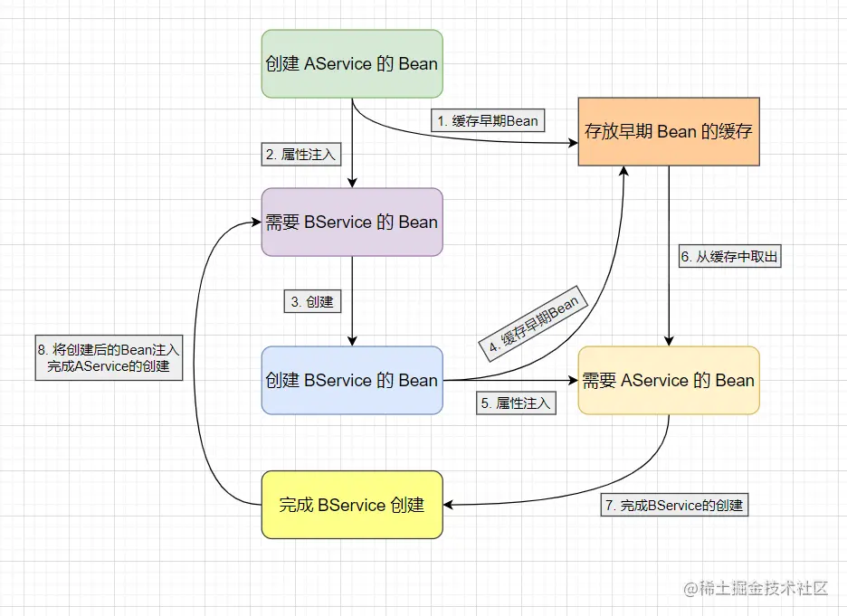

## 一、Spring中单例bean的创建流程：
      1、bean实例化（使用构造器、或者instanceSupplier、或者@Bean方法）
      2、属性赋值（set方法，不同于类实例化中的属性直接赋值）
      3、依赖注入（IOC：set注入或者构造注入）
      4、初始化：
            1>、调用BeanPostProcessor的前置处理方法
            2>、调用init初始化方法：init-method
            3>、调用BeanPostProcessor的后置处理方法（AOP在这里实现）
            4>、获得一个完整的对象，并将对象放入map容器中（通过Context.getBean()可以获取到Bean对象并使用）

## 二、Spring Bean是如何产生循环依赖？
      AService 和 BService 的依赖关系，
      当 AService 创建Bean时，会先对 AService 进行实例化生成一个原始对象，
      然后在进行属性注入时发现了需要 BService 对应的 Bean，此时就会去为 BService 进行创建Bean，
      在 BService 实例化后生成一个原始对象后进行属性注入，此时会发现也需要 AService 对应的 Bean。
      这样就会造成 AService 和 BService 的 Bean 都无法创建，就会产生 循环依赖 问题。

   

## 三、Spring的一二三级缓存是什么？
   ```
   注意：这里的Bean流程与类的实例化流程是有区别的。
   /** 第一级缓存，存放可用的成品Bean。缓存的是已经实例化、属性注入、初始化后的 Bean 对象。 */
   private final Map<String, Object> singletonObjects = new ConcurrentHashMap<>(256);

   /** 第二级缓存，存放半成品的Bean。缓存的是实例化后，但未属性注入、初始化的 Bean对象（用于提前暴露 Bean）*/
   private final Map<String, Object> earlySingletonObjects = new ConcurrentHashMap<>(16);

   /** 第三级缓存，存的是Bean工厂对象。缓存的是一个ObjectFactory，主要作用是生成原始对象进行AOP操作后的代理对象(这一级缓存主要用于解决AOP问题)*/
   private final Map<String, ObjectFactory<?>> singletonFactories = new HashMap<>(16);
   ```

## 四、Spring 是如何解决Bean的循环依赖问题？
      上述中可以看到 AService 和 BService 的循环依赖问题是因为 
      AService的创建 需要 BService的注入，
      BService的注入 需要 BService的创建，
      BService的创建 需要 AService的注入，
      AService的注入 需要 AService的创建，从而形成的环形调用。
      想要打破这一环形，只需要增加一个 缓存 来存放 代理对象 即可。

      在创建 AService 的Bean对象时，实例化后将 AService代理对象 存放到缓存中(提早暴露)，然后依赖注入时发现需要 BService，
      然后去创建 BService，实例化后同样将 BService代理对象 存放到缓存中，然后依赖注入时发现需要 AService 便会从缓存中取出并注入，
      这样 BService 就完成了创建，随后 AService 也就能完成属性注入，最后也完成创建。这样就打破了环形调用，避免循环依赖问题。
   
   

## 五、Spring 如何解决Bean的AOP循环依赖问题？
      问题：
          通过上面的分析可以发现只需要一个存放 代理对象 的缓存就可以解决循环依赖问题。
          也就是说只要二级缓存（earlySingletonObjects）就够了，
          那么为什么 Spring 还设置了三级缓存（singletonFactories）呢？

      分析：
          假设 A 与 B 之间出现循环依赖，C 是 A 的切面编程类。
          那么，正常情况我们还是创建好 A实例化但未属性注入、未初始化的Bean（代理对象a1）
          然后，因为C是A的Aop切面类，基于动态代理实现(JDK和Cglib两种方式)，因此动态代理会创建一个新的A对象（代理对象a2）
          并且把这个 代理对象a2 放入单例池（一级缓存）中。
          也就是说此时，B 中注入的对象是 代理对象a1，而 A 最终创建的完成后是 代理对象a2，
          这样就会导致 B依赖的A 和 最终的A 不是同一个对象。

          Tips：出现这个问题主要 AOP 是通过 BeanPostProcessor 实现的，
                而 BeanPostProcessor 是在 属性注入阶段后 才执行的，属性注入后会将代理对象放入一级缓存，
                所以会导致注入的对象有可能和最终的对象不一致。

      1️⃣、假如 A 和 B 循环依赖，A 和 C也循环依赖，所以当创建A的bean的时候，为避免B和C 拿到不同的代理对象，
          因此我们需要第二个缓存来存储B和C拿到的A代理对象，当C去拿A代理对象的时候，就可以直接从第二个缓存中拿取了。
      2️⃣、为了实现只有出现循环依赖的时候才实时地创建代理对象这个过程，Spring 又引入了第三个缓存，
          第三个缓存的作用是当A在实例化的时候，就把自己放入第三个缓存，
          当B需要注入A的时候就会先去第一级缓存拿，没有就去第二级缓存拿，二级没有的话，就去第三级缓存看看，
          当在第三级缓存发现有A的时候，说明此时A正在创建中，且未被其他bean引用，
          此时B相当于从三级缓存中拿到了A的代理对象。
      3️⃣、B为了后面的C和自己拿到的是同一个A的代理对象，他就需要把这个A代理对象放入第二级缓存。
          同时移除第三级缓存的A，表示A已经提前创建好了代理对象，不需要再从三级缓存里面获取新代理对象了。
      4️⃣、接下来，B的创建好后，A继续注入C，C直接从第二级拿到已经创建好了的A的代理对象。这样就解决了带有AOP的循环依赖。

   