## Elasticsearch是一个分布式的搜索引擎

   &emsp;&emsp;&emsp;&emsp;ElasticSearch的服务IP是：https://localhost:9200

   &emsp;&emsp;&emsp;&emsp;为了更好的在浏览器上直观的显示搜索命令可以使用kibana

   &emsp;&emsp;&emsp;&emsp;kibana的服务IP是：http://localhost:5601

   &emsp;&emsp;&emsp;&emsp;Windows系统下不需要安装ElasticSearch和kibana，只需要在bin目录下运行后缀为elasticsearch.bat或kibana.bat的文件

***

- **基本elasticsearch7.7以上版本都可以设置安全验证登录使用。第一次下载安装，命令行会给你 密码 和 token令牌。需要注意的是只有在第一次启动的时候才会显示出来**
    - 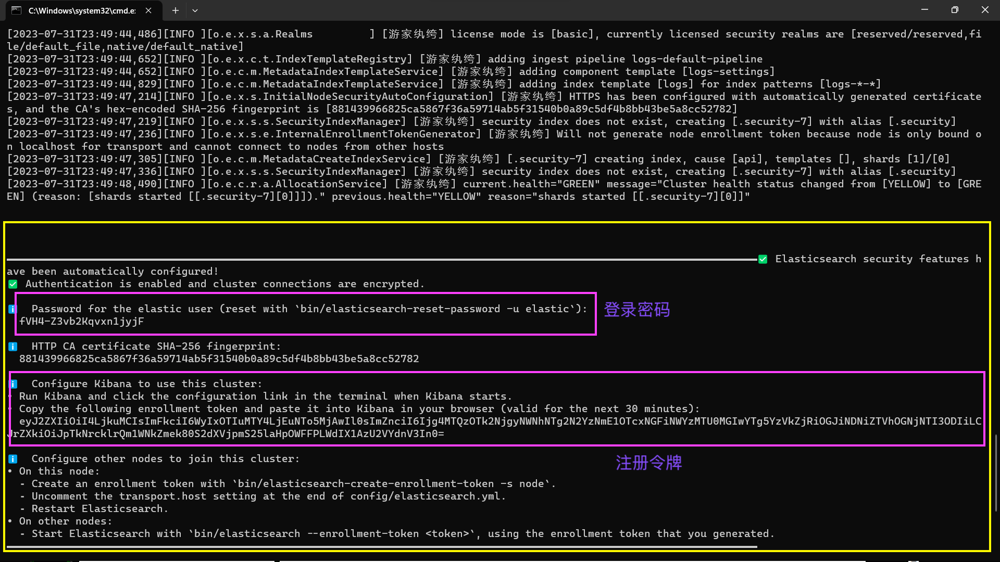

    &emsp;&emsp;&emsp;&emsp;**进入 https://localhost:9200 地址会弹出用户名和密码登录界面：**

    &emsp;&emsp;&emsp;&emsp;&emsp;&emsp;&emsp;&emsp;用户名 ==> elastic(固定的)    密码 ==> fVH4-Z3vb2Kqvxn1jyjF

    &emsp;&emsp;&emsp;&emsp;**进入 http://localhost:5601 地址会弹出注册令牌的界面:**
      `eyJ2ZXIiOiI4LjkuMCIsImFkciI6WyIxOTIuMTY4LjEuNTo5MjAwIl0sImZnciI6Ijg4MTQzOTk2NjgyNWNhNTg2N2YzNmE10TcxNGFiNWYzMTU0MGIwYTg5YzVkZjRiOGJiNDNiZTVhOGNjNTI30DIiLCrZXkiOiJpTkNrcklrQm1WNkZmek80S2dXVjpmS25laHpOWFFPLWdIX1AzU2VYdnV3In0=`

***

- **通常在我们自己个人使用需要在config包下的elasticsearch.yml中关闭安全连接SSL: false; 当然如果公司需要我们也可以去开启这个安全设置**
  - 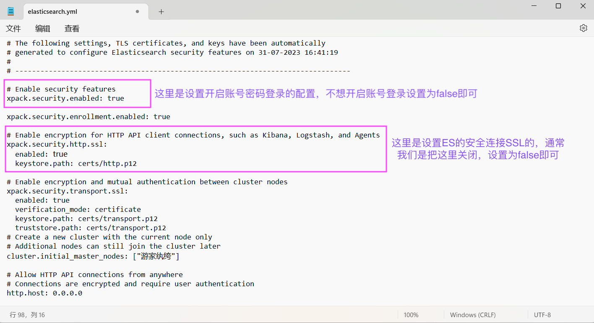
 
***

- **如果我们不想使用自动生成的密码，我们还可以自己修改成固定的密码**
  
  - 在ES的bin目录下输入：`elasticsearch-reset-password --username elastic -i`
  - 按照提示输入y确定要继续更新密码，然后输入两次密码即可，这里可以输的密码好记一点
  - 设置好后我们去访问一下端口为9200的请求
    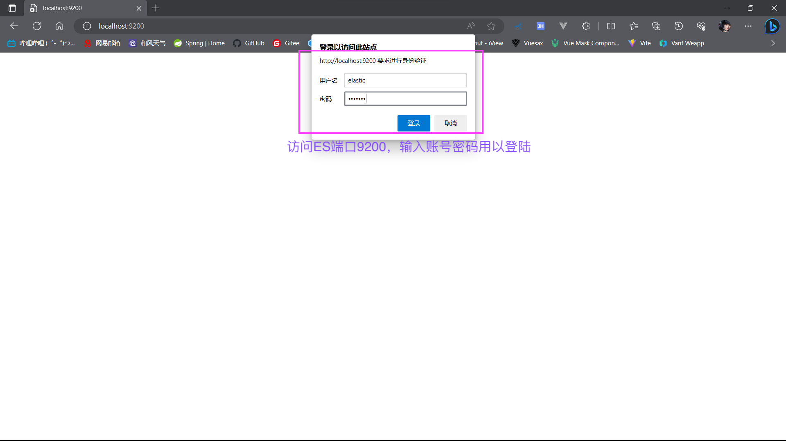


***

- **ElasticSearch-head 可视化工具(长时间没有更新版本，已弃用)**
  - 1、在GitHub上下载好插件并且cd到该目录下----引入依赖：cnpm install  
  - 2、在该目录下启动插件：npm run start
  - 3、对elasticsearch.yml文件进行配置，添加一下配置到文件的最后  
    - 关闭elasticsearch的机器学习  
      &emsp;&emsp;&emsp;&emsp;xpack.ml.enabled: false
    - 开启跨域支持  
      &emsp;&emsp;&emsp;&emsp;http.cors.enabled: true
    - 允许所有人跨域访问  
      &emsp;&emsp;&emsp;&emsp;http.cors.allow-origin: "*"

- **推荐使用Edge浏览器的扩展：es-client 来实现对ElasticSearch的可视化操作**
***

## 一、Elasticsearch也是基于Lucene的全文检索库，本质也是存储数据，很多的概念与MySQL类似
    1. 对比关系
       索引集(indices)-------Databases数据库
       
             类型(type)-----------------表
             (从6.0.0开始单个索引中只能有一个类型，7.0.0以后将不建议使用，8.0.0 以后完全不支持,现在统一用'_doc')
       
                   文档(Document)----------Row行(类比字段类型,是否主键等)
           
                         字段(Field)----------low列(类比字段)
    
    2. 每个Elasticsearch索引都有自己的 分片(number_of_shards) 和 副本(number_of_replicas)
       分片：数据拆分后的各个部分（比如"我是中国人"，进行分词后就会有"我","是","中国人","中国","国人"，那么就会有五个分片）
       副本：每个分片的复制（就是"我","是","中国人","中国","国人"的备份，避免主分片出现异常错误，可以在副本中检索）
    
    3. Elasticsearch 集群有多个节点组成，形成分布式集群。那么，什么是节点呢？
       节点（Node），就是一个 Elasticsearch 应用实例。大家都知道 Elasticsearch 源代码是 Java 写的，那么节点就是一个 Java 进程。
       所以类似 Spring 应用一样，一台服务器或者本机可以运行多个节点，只要对应的端口不同即可。
       但生产服务器中，一般一台服务器运行一个 Elasticsearch 节点。（通俗讲就是启动一个elasticsearch就有一个节点）
    
    4. 要注意的是：Elasticsearch本身就是分布式的，因此即便你只有一个节点，Elasticsearch默认也会对你的数据进行主分片和副本分片操作，当你向集群添加新数据时，数据也会在新加入的节点中进行平衡。**
       比如：节点indexA索引的主分片为5，副本为1(复制一份主分片)，则表示一共有10块分片。
            这个时候再启动一个节点indexB，那么10块分片会均匀分布。(例如：indexA节点主分片有3块分片，副本分片4块，indexB节点3块分片)
    
    5. 索引状态
       Green 主分片与副本分片都正常
       Yellow 主分片正常，副本分片不正常
       Red 有主分片不正常，可能某个分片容量超过了磁盘大小等
    
    6. 为了能将搜索细化到底，可以使用ik分词器，可以下载解压后放入Elasticsearch包下的plugins包内，并重启Elasticsearch
        ```
          POST _analyze               
          {  
          "analyzer": "ik_max_word",  
          "text": "我是中国人"  
          }  
          analyzer: "ik_max_word"  最细的分法  
          analyzer: "ik_smart"     稍粗略的分法
        ```  
   - 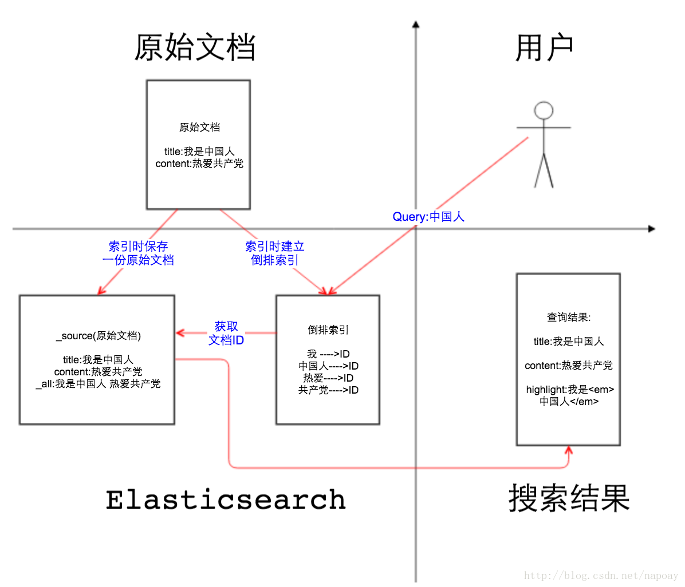

## 二、CURL语法

### 1. **创建索引（PUT）**
 - ```
   PUT /索引       # 索引名类比于MySQL的数据库
   {
     "settings": {   # 设置
       "index": {    # 索引
         "number_of_shards": "8",    # 主分片8块
         "number_of_replicas": "1"   # 副本1个，副本分片8块
       }
     },
       mapping映射。用来定义一个文档以及其所包含的字段如何被存储和索引，可以在映射中事先定义字段的数据类型、字段的权重、分词器等属性，
       就如同在关系型数据库中创建数据表时会设置字段的类型。
     "mappings":{
       "properties": {   # 属性
         "title":{       # 标题
           "type": "text",    # 可分词的类型
           "analyzer": "ik_max_word"   # 最细的分法
         },
         "images":{         # 图片，是一个url地址
           "type": "keyword",  # 不需要分词，所以可以加一个keyword类型
           "index": false    # 也没必要加上搜索
         },
         "price":{           # 价格
           "type": "float"   # float类型
         },
         "name": {
           "type": "text",
           "fields": {
             "kyName" : {
               "type": "keyword"
             }
           }
         }
       }
     }
   }
   
   type: text(可分词)、keyword(不可分词)、long、integer、short、double、float、date、boolean、binary......
   fields: 实现一个字段多种数据类型，例如上述name是全文检索可以进行分词的，但是我们也可以对其进行排序或者聚合等，
           很奇怪：正常的不是说es中进行过滤、排序、聚合的字段,不能被分词嘛，怎么name又可以进行排序或者聚合等呢？
           因为其中kyName可以理解为附加名，不设置的话默认是keyword。我们通过name.kyName作为排序条件：
           GET /ysc/_search
           {
             "query": {
               "match_all": {}
             },
             "sort": [
               {
                 "name.kyName": {
                   "order": "asc"
                 }
               }
             ]
           }
   index: true表示字段会被索引，默认是true。false表示字段不会被索引
   store: Elasticsearch在创建文档索引时，会将文档中的原始数据备份，保存在一个叫做_source的属性中。
          而我们可以通过过滤_source来选择哪些要显示，那些不显示。
   如果存的是对象，比如：
          {girl:{name:"rose",age:21}}
          会处理成两个字段：girl.name和girl.age
   ```
### 2. **查看映射关系（_mapping）**
 
   - `GET /索引名/_mapping`

### 3. **新增(更新)数据（POST）其实使用PUT也有一样的效果，学了就能理解**
  - ```
    POST /索引库名/_doc      # id会随机赋值进行新增
    {
      "title": "小米手机",
      "images": "http://localhost:8080/img/2.jpg",
      "price": 2699.00
    }

    POST /索引库名/_doc/自定义id值     # 根据id进行新增
    {
        "title":"超米手机",
        "images":"http://image.leyou.com/12479122.jpg",
        "price":3699.00
    }
    ```
### 4. **更新数据（PUT）**
 - ```
   PUT /索引库/_doc/id值    # 根据文档id更新
   {
     "title": "巨无霸手机",
     "images": "http://localhost:8080/img/2.jpg",
     "price": 2699.00
   }
   ```

### 5. **删除索引（DELETE）**
   - `DELETE /索引库名/_doc/id值 # 根据id删除`


### 6. **查询索引（GET）**
 - ```
   Ⅰ、全文检索(match模糊查询，搜索的词会先进行分词)
         GET /ysc/_search                   GET /ysc/_search             GET /ysc/_doc/{id}
         {                                  {
           "query": {                          "query": {
              "match": {                         "match_all": {}
                "title": "大米手机"                }
              }                             }
           }
         }
   
         你会发现，你做一个全文检索 "大米手机"，会查出很多的数据。这是因为，你在做 "大米手机" 检索的时候。
         Elasticsearch会先做一个分词处理，比如："大","米","手","机","手机"......。
         所以只要包含这些词条的信息就都会被查询到。
   
   Ⅱ、词条匹配(terms查询用于精准值匹配，搜索的词不会进行分词)
         GET /ysc/_search                 GET /ysc/_search
         {                                {
           "query": {                       "query": {
             "term": {                        "terms": {
               "title": "小米"                   "title": ["小米","oppo"]  # 这里注意,里面的英文oppo要小写，大写查询不到
             }                                 }
           }                                 }
         }                                }
    
         match与term的区别：
           match是代表模糊查询，match查询会先对搜索词进行分词,分词完毕后再逐个对分词结果进行匹配，
           term是代表精确查询，搜索前不会再对搜索词进行分词，所以我们的搜索词必须是文档分词集合中的一个
 
   Ⅲ、结果过滤(excludes:不显示的字段  includes: 显示的字段)
         GET /ysc/_search
         {
           "_source": {
             "excludes": "{images}"
           },
           "query": {
              "match": {
                 "title": "大米手机"
              }
           }
         }
   
         表示搜索出来的信息返回的只有"title","price"
 
   Ⅳ、模糊查询(fuzzy可以允许搜索字段是错误的)
         GET /ysc/_search
         {
           "_source": ["title","price"],
           "query": {
              "fuzzy": {
                 "title": "appla"
              }
           }
         }
   
         我的索引库中只有一个apple手机的信息，但是这里，我去查询appla。按理说词条是错误的查询不到
         但是结果还是能得到apple手机信息。_source表示显示的字段
 
   Ⅴ、范围查询(range)
         GET /ysc/_search
         {
           "_source": ["title","price"],
           "query": {
              "range": {
                 "price": {
                    "gte":1000,  # 大于1000
                    "lte":3000   # 小于3000
                 }
              }
           }
         }
   
         通过"range"关键字，在价格里进行范围查询。
 
   Ⅵ、布尔查询(bool)
         GET /ysc/_search
         {
           "_source": ["title","price"],
           "query": {
             "bool": {
               "must": [       # 表示的是查询条件都要满足，还有一个must_not表示查询条件都不满足
                 {"match":{"title": "apple"}},{"range":{"price": {"gte": 3000}}}
               ]
             }
           }
         }
   
         GET /ysc/_search
         {
           "_source": ["title","price"],
           "query": {
             "bool": {
               "should": [       # 表示的是只要满足一个条件就可以
                 {"match": {"title": "apple"}},{"range":{"price": {"gte": 3000}}}
               ]
             }
           }
         }
 
   Ⅶ、过滤(filter),过滤只能在bool属性或者聚合查询桶之下使用
         GET /ysc/_search
         {
           "_source": ["title","price"],
           "query": {
             "bool": {
               "must": [
                 {"match": {"title": "apple"}}
               ],
               "filter": {
                 "term": {"name.keyword": "游诗成"},  # 精准匹配name值为游诗成的数据，并进行过滤掉(name为可分词的字段属性，精准匹配则需加上keyword)
                 "terms": {"context": ["123", "456"]},  # 多数据精准匹配
                 "range": {"price": {"gte": 3000}},  # 取范围price值大于3000的数据
                 "bool": {                          # 
                   "must": {
                     "match": {"hobby": "运维大佬"}
                   }
                 },
                 "age": [25,26,27],      # 过滤掉字段属性age值为[25,26,27]的数据
                 "exits": {              # 过滤存在指定字段，获取字段不为空的索引记录使用
                   "field": "sex"
                 }
               }
             }
           }
         }
 
   Ⅷ、排序(sort)以及分页
         GET /ysc/_search
         {
           "_source": ["title","price"],
           "query": {
             "bool": {
               "must": [
                 {"match": {"title": "apple"}}
               ],
               "filter": {
                 "range": {"price": {"gte": 3000}}
               }
             }
           },
           "sort": [
             {
               "price": {
                  "order": "desc"
                }
             }
           ],
           "from":1,  # 表示当前偏移量：一共有13条数据，如果from是12，则只会有一条数据
           "size":7   # 表示一页几条数据
         }
 
   Ⅸ、聚合aggregations
        Elasticsearch中的聚合，包含多种类型，最常用的两种，一个叫“桶(相当于分组)”，一个叫“度量(相当于求max,min,avg,sum...)”
        和关系型数据库中的聚合函数相类似
        GET /test/_search
        {
          "size": 0,         # size设置为0，返回结果里是没有文档数据的，只有分组aggregations数据
          "aggs": {          # 官方的属性，用于表示开启聚合
            "max_title": {   # 自定义的名字
              "max": {
                "field": "title"
              }
            }
          }
        }
        
        聚合中常用的桶terms、filter、top_hits
        GET /test/_search
        {
          "query": {
            "match_all": {}
          },
          "size": 0,             # size设置为0，返回结果里是没有文档数据的，只有分组aggregations数据
          "aggs": {              # 官方的属性，用于表示开启聚合
            "group_by_name": {   # 自定义的名字
              "terms": {         # 第一个桶：terms桶--针对某个field的值进行分组，field有几种值就分成几组
                "field": "name", # 查询的字段name,注意：这个name不能是text类型的，不可以被分词。如果是text类型则要定义name.keyword
                "size": 10000,   # 指定返回的term个数，默认为10
                "order": {       # 按照price值进行倒排
                  "price": "desc"
                } 
              },
              "aggs":{           # aggs可以嵌套在别的aggs里，相当于分组之后继续进行分组
                "group_by_price": {
                  "sum": {
                    "field": "price"
                  }
                }
              }
            },
            "group_by_title": {
              "filter": {        # 第二个桶：filter--一个用来过滤的桶。用法与上述布尔中filter一致
                "term": {
                  "title": "游诗成"
              }
            }
          }
        }
  
        注意：es中进行过滤,排序,聚合的字段,不能被分词!!!!*
 
   Ⅹ、实现搜索高亮highlight
        这个高亮的字段是你想要查询的可分词的字段。
        比如：我去百度一个关键字，给出的结果高亮部分肯定是你关键词中分词的一部分
        所以，这里高亮的字段必须跟的query查询中的字段
   
        GET /ysc/_search
        {
           "query": {
              "match": {
                 "title": "手机"
              }
           },
           "highlight": {
             "fields": {
               "title": {}
             }
           }
        }
   
        // 构建多个字段高亮
        GET /ysc/_search
        {
           "query": {
              "bool": {
                 "should": [{
                    "match": {
                       "title": "手机"
                    }
                 }, {
                    "match": {
                       "price": "4562"
                    }
                 }]
              }
   
           },
           "highlight": {
             "fields": [{
               "name": {}
             }, {
               "price": {}
             }],
             "preTags": "<span style='color: blue'",
             "postTags": "</spn>"
           }
        }
   
   Ⅺ、修改新增已经创建好的索引字段
        GET /ysc/_mapping
        {
          "properties": {
            "price": {
              "type": "long"
            },
            "price": {
              "type": "keyword"
            },
            "price": {
              "type": "keyword"
            }
          }  
        }
   ```

## 三、高级内容

### 1. **自定义分词（analyzer）**

   - **①、当 ES 自带的分词器无法满足时，可以自定义分词器。通过自己组合上面不同的组件，可以实现出不同的分词器效果。**
   
     - Character Filter（在 Tokenizer 之前对文本进行处理。可以配置多个进行不同的文本处理。会影响 Tokenizer 的 position 和 offset 信息。下面是自带的 Character Filter）
     
       &emsp;&emsp;&emsp;&emsp;HTML strip 去除 html 标签   
       &emsp;&emsp;&emsp;&emsp;Mapping 字符串替换   
       &emsp;&emsp;&emsp;&emsp;Pattern replace 正则匹配替换  
   
     - Tokenizer（将原始的文本按照一定的规则，切分为词。下面是一些ES内置的 Tokenizer）
   
       &emsp;&emsp;&emsp;&emsp;whitespace  
       &emsp;&emsp;&emsp;&emsp;standard  
       &emsp;&emsp;&emsp;&emsp;uax_url_email  
       &emsp;&emsp;&emsp;&emsp;pattern  
       &emsp;&emsp;&emsp;&emsp;keyword  
       &emsp;&emsp;&emsp;&emsp;path hierarchy  
       &emsp;&emsp;&emsp;&emsp;*也可以用 JAVA 开发插件，实现自己的 Tokenizer*
   
     - Filter（将 Tokenizer 输出的单词 进行增加修改删除等操作。下面是ES 自带的）
   
       &emsp;&emsp;&emsp;&emsp;Lowercase 小写  
       &emsp;&emsp;&emsp;&emsp;stop 停止词  
       &emsp;&emsp;&emsp;&emsp;synonym 近义词  
 
   - **②、这几个操作简单来说就是**
 
     - Character Filter 在分词前进行处理  
     - Tokenizer 分词  
     - Token Filter 分词后进行处理  
 
   - ```
     PUT test_home
     {
       "settings": {
         "analysis": {
           "analyzer": {
             "my_analyzer": {      # 自定义分词器
               "type": "custom",
               "char_filter": [
                 "test"            # 引入自定义的 character filter
               ],
               "tokenizer": "test_tokenizer",  # 引入自定义的 tokenizer
               "filter": [
                 "lowercase",
                 "english_stop"    # 引入自定义的 token filter
               ]
             },
             "char_filter": {      # 自定义 character filter -替换成_
               "test": {
                 "type": "mapping",
                 "mappings": [
                   "-" => "_"
                 ]
               }
             },
             "tokenizer": {        # 自定义 tokenizer
               "test_tokenizer": {
                 "type": "pattern",
                 "pattern": "[?]"
               }
             },
             "filter": {           # 设置 停止词
               "english_stop": {
                 "type": "stop",
                 "stopwords": "_english_"
               }
             }
           }
         }
       }
     }
     ```
 
     ```
     # 实操ElasticSearch同时支持中文ik分词器和pinyin分词器：需要去下载pinyin分词器解压到plugins包下，重启elasticsearch
     PUT index
     {
       "settings": {
         "analysis": {
           "analyzer": {
             "ik_smart_pinyin": { 
               "tokenizer": "ik_smart",
               "filter": "pinyin_first_letter_and_full_pinyin_filter"  #使用自定义的filter
             },
             "ik_max_pinyin": {
               "tokenizer": "ik_max_word",
               "filter": "pinyin_first_letter_and_full_pinyin_filter"
             }
           },
           "filter": {
             "pinyin_first_letter_and_full_pinyin_filter": {  # 自定义filter名称
               "type": "pinyin",                    # 使用插件拼音分词
               "keep_separate_first_letter": true,  # 单独保留首字母
               "keep_full_pinyin": true,            # 保留所有拼音
               "keep_original": true,               # 保留原创
               "limit_first_letter_length": 16,     # 首字母长度限制
               "lowercase": true,                   # 转小写
               "remove_duplicated_term": true       # 删除重复
             }
           }
         }
       },
       "mapping": {
         "properrties": {
           "title": {
             "type": "text",
             "analyzer": "ik_max_pinyin",
             "search_analyzer": "ik_smart_pinyin"   # 查询条件的分词器
           },
           "content": {
             "type": "text",
             "analyzer": "ik_smart_pinyin",
             "search_analyzer": "ik_smart_pinyin"   # 查询条件的分词器
           }
         }
       }
     }
     ```

### 2. **如果想要让 索引 和 查询 时使用不同的分词器，ElasticSearch也是能支持的，只需要在字段上加上search_analyzer参数**

   &emsp;&emsp;&emsp;analyzer：是在创建索引的时候对文档中相应的字段属性数据进行分词
   
   &emsp;&emsp;&emsp;search_analyzer：是对查询条件中的数据，进行分词(通常指的是用户输入的关键字)
   
   &emsp;&emsp;&emsp;在索引时，只会去看字段有没有定义analyzer，有定义的话就用定义的，没定义就用ES预设的
   
   &emsp;&emsp;&emsp;在查询时，会先去看字段有没有定义search_analyzer，如果没有定义，就去看有没有analyzer，再没有定义，才会去使用ES预设的

### 3. **Suggest查询建议(自动补全&纠错)**

   &emsp;&emsp;&emsp;&emsp;**现代的搜索引擎,一般会提供一个Suggest as you type 功能。elasticsearch提供了以下不同类型的suggester来完成拼写纠错和自动完成功能**

   &emsp;&emsp;&emsp;&emsp;&emsp;&emsp;**completion suggester**主要提供一种快速高效的自动提示功能；

   &emsp;&emsp;&emsp;&emsp;&emsp;&emsp;**term suggester**主要针对单个的term分词进行纠正的场景；(只针对英文单词进行纠错。中文无法纠错，因为中文每一个字始终是对的，只是词性不对，无法纠错)

   &emsp;&emsp;&emsp;&emsp;&emsp;&emsp;**phrase suggester**主要针对整个短语的拼写纠正场景；(只针对英文单词进行纠错。中文无法纠错，因为中文每一个字始终是对的，只是词性不对，无法纠错)


#### &emsp;&emsp;&emsp;**①、自动补全（completion suggester）**

  - ```
    # 创建movie的索引                                                        # 查询前缀为'西游记'的title
    PUT /movie                                                             GET /movie/_search
    {                                                                      {
      "mappings": {                                                          "suggest": {                        # 定义建议 suggest
        "properties": {                                                        "my_suggest": {                   # 自定义的名字
          "title": {                                                             "prefix": "西游记",              # 搜索的前缀
            "type": "text",                                                      "completion": {                 # 补全
            "analyzer": "ik_max_word",                                             "field": "title.custom_suggest"  # 补全的字段属性为 title.custom_suggest           
            "fields": {                                                          }
              "custom_suggest": {     # 这个名字可以随便起,这里取名为suggest        }
                "type": "completion", # 类型是completion,就是自动补全           }
                "analyzer": "ik_max_word" # 采用的分词器                     }
              }                                                             
            }                                                             
          }                                                          
        }                                                             
      }                                                             
    }0
    ```
    
    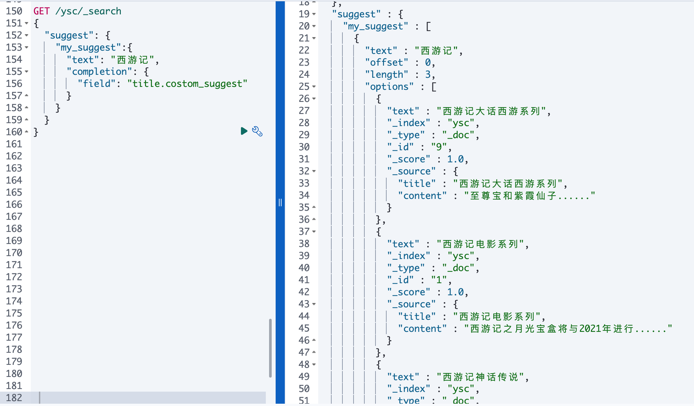   
    
#### &emsp;&emsp;&emsp;**②、词语纠错，这里不需要加上title的多类型（term suggester）**
  - 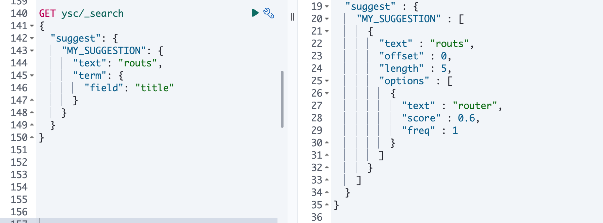

#### &emsp;&emsp;&emsp;**③、短语纠错，这里不需要加上title的多类型（phrase suggester）**
  - 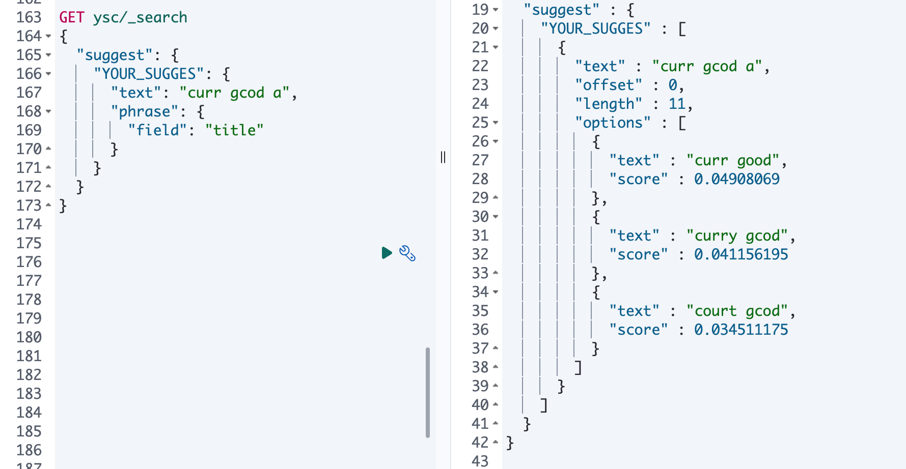


## 四、权重

### 1. 查询时设置权重
&emsp;&emsp;&emsp;&emsp;在默认情况下，这些查询的权重都为1，也就是查询之间都是平等的。有时我们希望某些查询的权重高一些，也就是在其他条件相同的情况下，匹配该查询的文档得分更高。
但是我们在做一般查询的时候可以看到相关的索引结果的得分是不一样的，在没有外部人为影响的情况下，造成这个得分不同的最大原因是搜索分片占比  
**1.1 查询时boost参数的设置**  
- &emsp;&emsp;&emsp;&emsp;在ES中可以通过查询的boost值对某个查询设定其权重。在默认情况下，所有查询的boost值为1。但是当设置某个查询的boost为2时，不代表匹配该查询的文档评分是原来的2倍，而是代表匹配该查询的文档得分相对于其他文档得分被提升了。  
- &emsp;&emsp;&emsp;&emsp;boost值的设置只限定在term查询和类match查询中，其他类型的查询不能使用boost设置。boost值没有特别约束，因为它代表的是一个相对值。当该值在0～1时表示对权重起负向作用，当该值大于1时表示对权重起正向作用。
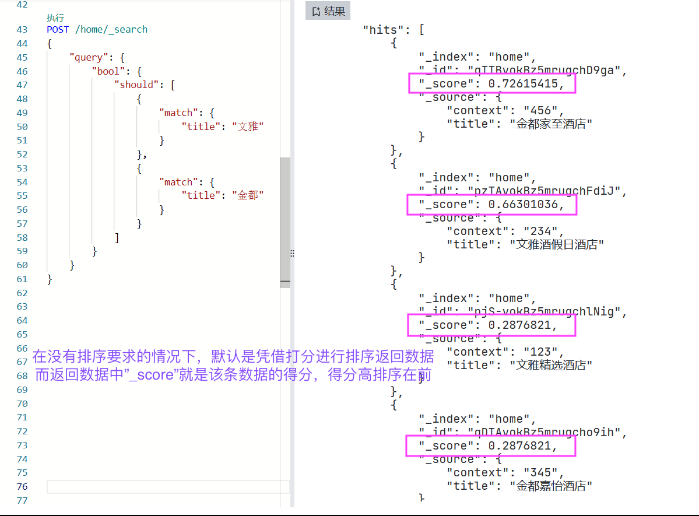
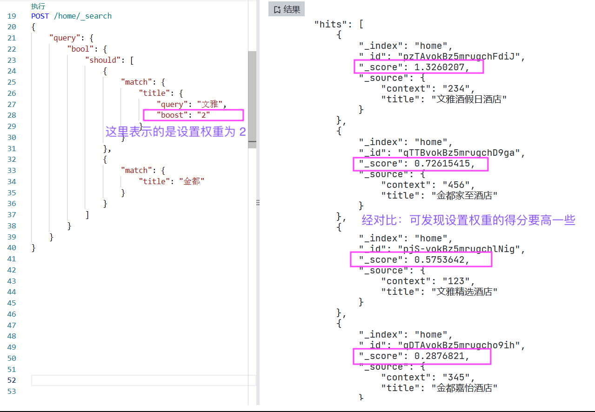

- &emsp;&emsp;&emsp;&emsp;在默认情况下，文档的boost为BM25中的k1+1，因为在默认情况下 k1 = 1.2，所以 boost = k1+1 = 1.2+1 = 2.2。当在match查询中设置boost为2时，匹配该查询文档的最终boost =（k1+1）× 2 =（1.2+1）× 2 = 4.4。可以使用explain进行验证：
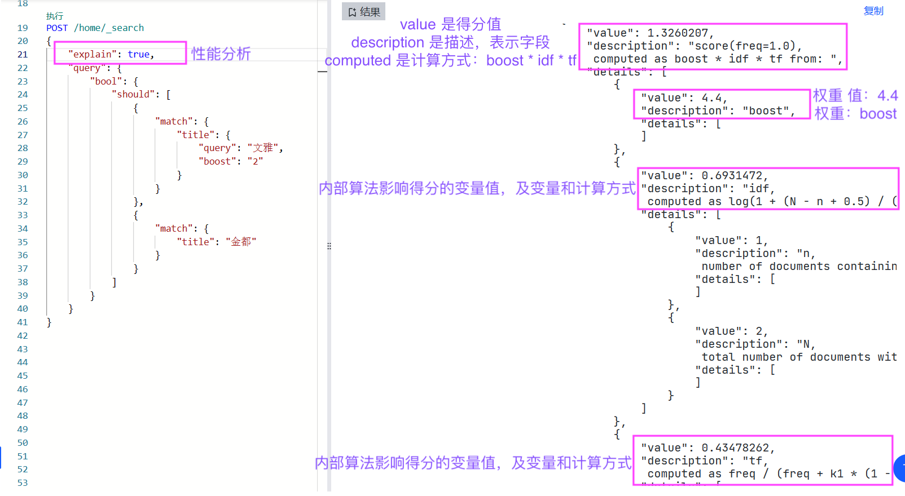

**1.2 boosting查询**  
- &emsp;&emsp;&emsp;&emsp;虽然使用boost值可以对查询的权重进行调整，但是仅限于term查询和类match查询。 有时需要调整更多类型的查询，如搜索酒店时，需要将房价低于200的酒店权重降低，此时可能需要用到range查询，但是range查询不能使用boost参数，这时可以使用ES的boosting查询进行封装。
ES的boosting查询分为两部分，一部分是positive查询，代表正向查询，另一部分是negative查询，代表负向查询。 可以通过negative_boost参数设置负向查询的权重系数，该值的范围为0～1。最终的文档得分为：正向匹配值 + 负向匹配值 × negative_boost。
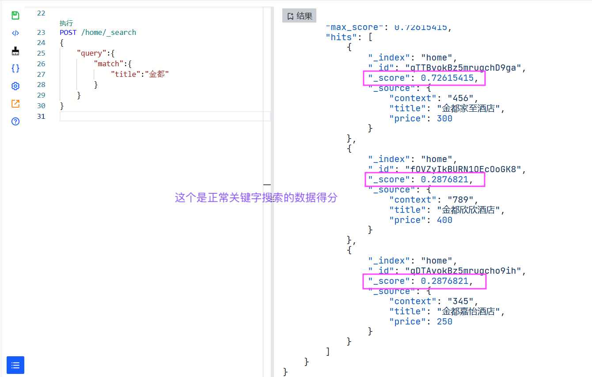
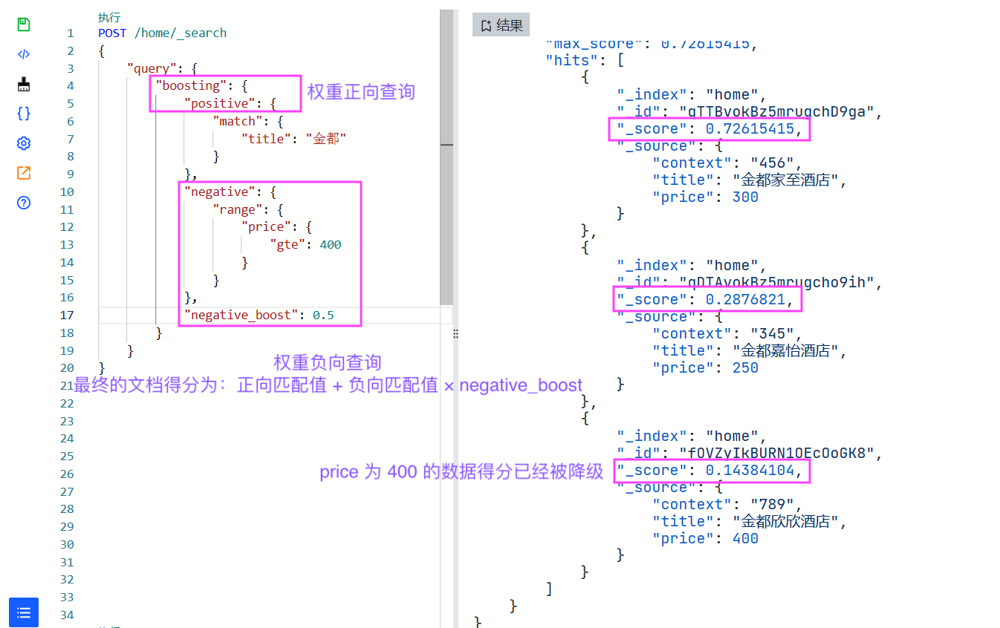