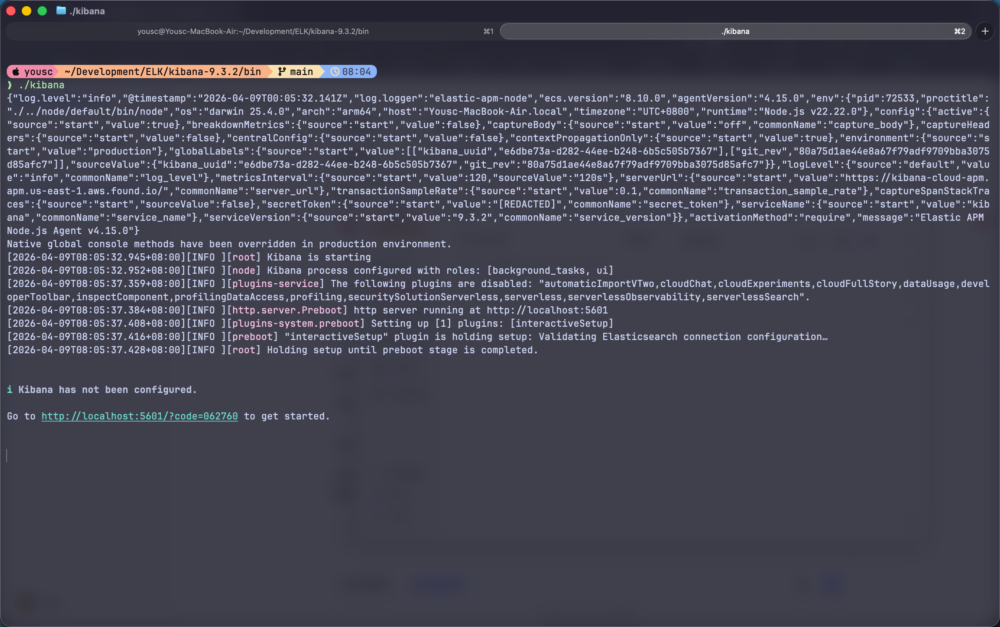
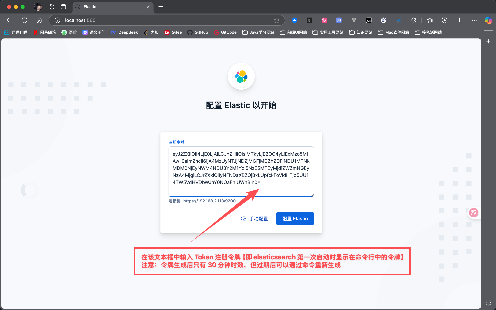
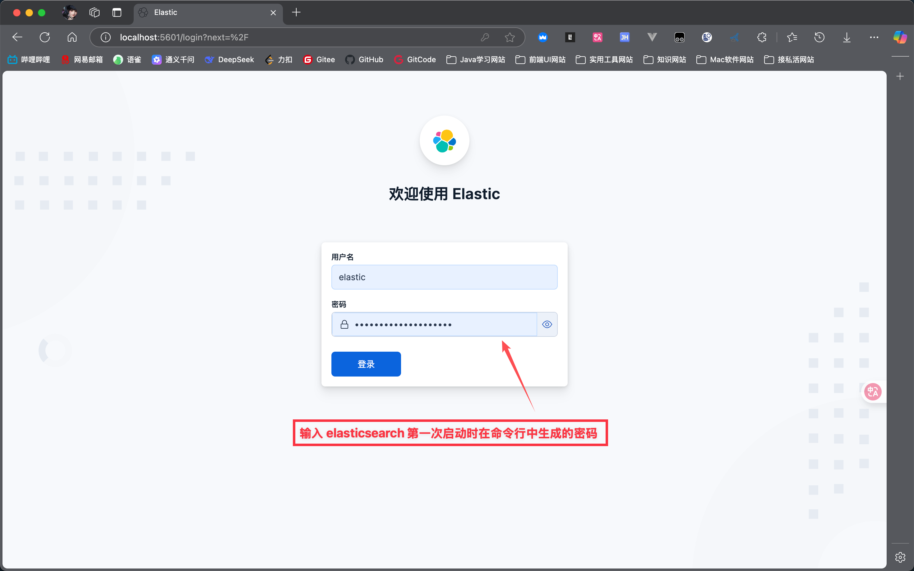

# Kibana 详解
## 一、简介
### 1.1 什么是 Kibana
Kibana 是 Elastic Stack（原 ELK Stack）的可视化组件，是一个开源的数据分析可视化平台，与 Elasticsearch 深度集成，可实现日志/数据的实时检索、可视化分析和监控告警。

### 1.2 核心功能
| 功能模块   | 核心描述                                                                 |
|------------|--------------------------------------------------------------------------|
| Discover   | 实时搜索/浏览日志数据，支持 Lucene/KQL 复杂查询、字段过滤、时间范围筛选   |
| Visualize  | 创建多维度可视化图表（柱状图、折线图、饼图、热力图、计量仪等）           |
| Dashboard  | 组合多个可视化组件，支持拖拽布局、全局时间筛选、行级权限控制             |
| Canvas     | 像素级精准设计的富媒体仪表盘，支持自定义排版和多数据源展示               |
| Maps       | 地理空间数据可视化，适配各类位置相关数据的分析展示                       |
| Reports    | 生成 PDF 格式的可视化报表，支持定时导出、自定义模板                     |
| Alerting   | 配置多维度告警规则，触发邮件/钉钉/WEBHOOK 等通知方式                     |
| Fleet      | Elastic Agent 统一管理中心，支持代理的批量部署、配置和监控               |

## 二、快速开始
### 2.1 安装方式
#### 方式一：压缩包部署（Linux/Mac）
```bash
# 下载指定版本压缩包（以 8.11.0 为例）
wget https://artifacts.elastic.co/downloads/kibana/kibana-8.11.0-linux-x86_64.tar.gz

# 解压并进入目录
tar -zxvf kibana-8.11.0-linux-x86_64.tar.gz
cd kibana-8.11.0-linux-x86_64

# 启动 Kibana（前台运行）
./bin/kibana
```

#### 方式二：Docker 部署
```bash
docker run -d \
  --name kibana \                  # 容器名称
  --publish 5601:5601 \            # 端口映射（宿主机:容器）
  --link elasticsearch:elasticsearch \  # 关联 Elasticsearch 容器
  docker.elastic.co/kibana/kibana:8.11.0  # 镜像地址
```

### 2.2 启动与访问
#### 基础启动命令
| 系统类型   | 启动命令                          | 说明                     |
|------------|-----------------------------------|--------------------------|
| Linux/Mac  | `./bin/kibana`                    | 前台运行，日志实时输出   |
| Windows    | `bin\kibana`                      | 前台运行                 |
| Linux      | `nohup ./bin/kibana &`            | 后台运行，日志输出到nohup.out |

#### 访问信息
- 默认地址：`http://localhost:5601/`
- 首次访问：需完成 Elasticsearch 连接配置或输入注册 Token

#### 界面示例
- Kibana 主界面：
- 索引模式配置：
- 可视化创建：
- 仪表盘示例：

### 2.3 Elasticsearch 连接配置
#### 场景 1：ES 启用安全配置（`xpack.security.enabled: true`） + 启用 Https（`xpack.security.http.ssl.enabled: true`）
Kibana 启动后会自动生成连接配置到 `config/kibana.yml`，无需手动修改：
```yaml
# 自动生成的 ES 连接配置
elasticsearch.hosts: [https://192.168.1.17:9200]
elasticsearch.serviceAccountToken: AAEAAWVsYXN0aWMva2liYW5hL2Vucm9sbC1wcm9jZXNzLXRva2VuLTE3NzU3OTYwNjEzODc6Wkd4Zkg3UVpTdlNuRnlwTnpZVXlKdw
elasticsearch.ssl.certificateAuthorities: [/Users/yousc/Development/ELK/kibana-9.3.2/data/ca_1775796061667.crt]
# Fleet 输出配置（自动关联）
xpack.fleet.outputs: [{
  id: fleet-default-output, 
  name: default, 
  is_default: true, 
  is_default_monitoring: true, 
  type: elasticsearch, 
  hosts: [https://192.168.1.17:9200], 
  ca_trusted_fingerprint: 080e99081372307b4a6c6cf99df5ecac1bc59939698eb049a8c814f28157f6e2
}]
```

#### 场景 2：ES 启用安全配置（`xpack.security.enabled: true`） + 关闭 Https（`xpack.security.http.ssl.enabled: false`）
需手动修改 `config/kibana.yml`，配置 ES 连接信息：
```yaml
# 1. ES 集群地址（支持多节点，逗号分隔）
elasticsearch.hosts: ["http://localhost:9200"]

# 2. 认证账号（建议使用 kibana_system 专用账号）ES 专门给 Kibana 内置的最小权限系统账号 kibana_system（不能删数据，只能给 Kibana 做连接）
# 密码重置命令：./elasticsearch-reset-password -u kibana_system
elasticsearch.username: "kibana_system"
elasticsearch.password: "你的重置密码"

# 3. SSL 验证模式（关闭 HTTPS 时设为 none）
# 可选值：certificate（严格验证）、none（不验证）、warning（警告不阻止）
elasticsearch.ssl.verificationMode: none
```

## 三、核心配置文件详解
Kibana 主配置文件路径：`config/kibana.yml`，以下为常用核心配置（按功能分类）：

```yaml
# ======================== 基础服务配置 =========================
server.port: 5601                # 监听端口
server.host: "0.0.0.0"           # 监听地址（0.0.0.0 允许外网访问）
server.name: "dev-kibana"        # 实例名称（便于多实例区分）
server.timezone: "Asia/Shanghai" # 时区（建议统一为东八区）
i18n.locale: "zh-CN"             # 界面语言（中文）

# ======================== 加密密钥配置（8.x 必配）=========================
# 作用：用以支持 Fleet、Alerting、报表、敏感数据加密等功能
# 生成命令：./bin/kibana-encryption-keys generate
xpack.encryptedSavedObjects.encryptionKey: "9f2f164bcb3589eea3716bae3c3a67672afd1a9c0a4a01751fdc6bcb3b212b0e"
xpack.reporting.encryptionKey: "284a15ee9345b541d01d9165ed3dfde6fef1b18c155cb5f08b56bd73c16d8450"
xpack.security.encryptionKey: "afa1064cdc743feb132e2ba355872410cb7f5d983f7e1ef7eceb0985fe4dd77f"

# ======================== 性能/网络优化 =========================
# 禁用遥测（Kibana 默认会向 Elastic 遥测服务发送匿名使用统计，国内网络避免超时）
telemetry.optIn: false
telemetry.allowChangingOptInStatus: false
# Kibana 8.x 引入的 Agentless 功能无需安装任何软件，就能直接把云服务（比如 AWS、Azure、GCP）的数据接入 Elastic，但要求Kibana 提供有效 SSL 证书。
# 开发环境直接禁用Agentless（避免自签名证书问题）
xpack.fleet.agentless.enabled: false

# ======================== 日志配置 =========================
logging.level: "debug"                   # 日志级别：debug/info/warn/error
logging.dest: "./logs/kibana.log"        # 日志输出路径（默认控制台）
logging.rotate.enabled: true             # 启用日志轮转
logging.rotate.maxBytes: 104857600       # 单日志文件最大大小（100MB）
logging.rotate.maxFiles: 7               # 保留日志文件数
```

## 四、核心功能使用指南
### 4.1 Discover（数据探索）
- 支持 Lucene 查询语法、KQL（Kibana 专属查询语言）
- 可自定义时间范围（快速选择：近15分钟/1小时/1天，或手动输入）
- 支持字段过滤、高亮显示、数据导出（CSV/JSON）
- 可保存常用查询语句，便于重复使用

### 4.2 Visualize（可视化制作）
#### 支持的图表类型
| 分类       | 具体类型                                                                 |
|------------|--------------------------------------------------------------------------|
| 基础图表   | 柱状图、条形图、折线图、区域图、饼图、环形图、直方图                     |
| 计量图表   | 垂直计量仪、水平计量仪、进度条、目标值对比图                             |
| 数据表格   | 普通数据表、聚合表格、交叉表                                             |
| 其他类型   | 热力图、Venny 图、地图可视化、Markdown 文本块                           |

#### 制作流程
1. 选择数据源（索引模式）→ 选择图表类型
2. 配置聚合方式（桶聚合：按时间/字段分组；指标聚合：求和/平均值/计数等）
3. 调整样式（颜色、标签、图例）→ 保存可视化

### 4.3 Dashboard（仪表盘）
- 拖拽式布局调整，支持自定义行/列布局
- 全局时间筛选器：所有组件同步时间范围
- 权限控制：支持基于角色的行级数据权限
- 嵌入支持：可将仪表盘嵌入到其他系统（iframe）
- 定时刷新：配置自动刷新间隔（10秒/1分钟/5分钟等）
```
