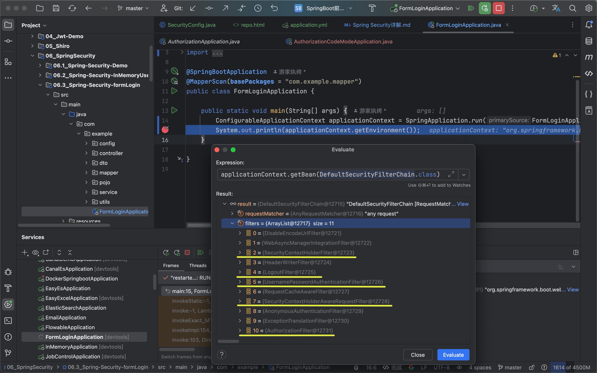

## 一、SpringSecurity简介
    1、添加依赖：
           <dependency>
                 <groupId>org.springframework.boot</groupId>
                 <artifactId>spring-boot-starter-security</artifactId>
           </dependency>

    2、Spring Security登录页面：
           默认登陆界面：http://localhost:8080/login
           默认的用户名: user
           默认的密码: 控制台打印

    情况一：  
    3、在登陆之前，访问接口：http://localhost:8080/sayHello 时，会自动被spring security 拦截认证，
       发现请求没有携带有效的cookie 认证授权，就会自动重定向到登录spring security的默认登录页面：http://localhost:8080/login  
    4、当用户输入用户名和密码后，点击登录，spring security认证授权成功后，
       会重新设置了cookie，然后重定向会到用户访问的接口地址，即 http://localhost:8080/sayHello  
    5、重定向回来了用户的访问地址：http://127.0.0.1:8080/sayHello，携带上了有效的cookie，
       所以能正常访问接口，并返回了接口值  
    6、最后退出登录，去访问 http://localhost:8080/logout

    情况二：  
    3、我们不访问接口：http://localhost:8080/sayHello，直接就输入账号密码登陆  
    4、在我们输入账号与密码后，由于我们并没有设置登陆成功后的访问路径与界面，并且也没有用户需要访问的接口，
       所以成功登录后Spring Security路由不到接口就会报404  
    5、这个时候再去访问 /sayHello, 我们可以发现访问成功  
    6、最后退出登录，去访问 http://localhost:8080/logout


    补充：使用 BCryptPasswordEncoder 算法进行加密敏感数据

   ```java
   public static void main(String[] args) {
       // 使用BcryptPasswordEncoder加密,需要注意的是，这样加密的话，盐值是随机的，最终结果每次都会不一样
       BCryptPasswordEncoder bcyencoder = new BCryptPasswordEncoder();
       System.out.println(bcyencoder.encode("123456"));
   
       // 所以应该通过自己制定盐值的方法来生成加密
       // (盐值有规则：不想看源码规则的就--长度不下于28位，开头以'$2$10$'[不是必须的开头，但万能])
       String password = "123456";
       String encode = BCrypt.hashpw(password, "$2$10$shichengqwertyuioplkjhgfdsa");
       System.out.println(encode);
   }
   ```
  

