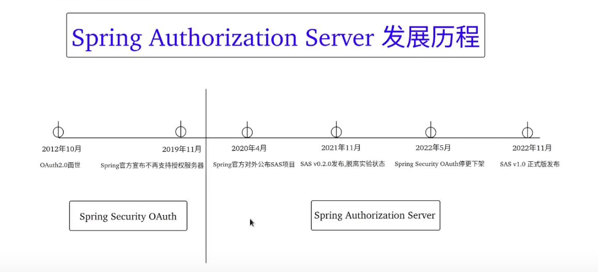

1．授权服务器框架
2. 实现了 OAuth 2.1 和 OpenID Connect 1.0 规范
3. 以 Spring Security 为基础
4. 可定制
5. Java 17/SpringBoot 3.x 或更高版本的环境，最新版 V1.3.2（截止2024-09-02)

Spring Authorization Server发展历程
 

OAuth2.1
OAuth2.1对比 OAuth2.0 的区别
1. 0Auth 2.1 目前仍旧处在草案阶段
2. OAuth 2.1 移除"Implicit"、"Password"两种不安全的授权模式，新增了"Refresh Token"模式
3. 0Auth 2.1 对 "Authorization Code" 模式进行了改进，引入了"PKCE"（授权码交换的证明密钥）。
   如果你的应用是一个 SPA 前端应用或移动端 App，建议使用 授权码 + PKCE 模式来完成用户的认证和授权，降低了恶意拦截授权码的风险

OIDC 1.0
本系列的第21集 "保存OAuth2用户信息" 介绍了 OIDC1.0协议，本视频做进一步的补充。
OIDC 支持将用户数据安全地暴露给第三方客户端。OIDC提供的"ID Token” 包含了用户的身份认证信息，
使得客户端能够验证用户的身份，并在需要时能够获取用户的基本信息

JWS/JWK
JWS 的全称是JWT Signature（通常是指添加了签名的JWT）。签名是用来保证JWT 不能被他人随意篡改。
JWK的全称是JSON Web Key（通常是指JWT的 密钥[对称加密] 或者 密钥对[非对称加密--公钥私钥]）。
当OAuth2客户端接收到一个JWT时，它需要使用这些公钥来验证JWT的有效性，确保JWT没有被篡改，并且是由可信的授权服务器签发的。