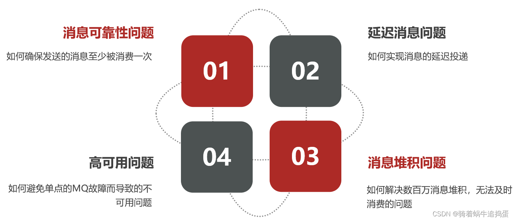

## RabbitMQ除了像兔子一样跑的很快以外，还有这些特点：
    开源、性能优秀，稳定性保障
    提供可靠性消息投递模式、返回模式
    与Spring AMQP完美整合，API丰富
    集群模式丰富，表达式配置，HA模式，镜像队列模型
    保证数据不丢失的前提做到高可靠性、可用性

## MQ典型应用场景：
    异步处理：把消息放入消息中间件中，等到需要的时候再去处理。
    流量削峰：例如秒杀活动，在短时间内访问量急剧增加，使用消息队列，当消息队列满了就拒绝响应，跳转到错误页面，
            这样就可以使得系统不会因为超负载而崩溃。
    应用解耦：比如：双十一的时候，用户的订单系统就需要和库存系统相联系。但是人流量巨大，万一其中一个系统宕机，就会造成数以万计的损失。
            所以这个时候就可以使用消息中间件，实现应用解耦

## AMQP协议和RabbitMQ
    提到RabbitMQ，就不得不提AMQP协议。AMQP协议是具有现代特征的二进制协议。
    是一个提供统一消息服务的应用层标准高级消息队列协议，是应用层协议的一个开放标准，为面向消息的中间件设计。

## RabbitMQ消息中间件的地址：http://localhost:15672
   默认用户名，密码：guest
   打开方式，解压包下的/sbin/rabbitmq-server.bat

## 一、先了解一下AMQP协议中间的几个重要概念：
    Server：    接收客户端的连接，实现AMQP实体服务。
    Connection：连接，应用程序与Server的网络连接，TCP连接。
    Channel：   信道，消息读写等操作在信道中进行。客户端可以建立多个信道，每个信道代表一个会话任务。
    Message：   消息，应用程序和服务器之间传送的数据，消息可以非常简单，也可以很复杂。有Properties和Body组成。Properties为外包装，可以对消息进行修饰，比如消息的优先级、延迟等高级特性；Body就是消息体内容。
    Virtual Host：虚拟主机，用于逻辑隔离。一个虚拟主机里面可以有若干个Exchange和Queue，同一个虚拟主机里面不能有相同名称的Exchange或Queue。
    Exchange：  交换器，接收消息，按照路由规则将消息路由到一个或者多个队列。如果路由不到，或者返回给生产者，或者直接丢弃。RabbitMQ常用的交换器常用类型有direct、topic、fanout、headers四种，后面详细介绍。
    Binding：   绑定，交换器和消息队列之间的虚拟连接，绑定中可以包含一个或者多个RoutingKey。
    RoutingKey：路由键，生产者将消息发送给交换器的时候，会发送一个RoutingKey，用来指定路由规则，这样交换器就知道把消息发送到哪个队列。
                路由键通常为一个“.”分割的字符串，例如“com.rabbitmq”。
    Queue：     消息队列，用来保存消息，供消费者消费。

## 二、消息流程：
                                (Channel信道)                                (Channel信道)
    消息生产者 ---> Exchange交换器 ------------> Queue消息队列 ---> Connection通道连接 ---> 消费者
                        (Binding绑定交换器和队列的规则)
    交换器有四种策略：
           direct：生产者在生产消息的同时会有一个key产生，交换器会根据消息中的key的内容精准匹配，将消息发送给key完全一致的队列。
                   消费者只需要监听某个队列，以后就能获取到队列中信息的消息。
                   比如生产者消息的key=123,那么交换器中只有key=123队列才能接收。如果没有，那么这条消息不会进入队列。
           topic： 和Direct有点类似，也存在key，但是这种策略中的key并不是一个具体的值。
                   比如说有三个队列，其中队列的key分别为 ①aa  ②aa.*  ③aa.#
                   那么生产者在生产消息时的key就只能被与之相对应的队列key接收。
                      比如生产者key=aa,三条队列都能接收；  key=aa.bb,只有②、③能接收；  key=aa.bb.cc,就只有③能接收
           fanout：这种交换器就没有路由key的概念，直接将消息发送给队列，类似于一种广播的模式。
                   比如有三个队列，生产者发送消息时，三个队列都能接收到消息。
           headers:不依赖于传统的routing key进行消息路由，而是根据消息头（headers）属性来决定将消息路由到哪些队列。
                   这种类型的交换机提供了更加灵活的消息路由方式，因为它允许基于多个属性的复杂逻辑判断来进行消息分发。

## 三、死信
    1、概念：
           一般来说，生产者将消息投递到queue里，消费者从queue取出消息进行消费，但某些时候由于特定的而原因导致queue中的某些消息无法被消费，
       这样的消息如果没有后续的处理，就变成了死信，有死信自然就有死信队列
           应用场景：为了保证订单业务的消息数据不会丢失，需要使用到RabbitMQ的死信队列机制，当消息消费发生异常时，将消息投入到死信队列中。
       还有比如说：用户在商城下单成功并点击去支付后在指定时间内未支付时自动失效。
    2、死信的来源：
         ①、消息TTL过期（设置过期时间，一般来说都是生产者设置过期时间）
         ②、队列达到最大程度 "x-max-length"（队列满了，无法再添加数据到mq中。通过消费者声明死信交换机的x-max-length为队列设置长度）
         ③、消息被拒绝（basic.reject 或 basic.nack） 并且 requeue=false

                                  (Binding绑定)
                                  (Channel信道)                                 (Channel信道)
       消息生产者 -----> Exchange交换器 -----> Queue消息队列 ------> Connection通道连接 -----> 消费者c1
                                                           ||
                                                           \/
                                                        死信交换器
                                                           ||
                                                           \/
                                                         死信队列 ---> Connection通道连接 ---> 消费者c2

## 四、MQ高级
<figure>

   ### 消息队列在使用过程中，面临着很多实际问题需要思考：
   

   ### 1、延迟队列（"x-message-ttl"）
   <figure>    

   #### ①、概念
    给队列设置过期时间，将消息加入队列，过期时间之后消息自动进入死信队列，监听死信队列，进行消费操作即可实现延迟队列
   #### ②、延时队列使用场景
    订单在十分钟之内未支付则自动取消。
    新创建的店铺，如果在十天内都没有上传过商品，则自动发送消息提醒。
    账单在一周内未支付，则自动结算。
    用户注册成功后，如果三天内没有登陆则进行短信提醒。
    用户发起退款，如果三天内没有得到处理则通知相关运营人员。
    预定会议后，需要在预定的时间点前十分钟通知各个与会人员参加会议。
   #### ③、RabbitMQ中的TTL
    TTL（Time To Live）是RabbitMQ中一个消息或者队列的属性，表明一条消息或者该队列中的所有消息的最大存活时间，单位是毫秒。
    换句话说，如果一条消息设置了TTL属性或者进入了设置TTL属性的队列，那么这条消息如果在TTL设置的时间内没有被消费，则会成为“死信”。
    如果同时配置了队列的TTL和消息的TTL，那么较小的那个值将会被使用。
   #### ④、延时队列写法
    第一种方式：AMQP.BasicProperties properties = new AMQP.BasicProperties().builder().expiration("10000").build();
              支持在spring框架中生产端使用
    第二种方式：map.put("x-message-ttl", 10000);
              支持在spring、springboot中使用，但是有个很明显的缺陷：当延迟需求很多时，要重复地去声明新队列，维护很麻烦
    第三种方式：rabbitTemplate.convertAndSend("bootDirectExchange", "bootDirectRoutingKeyC", message, msg -> {
                   // 发送消息的时候 延长时长
                   msg.getMessageProperties().setExpiration(ttlTime);
                   return msg;
              });
              支持在springboot框架中使用，是在第二种方式上的改良，延迟时长由用户决定。
              但是如果第一个用户消息的延时时长很长，而第二个用户消息的延时时长很短，第二个消息并不会优先得到执行
   #### ⑤、基于插件的延迟队列
    首先关闭RabbitMq,下载 rabbitmq_delayed_message_exchange-3.13.0.ez 插件到 \rabbitmq_server-3.13.4\plugins 中，
    然后在 \rabbitmq_server-3.13.4\sbin目录下打开cmd输入：rabbitmq-plugins enable rabbitmq_delayed_message_exchange进行安装
    最后再重新启动，使插件生效。
    打开http://localhost:15672可以后台管理页面Exchange项的Type下拉，能找到 x-delayed-message 类型表示安装成功！

                                (Binding绑定)
                                (Channel信道)                                     (Channel信道)
    消息生产者 ---> Exchange交换器 ----------> Queue消息队列 ------> Connection通道连接 ---------> 消费者

    死信队列的延迟是在队列中进行的，而基于插件的延迟队列是在交换机中实现的
   </figure>

   ### 2、消息可靠性投递（消息投递的每一步都可能导致消息丢失）
   <figure>

   
   
   <h3 style="color: red">
    消息丢失原因：
   <h4>

    ①、发送时丢失：
           生产者发送的消息未送达exchange
           消息到达exchange后未到达queue
    ②、RabbitMQ 异常（如：MQ宕机，queue将消息丢失）
    ③、consumer接收到消息后未消费就宕机

   </h4>
   </h3>

   <h3 style="color: red">
   解决方案：
   <h4>

    ①、生产者开启确认机制，确保生产者的消息能到达队列
    ②、mq开启持久化功能，确保消息未消费前在队列中不会丢失
    ③、开启消费者确认机制，确认消息处理成功后完成ack
    ④、开启消费者失败重试机制，并设置MessageRecoverer，多次重试失败后将消息投递到异常交换机，交由人工处理
   </h4>
   </h3>
   
   

   <h3 style="color: #2af458">RabbitMQ提供 transactional 和 confirm模式 来确保生产者不丢消息。</h3>
    
    2.1、Transactional模式
         概念：通过事务实现机制，只有消息成功被rabbitmq服务器接收，事务才能提交成功，否则便可在捕获异常之后进行回滚，
              然后进行消息重发，但是事务非常影响rabbitmq的性能。
              还有就是事务机制是阻塞的过程，只有等待服务器回应之后才会处理下一条消息，这样会大大降低消息的发送速度。
              吞吐量下降；性能较差，一般不使用。
         ①、开启事务
             channel.txSelect();
         ②、发送消息
             channel.basicPublish("exchangeName", "routingKey", null, "message".getBytes());
         ③、提交事务
             channel.txCommit();
         ④、回滚事务
             channel.txRollback();
   

    2.2、Confirm模式
      Ⅰ、概念：Confirm 模式（Publisher Confirms）是 RabbitMQ 提供的一种消息可靠性投递机制，
              用于确保生产者发送的消息成功到达 RabbitMQ 服务器（确切地说是到达交换机）。

                                        (Binding绑定)
                                        (Channel信道)                                (Channel信道)
             消息生产者 -----> Exchange交换器 -----> Queue消息队列 -----> Connection通道连接 ------> 消费者
                ||                ||
                ||(发送消息备份)    ||(当交换机收到消息，从缓存中清除已收到的消息)
                ||                ||
               缓存(Redis) ========
      【定时任务对未成功发布的消息进行定时投递】
       
       ①、配置文件：# none：是禁用发布确认模式，是默认值
                   # correlated：是发布消息成功到交换器后会触发回调方法
                   # 设置 correlated 即可在发布消息成功到达交换器(Exchange)后触发回调方法。
                   spring.rabbitmq.publisher-confirm-type = correlated
       ②、开启生产者确认机制
           rabbitTemplate.setConfirmCallback(new RabbitTemplate.ConfirmCallback() {
               @Override
               public void confirm(CorrelationData correlationData, boolean ack, String cause) {
                   if (ack) {
                       log.info("消息发送成功：correlationData({}),ack({}),cause({})", correlationData, ack, cause);
                   } else {
                       log.error("消息发送失败：correlationData({}),ack({}),cause({})", correlationData, ack, cause);
                   }
               }
           });
       ③、发送消息
           rabbitTemplate.convertAndSend("bootDirectExchange", "bootDirectRoutingKeyC", message, correlationData);

       confirm方式有三种模式：普通confirm模式、批量confirm模式、异步confirm模式
              普通confirm模式：每发送一条消息，就调用waitForConfirms()方法，等待服务端返回Ack或者nack消息。
              批量confirm模式：每发送一批消息，就调用waitForConfirms()方法，等待服务端返回Ack或者nack消息。
              异步confirm模式：提供一个回调方法，服务端返回Ack或者nack消息时，会回调这个confirm()方法。

      Ⅱ、回退消息————如果队列发生故障（即消息无法路由到队列）
         概念：在仅开启了生产者确认机制的情况下，交换机接收到消息后，会直接给消息生产者发送确认消息，
              如果发现消息不可路由，那么消息会被直接丢弃，此时生产者是不知道消息被丢弃这个事件的。
              那么如何让无法路由的消息帮我们处理一下？这就需要开启回退消息机制。
              通过设置mandatory参数可以在当消息传递过程中不可达目的地时将消息返回给生产者
         ①、配置文件：
              # 当消息不可达队列时，mandatory 参数值来决定是返回消息还是直接丢弃消息。true表示返回消息不可达的包装信息[消息体、路由键、失败原因...]。
              spring.rabbitmq.template.mandatory=true
              # 开启ReturnsCallback监听器来监听 mandatory(消息不可达队列) 返回的消息，如果有返回消息则执行 returnedMessage()
              spring.rabbitmq.publisher-returns=true
         ②、创建一个类去实现 RabbitTemplate.ReturnsCallback 接口，重写Returned 方法
            rabbitTemplate.setReturnsCallback(new RabbitTemplate.ReturnsCallback() {
                @Override
                public void returnedMessage(ReturnedMessage returned) {
                    log.error("在回调returnedMessage()方法中，消息:{} 被交换机{}退回，回应码：{}，退回原因：{}，路由{}", 
                              new String(returned.getMessage().getBody()), 
                              returned.getExchange(), 
                              returned.getReplyCode(), 
                              returned.getReplyText(), 
                              returned.getRoutingKey());
                };
            });

      Ⅲ、备份交换机
         ①、概念：
                有了mandatory参数和回退消息，我们获得了对无法投递消息的感知能力，有机会在生产者的消息无法被投递时发现并处理。
            但有时候我们并不知道该如何处理这些无法路由的消息。
                问题：那能否添加死信的机制来解决这些消息呢?
                回答：不可路由消息根本就没有机会进入到正常队列里，更别说是进入到死信队列中来保存消息了。
                方案：在RabbitMq中有一种备份交换机的机制存在，可以很好地应对这个问题。
                     当我们为某个交换机声明一个对应的备份交换机时，就是为他创建一个备胎，
            当交换机接收到一条不可路由消息时，将会把这条消息转发到备份交换机中，由备份交换机来转发和处理，通常备份交换机的类型为Fanout,
            这样就能把所有消息都投递到与其绑定的的队列中，然后我们在备份交换机下绑定一个队列，这样所有那些原交换机无法被路由的消息，
            就会都进入这个队列了。当然，我们还可以建立一个报警队列，用独立的消息着来进行检测和报警。
                                       (Binding绑定)
                                       (Channel信道)                                (Channel信道)
            消息生产者 -----> Exchange交换器 -----> Queue消息队列 -----> Connection通道连接 -----> 消费者
                               ||
                               ||              备份队列
                               \/           /
                            备份交换机------<
                                            \
                                               警告队列 -------------> 警告消费者
         ②、步骤：
             Ⅰ、创建备份交换机和备份队列还有警告队列以及 Binding 等实例
             Ⅱ、将正常交换机上绑定备份交换机
             Ⅲ、监听警告队列

             注意：mandatory参数和备份交换机一起使用时，消息该何去何从？是先回退给生产者还是先备份给交换机
             经过发现，备份交换机的优先级高于回退消息。有备份交换机的时候，ReturnsCallback是失效的

      Ⅳ、总结
         1、ConfirmCallback 只能确认消息是否到达交换机，不能确认是否路由到队列
         2、setPublisherConfirmType(ConfirmType.correlated) 必须设置才能确保消息到达交换机时触发 ConfirmCallback
         3、ReturnsCallback 只能确认消息是否路由到队列，不能确认是否到达交换机
         4、setMandatory(true) 必须设置才能确保消息无法路由时触发 ReturnCallback
   </figure>
</figure>

## 五、其他知识点
    1、幂等性
       1.1、概念
                用户对于同一操作发起的一次请求或者多次的结果是一致的，不会因为多次点击而产生了副作用。
           举个例子：用户给购买商品后支付，支付扣款成功，但是返回结果的时候网络异常，此时钱已经扣除了，用户再次点击按钮，此时会进行第二次扣款，
           返回结果成功，用户查询余额发现多扣钱了，流水记录也变成了两条。在以前订单应用系统中，我们只需要把数据操作放入事务中即可，
           发生错误立即回滚，但是再响应客户端的时候也有可能出现网络中断或者异常等等
       1.2、消息重复消费
                消费者在消费MQ中的消息时，MQ已把消息发送给消费者，消费者在给MQ返回ack时网络中断，故MQ未收到确认信息
           该条消息会重新发给其他的消费者，或者在网络重连后再次发送给该消费者，但实际上该消费者已成功消费了该消息，造成消费者消费了重复的消息
       1.3、解决思路
                MQ消费者的幂等性的解决一般使用全局ID 或者写个唯一标识比如时间戳 或者UUID 或者订单消费者消费MQ 中的消息也可利用MQ的该ID来判断
            或者可按自己的规则生成一个全局唯一id，每次消费消息时用该id先判断该消息是否已消费过
       1.4、Redis原子性
    2、优先级队列
       RabbitMQ的优先级1~255
       一般来说设置10足够，因为优先级设置越大，越耗内存，占CPU就越高（设置优先级就需要排序）
    3、异步处理
       比如在秒杀活动里，当整点秒杀时间开始，会有大量的请求来进行秒杀，我们一般会通过库存预减、内存标记来进行简单的预处理。
       然后再利用RabbitMq去发送消息 rabbitTemplate.convertAndSend(...); 这个方法主要是异步处理的，也就是说只负责发送消息给队列
       至于后续是否消费队列中的消息，可以在 @RabbitListener 监听方法中去进行处理。所以在Controller中发送消息后就可以返回结果给用户，
       然后在前端做处理后返回秒杀成功，并给出是否查看订单的选项。这样就避免了消费消息时间过长，阻塞返回结果给用户，从而影响用户体验。
    4、手动拒绝消费方法
      basicNack 和 basicReject
      basicReject: 一次只能拒绝一条消息，可以设置requeue
      basicNack:   一次可以拒绝0~N 多条消息，可以设置requeue
    5、标识Id 的区别
      CorrelationData的id 和 message.getMessageProperties().getDeliveryTag()获取的消息id
 
      CorrelationData 是实现接口 ConfirmCallback ，重写其confirm()方法的参数之一，是可自定义的id，为当前消息的唯一id
      表示对象内部只有一个 id 属性，用来表示当前消息的唯一性；用来与 Redis 做交互，记录这条消息的唯一id
      DeliveryTag 作为消息通道的标识ID，可通过deliveryTag参数来对消息进行确认和拒绝
      也可以把它当做此消息处理通道的名字，回传告诉 rabbitmq 这个消息处理成功并清除此消息，每次接收消息+1。
      消息进行确认和拒绝为什么要选择使用信道id 作为参数呢？因为确认跟拒绝消息 直接打交道的是信道啊😆
    6、消息变成死信，可能是由于以下的原因：
         消息 TTL 过期（消息生存时间过期）
         队列达到最大长度(队列满了，无法再添加数据到 mq 中)
         消息被拒绝(basic.reject 或 basic.nack)并且 requeue=false.(不重新放入队列)
    7、消息堆积
       消息堆积问题：当生产者发送消息的速度超过了消费者处理消息的速度，就会导致队列中的消息堆积，直到队列存储消息达到上限。
                   之后发送的消息就会成为死信，可能会被丢弃。
       解决消息堆积的思路：
            1、增加更多的消费者，提高消费速度，也就是我们之前说的work queue模式
            2、扩大队列容积，提高堆积上限
               但是提升队列容积，把消息保存在内存中显然是不行的。所以 RabbitMQ 提供了一种惰性队列的概念
               惰性队列特征如下：接收到消息后直接存入磁盘而非内存
                              消费者要消费消息时才会从磁盘中读取并加载到内存
                              支持数百万条的消息存储，适用于大量消息的场景，但是消费速度会变慢
               ①、正常持久化队列：在 RabbitMQ 中，默认情况下，消息会尽可能地保存在内存中，并且只有当内存达到一定限制时，
                                才会将消息换出到磁盘。这种方式适合于处理相对少量的消息或需要快速访问消息的场景。
               ②、惰性队列：惰性队列的设计目的是为了尽量减少内存使用，它会尽可能将消息直接存储到磁盘上，
                           而不是首先加载到内存中。这对于需要处理大量消息而不想占用过多内存资源的场景特别有用。
    8、RabbitMQ顺序消费
       场景1：一个queue，多个consumer去消费
          只有一个queue，有多个consumer去消费，这样就会造成顺序的错误。consumer从MQ里面读取数据是有序的，
          但是每个consumer的执行时间是不固定的，无法保证先读到消息的consumer一定先完成操作，
          这样就会出现消息并没有按照顺序执行，造成数据顺序错误。
       方案：采用MQ本身的特性，可以设置队列的“单活模式”。
          x-single-active-consumer（单活模式）： 单一活跃消费者（Single Active Consumer）表示队列中可以注册多个消费者，
          但是只允许一个消费者消费消息，只有在此消费者出现异常时，才会自动转移到另一个消费者进行消费。
          单一活跃消费者适用于需要保证消息消费顺序性，同时提供高可靠能力的场景。
       扩展：如果业务又要顺序消费，又要增加并发，通常思路就是开启多个队列，业务根据规则将消息分发到不同的队列，
          通过增加队列的数量来提高并发度。
          例如：电商订单场景，只需要保证同一个用户的订单消息的顺序性就行，不同用户之间没有关系，
               所以只要让同一个用户的订单消息进入同一个队列就行，其他用户的订单消息，可以进入不同的队列。

       场景2： 一个queue对应一个consumer，consumer多线程消费
          同一个queue对应一个consumer，但是consumer是多线程消费，这样也会造成顺序的错误。
       方案：不启用多线程消费
