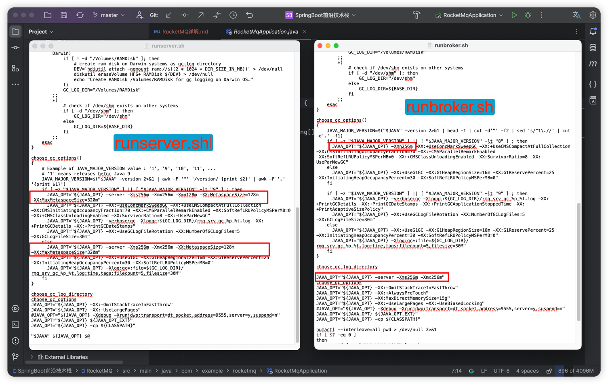
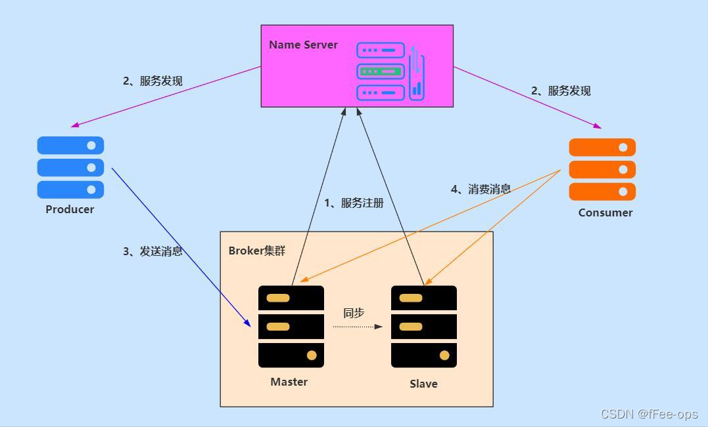

## 一、RocketMQ安装
<figure>

   ### 1、在RocketMQ官网下载，解压后修改配置文件
   
   
   

   ### 2、启动 RocketMQ（注意：截止2025年2月7号，RocketMQ服务端需要在 JDK8版本下开启）
   > ##### 2.1、启动 Name Server 
   > <figure>
   >
   > ##### RocketMQ解压后进入 bin 路径：nohup sh mqnamesrv & tail -f ~/Development/rocketmq/rocketmq-all-5.3.2-bin-release/logs/namesrv.log  
   > ①、nohup 命令用于在后台运行程序，并忽略 SIGHUP（终端关闭）信号。这意味着即使终端关闭，程序仍然会继续运行。  
     ②、sh mqnamesrv：运行bin目录下的mqnamesrv文件  
     ③、& 符号用于将前面的命令放入后台执行。   
     ④、tail -f ~/Development/rocketmq/rocketmq-all-5.3.1-bin-release/logs/namesrv.log ：是用于实时查看指定日志文件的最新内容。-f 参数表示持续监视文件，并实时输出新增的日志内容。  
   > </figure>
   > <hr/>
   >
   > ##### 2.2、启动 Broker
   > <figure>
   >
   > ##### RocketMQ解压后进入 bin 路径：nohup sh mqbroker -n localhost:9876 & tail -f ~/Development/rocketmq/rocketmq-all-5.3.2-bin-release/logs/namesrv.log
   > ①、nohup 命令用于在后台运行程序，并忽略 SIGHUP（终端关闭）信号。这意味着即使终端关闭，程序仍然会继续运行。  
     ②、sh mqbroker：运行bin目录下的mqbroker文件   
     ③、-n localhost:9876：指定了 Name Server 的地址。  
     ④、& 符号用于将前面的命令放入后台执行。  
     ⑤、tail -f ~/logs/rocketmqlogs/broker.log：是用于实时查看指定日志文件的最新内容。-f 参数表示持续监视文件，并实时输出新增的日志内容。
   > </figure>

   ### 3、关闭 RocketMQ
   > ##### 3.1、关闭 Name Server 
   > <figure>
   >
   > 方法一：直接杀死进程   
   >> ①、找到 Name Server(mqnamesrv) 进程 ID(PID)：   
   >>>     ps -ef | grep mqnamesrv   
   >> ②、找到 mqnamesrv 进程的 PID 后，可以使用 kill 命令关闭 Name Server 进程(TERM 信号可以让进程有机会清理资源并完成当前正在处理的任务，从而优雅地关闭)：   
   >>>     kill -TERM <PID>   
   > 
   > 方法二：直接运行 RocketMQ 提供的关闭脚本：   
   >> sh mqshutdown namesrv
   > </figure>
   > <hr/>
   > 
   > ##### 3.2、关闭 Broker
   > <figure>
   >
   > 方法一：直接杀死进程
   >> ①、找到 Broker(mqbroker) 进程 ID(PID)：    
   >>>     ps -ef | grep mqbroker    
   >> ②、找到 mqbroker 进程的 PID 后，可以使用 kill 命令关闭 Broker 进程(TERM 信号可以让进程有机会清理资源并完成当前正在处理的任务，从而优雅地关闭)：   
   >>>     kill -TERM <PID>    
   > 
   > 方法二：直接运行 RocketMQ 提供的关闭脚本：    
   >> sh mqshutdown broker
   > </figure>

   ### 4、RocketMQ可视化工具：rocketmq-dashboard
   > 在GitHub上下载解压后，使用IDEA打开项目，进行可视化服务的相关配置。配置完后使用jar包方式运行。

   > 
   > 
   > 
</figure>

## 二、RocketMQ介绍和使用
<figure>
   <h3>
    消息队列中间件是分布式系统中重要的组件，主要解决应用耦合，异步消息，流量削锋等问题 实现高性能，高可用，可伸缩和最终一致性架构。<br/>
    RocketMQ是阿里研发的一个纯Java、分布式、队列模型的开源消息中间件，支持事务消息、顺序消息、批量消息、定时消息、消息回溯等。<br/>
    现在开源给apache基金会成为了apache的顶级开源项目，具有高性能、高可靠、高实时、分布式特点。
   </h3>

   ### 1、RocketMQ应用场景
   > #### ①、应用解耦: 一个简单的用户下单后根据支付金额增加用户积分的场景，传统模式下需要订单模块调用积分模块接口，这样的话订单模块与积分模块就形成了系统耦合，一旦积分模块有修改或出现异常就会影响订单模块功能。引入消息队列方案后, 用户下单成功后，将消息写入消息队列就可以了。积分模块只需要订阅下单消息，从消息队列中获取数据进行消费，这样订单模块和积分模块都只要专注实现自己的功能实现，实现解耦。
   > #### ②、数据分发：用户下单后日志模块要记录下单日志，库存模块需要减少相应库存，积分模块需要增加用户积分等由下单成功引起的其余模块的业务操作，这个时候可以通过消息队列可以让数据在多个系统更加之间进行流通。数据的产生方不需要关心谁来使用数据，只需要将数据发送到消息队列，数据使用方直接在消息队列中直接获取数据即可。
   > #### ③、削峰填谷：双十一期间系统受到的请求流量猛增，有可能会将系统压垮。传统做法是为了保证系统的稳定性，一般是增加服务器配置、新增服务器做负载均衡这样的话在正常时间段都能满足服务的情况下采用这种做法无疑是对服务器性能的一种浪费，并不划算！另一种做法是如果系统负载超过阈值，就会阻止用户请求，但在流量高峰时这会影响用户体验。通过消息队列就可以完美解决这个问题，引入消息队列方案后可以将大量请求缓存起来，分散到很长一段时间处理，这样可以大大提到系统的稳定性和用户体验。

  ```
  <!--rocketmq包-->
  <dependency>
      <groupId>org.apache.rocketmq</groupId>
      <artifactId>rocketmq-client</artifactId>
      <version>5.1.3</version>
  </dependency>
  ```
   ### 2、RocketMQ 优势  
     目前主流的 MQ 主要是 RocketMQ、kafka、RabbitMQ，其主要优势有：  
     ①、支持事务型消息（消息发送和 DB 操作保持两方的最终一致性，RabbitMQ 和 Kafka 不支持）  
     ②、支持结合 RocketMQ 的多个系统之间数据最终一致性（多方事务，二方事务是前提）  
     ③、支持 18 个级别的延迟消息（Kafka 不支持）  
     ④、支持指定次数和时间间隔的失败消息重发（Kafka 不支持，RabbitMQ 需要手动确认）  
     ⑤、支持 Consumer 端 Tag 过滤，减少不必要的网络传输（即过滤由MQ完成，而不是由消费者完成。RabbitMQ 和 Kafka 不支持）  
     ⑥、支持重复消费（RabbitMQ 不支持，Kafka 支持）  
</figure>

## 三、RocketMQ 基本组成以及工作流程
<figure>

   ### RocketMQ主要由四大核心组成部分：NameServer、Broker、Producer以及Consumer
    1. NameServer：是整个 RocketMQ 的“大脑” ，它是 RocketMQ 的服务注册中心，
                   所以 RocketMQ 需要先启动 NameServer 再启动 Rocket 中的 Broker。
    2. Broker：消息服务器（Broker）是消息存储中心，主要作用是接收来自 Producer 的消息并存储，Consumer 从这里取得消息。
               它还存储与消息相关的元数据，包括用户组、消费进度偏移量、队列信息等。
               从部署结构图中可以看出 Broker 有 Master 和 Slave 两种类型，Master 既可以写又可以读，Slave不可以写只可以读。
   
    3. 生产者（Producer）也称为消息发布者，负责生产并发送消息至 Topic。
       生产者向brokers发送由业务应用程序系统生成的消息。RocketMQ提供了发送：同步、异步和单向（one-way）的多种范例。
    4. 消费者（Consumer）也称为消息订阅者，负责从 Topic 接收并消费消息。 
       消费者从brokers那里拉取信息并将其输入应用程序。
     
   
   ### RocketMQ工作流程
     ①、NameServer 先启动  
     ②、Broker 启动时向 NameServer 注册
     ③、生产者在发送消息之前先连接 NameServer，获取对应 Topic 的 Broker 地址列表（有可能是集群）。与 Broker 建立长连接。
         生产者根据负载均衡策略（如轮询、哈希）选择目标 Broker 的队列（Queue）。将消息发送到选中的 Broker Master 节点。
     ④、NameServer 与每台 Broker 服务器保持长连接，并间隔 30S 检测 Broker 是否存活，如果检测到Broker 宕机
       （使用心跳机制，如果检测超120S），则从路由注册表中将其移除。  
     ⑤、消费者在订阅消息之前先连接 NameServer，获取订阅 Topic 的路由信息。与 Broker 建立长连接。
         同一 Consumer Group 内的多个 Consumer 实例通过负载均衡策略（如平均分配、一致性哈希）分配消息队列（Queue）。
   
   ### RocketMQ发送消息消费流程
     ①、生产者发送消息到 RocketMQ 的 Broker。
     ②、Broker 接收到消息后，会先把消息写入到 PageCache 中，然后再持久化到磁盘上。
       【 Broker 持久化到硬盘的策略有两种（默认策略为：异步刷盘）
         同步刷盘：消息写入内存的 PageCache 后，立刻通知刷盘线程刷盘，然后等待刷盘完成，
                  刷盘线程执行完成后唤醒等待的线程，返回消息写成功的状态。
                  这种方式可以保证数据绝对安全，但是吞吐量不大。
         异步刷盘：消息写入到内存的 PageCache 中，就立刻给客户端返回写操作成功，当 PageCache 中的消息积累到一定的量时，
                  触发一次写操作，或者定时等策略将 PageCache 中的消息写入到磁盘中。
                  这种方式吞吐量大，性能高，但是 PageCache 中的数据可能丢失，不能保证数据绝对的安全。
        】
     ③、Broker 在策略成功执行后，会给生产者返回一个 ACK响应，表示消息已经成功写入到 Broker。
     ④、生产者收到ACK响应后，会继续执行本地事务逻辑。
     ⑤、生产者在本地事务逻辑执行成功后，会向 Broker 发送一个确认消息，Broker 收到确认消息后，会将消息标记为可消费状态。
     ⑥、消费者在消费消息时，会先从 Broker 中拉取消息，然后再消费消息。
     ⑦、消费者消费消息成功后，会向 Broker 发送一个 ACK（确认消费成功）。
         若收到确认消息后，Broker 并不会立即删除这条消息，而是通过更新消费位点(Consumer Offset)来标记消息已被消费。消息的实际清理由存储过期机制触发。
         若未收到 ACK（如超时或消费失败），Broker 会将消息重新投递（重试队列），最多重试 16 次后进入死信队列（DLQ）。

</figure>

## 四、RocketMQ 基本概念
<figure>
   <h4>1、消息模型（Message Model）</h4>
   <figure>

   > RocketMQ主要由 Producer、Broker、Consumer 三部分组成。   
   > 其中Producer 负责生产消息，Consumer 负责消费消息，Broker 负责存储消息。   
   > Broker 在实际部署过程中对应一台服务器，每个 Broker 可以存储多个Topic的消息，每个Topic的消息也可以分片存储于不同的 Broker。   
   > Message Queue用于存储消息的物理地址，每个Topic中的消息地址存储于多个 Message Queue 中。ConsumerGroup 由多个Consumer 实例构成。
   </figure>

   <h4>2、消息（Message）</h4>
   <figure>

   > 消息系统所传输信息的物理载体，生产和消费数据的最小单位，每条消息必须属于一个主题。   
   > RocketMQ中每个消息拥有唯一的Message ID，且可以携带具有业务标识的Key。系统提供了通过Message ID和Key查询消息的功能。
   </figure>

   <h4>3、主题（Topic）</h4>
   <figure>

   > 表示一类消息的集合，每个主题包含若干条消息，每条消息只能属于一个主题，是RocketMQ进行消息订阅的基本单位。   
   > 比如一个电商系统可以分为：交易消息、物流消息等，一条消息必须有一个 Topic 。
   </figure>

   <h4>4、标签（Tag）</h4>
   <figure>

   > 为消息设置的标志，用于同一主题下区分不同类型的消息。来自同一业务单元的消息，可以根据不同业务目的在同一主题下设置不同标签。   
   > 比如交易消息又可以分为：交易创建消息、交易完成消息等，一条消息可以没有 Tag 。标签能够有效地保持代码的清晰度和连贯性，并优化RocketMQ提供的查询系统。
   </figure>

   <h4>5、生产者组（Producer Group）</h4>
   <figure>

   > 同一类Producer的集合，这类Producer发送同一类消息且发送逻辑一致。   
   > 如果发送的是事务消息且原始生产者在发送之后崩溃，则Broker服务器会联系同一生产者组的其他生产者实例以提交或回溯消费。
   </figure>

   <h4>6、消费者组（Consumer Group）</h4>
   <figure>

   > 同一类Consumer的集合，这类Consumer通常消费同一类消息且消费逻辑一致。消费者组使得在消息消费方面，实现负载均衡和容错的目标变得非常容易。   
   > 要注意的是，消费者组的消费者实例必须订阅完全相同的Topic。RocketMQ 支持两种消息模式：集群消费（Clustering）和广播消费（Broadcasting）。
   </figure>

   <h4>7、支持拉（Pull）和推（Push）两种消息模式</h4>
   <figure>

    Pull其实就是消费者主动从MQ中去拉消息，Push 表面看似MQ推送消息。
    而在 Push 消费时，消费者是在不断轮询 Broker，询问是否有新消息可供消费。一旦有新消息到达，马上拉取该消息。
    也就是说 Push 模式内部使用了 Pull 消息的模式，这样就可以立即消费到最新的消息。
      那么 Push 模式或 Pull 模式如何进行消息的查询？
            能够想到的比较笨的方法是，每隔一定的时间（如1ms）就向 Broker 发送一个查询请求，如果没有新消息则立刻返回。
        可想而知这种方法非常浪费网络资源。
            RocketMQ 为了提高网络性能，在拉取消息时如果没有新消息，不会马上返回，而是会将该查询请求挂起一段时间，然后再重试查询。
        如果一直没有新消息，直到轮询时间超过设定的阈值才会返回。
            根据轮询设定的超时阈值大小的不同，RocketMQ 有两种轮询方式，分别为长轮询（默认）和短轮询。
        短轮询：longPollingEnable=false，轮询时间为 shortPollingTimeMills ，默认为 1s
        长轮询：longPollingEnable=true，轮询时间为 5s。
        拉取请求挂起时间：受 DefaultMQPullConsumer 的 brokerSuspendMaxTimeMillis 控制，默认push模式固定15s，pull模式固定20s。
   </figure>

   <h4>8、消费模式【默认模式为：集群模式】</h4>
   <figure>

   > 集群消费（Clustering）模式下，相同Consumer Group的每个Consumer实例平均分摊消息。   
   >        例如：一个Topic有 4 条消息，Consumer Group 有 2 个消费者，那么每个消费者将平均消费 2 条消息。   
   > <hr/>
   >
   > 广播消费（Broadcasting）模式下，相同Consumer Group的每个Consumer实例都接收全量的消息。    
   >        例如：一个Topic有 4 条消息，Consumer Group 有 2 个消费者，那么每个消费者都将消费 4 条消息。
   </figure>
</figure>

## 五、RocketMQ消费顺序
<figure>

  ### 例如：一个订单产生了三条消息分别是订单创建、订单付款、订单完成。消费时要按照这个顺序消费才能有意义，但是同时订单之间是可以并行消费的。RocketMQ可以严格的保证消息有序。
  ### 消息的有序性分为两种：全局有序和局部有序。
    ①、全局顺序是指某个Topic下的所有消息都要保证顺序；
        如果想要实现全局顺序消息，那么只能使用一个队列，以及单个生产者，这是会严重影响性能。
    ②、部分顺序消息只要保证每一组消息被顺序消费即可。
  
  ### 1、全局顺序消息
  <figure>

  #### 全局顺序消息的话，只需要将所有消息都发送到同一个队列，然后消费者端也订阅同一个队列，这样就能实现顺序消费消息的功能。
  

  ```java
  /** TODO 生产者发送消息*/
  // 实现MessageQueueSelector，重写select方法，保证消息都进入同一个队列
  // send方法的第一个参数: 需要发送的消息Message
  // send方法的第二个参数: 消息队列选择器MessageQueueSelector
  // send方法的第三个参数: 消息将要进入的队列下标，这里我们指定消息都发送到下标为1的队列
  SendResult sendResult = mqProducer.send(message, new MessageQueueSelector() {
      @Override
      // 第一个参数: 指该Topic下有的队列集合
      // 第二个参数: 发送的消息
      // 第三个参数: 消息将要进入的队列下标，它与send方法的第三个参数相同
      public MessageQueue select(List<MessageQueue> mqs, Message msg, Object arg) {
          return mqs.get((Integer) arg);
      }
  }, 1);

  /** TODO 消费者消费消息*/
  // 与普通消费一样需要注册消息监听器，但是传入的不再是 MessageListenerConcurrently
  // 而是需要传入 MessageListenerOrderly 的实现子类，并重写consumeMessage方法。
  // 顺序消费同一个队列的消息
  mqPushConsumer.registerMessageListener(new MessageListenerOrderly() {
      @Override
      public ConsumeOrderlyStatus consumeMessage(List<MessageExt> msgs, ConsumeOrderlyContext context) {
          context.setAutoCommit(false);
          for (MessageExt msg : msgs) {
              System.out.println("消费线程=" + Thread.currentThread().getName() +
                      ", queueId=" + msg.getQueueId() + ", 消息内容:" + new String(msg.getBody()));
          }
          // 标记该消息已经被成功消费
          return ConsumeOrderlyStatus.SUCCESS;
      }
  });
  ```
  </figure>

  ### 2、局部顺序消息（通过订单流程来说明局部顺序消息）
  ### 订单的状态流转大概是：【订单创建 -> 订单付款 -> 订单完成】
  <figure>

   <h3>问题：</h3>
   <h4 style="color: #f34464">
    普通发送消息的模式下，生产者会采用轮询的方式将消费均匀的分发到不同的队列中，然后被不同的消费者消费，
    因为一组消息在不同的队列，此时就无法使用 RocketMQ 带来的队列有序特性来保证消息有序性了。
   </h4>

   
   <h3>解决方案：</h3>
   ### 实现局部顺序消费实际上有两个核心点，一个是生产者有序存储，另一个是消费者有序消费。
   <figure>

   <h3>生产者有序发送</h3>
   
   <h4>方案一：</h4>
   <h4 style="color: #08b6ea">
    RocketMQ支持生产者投放消息的时候自定义投放策略，我们实现 MessageQueueSelector接口。<br/>
    使用订单业务的唯一标识自定义队列（用orderId订单号【唯一性】去选择队列）。<br/>
    订单号相同的消息会被先后发送到同一个队列中，消费时，同一个OrderId获取的肯定是同一个队列。
   </h4>

   <h4>方案二：</h4>
   <h4 style="color: #08b6ea">
    RocketMQ支持生产者投放消息的时候自定义投放策略，我们实现 MessageQueueSelector接口。<br/>
    通过算法，例如使用 Hash取模法 来保证同一个订单号的消息在同一个队列中就行了，<br/>
    即通过 订单ID % 队列数量 得到该ID的订单所投放的队列在队列列表中的索引，然后将该订单的所有消息都投放到同一个队列中。
   </h4>

   <h3>消费者有序消费</h3>
    <h4>
      ①、RockerMQ的MessageListener回调函数提供了两种消费模式.<br/>
         并发消费模式 MessageListenerConcurrently 和 有序消费模式 MessageListenerOrderly。  
      ②、这个时候小曹就会想说：我生产者实现有序发送，我消费者为什么还要保持顺序消费呢？就算消费者不是有序消费，我的相同订单业务应该是遵循队列先进先出的特点，不影响最终的局部顺序消费啊。  
      真的是这样吗？实则不然。RocketMQ的每一个消费者的的消费端都是采用线程池实现多线程消费的模式，即消费端是多线程消费。这个时候RocketMQ可没有RabbitMQ的消息确认机制，
      所以在多线程情况下，每个线程消费者处理消息的速度会有所不同，就很有可能会导致同队列中后发送的消息先被消费，这就违背了消息顺序消费的初心了。  
      ③、因此在消费的时候，消费者需要注册MessageListenerOrderly类型的回调接口实现单线程顺序消费。如果消费者采用Concurrently并行消费，则仍然不能保证消息消费顺序。
    </h4>
   
   </figure>
  </figure>
</figure>

## 六、RocketMQ事务介绍
  <h3>
   RocketMQ事务消息是指应用本地事务和发送消息操作可以被定义到全局事务中， 要么同时成功，要么同时失败。
   RocketMQ的事务消息提供类似 X/Open XA 的分布式事务功能，通过事务消息能达到分布式事务的最终一致。
   
   Apache RocketMQ在已经支持分布式事务消息，采用了 2PC(两阶段提交)+ 补偿机制(事务状态回查) 的思想来实现了提交事务消息，
   同时增加一个补偿逻辑来处理二阶段超时或者失败的消息，保证消息的最终一致性。

  </h3>

<figure>
 <h3>1、事务消息主要分为两个流程：</h3>

   

    (1)、正常事务消息的发送及提交
       a、生产者发送 half消息(半消息) 到 Broker服务端（半消息暂时不能投递，不会被消费）；
         【
           半消息是一种特殊的消息类型，该状态的消息暂时不能被Consumer消费。
           当一条事务消息被成功投递到Broker上，但是Broker并没有接收到Producer发出的二次确认时，
           该事务消息就处于 "暂时不可被消费" 状态，该状态的事务消息被称为半消息。
          】
       b、Broker服务端将消息持久化之后，给生产者响应消息写入结果（ACK响应）；
         【
           Broker向生产者发送确认响应（ACK），表明半消息已成功存储。生产者收到响应后，执行本地事务。
          】
       c、生产者根据发送结果执行本地事务逻辑（如果写入失败，此时half消息对业务不可见，本地逻辑不执行）；
       d、生产者根据本地事务执行结果向Broker服务端提交二次确认（Commit 或是 Rollback），
          Broker服务端收到 Commit 状态则将半事务消息标记为可投递状态，此时消费者就能进行消费；
          Broker服务端收到 Rollback 状态则直接丢弃半事务消息，不会进行消费；
    
    (2)、事务消息的补偿流程（在 "回查" 逻辑中处理）
       a、在网络闪断或者是应用重启的情况下，可能导致生产者发送的二次确认消息未能到达Broker服务端。
          当 MQ Server 发现某条消息长时间保持半消息状态时，它会定时（默认1分钟）向消息生产者发送一个 “回查” 请求，
          然后生产者根据本地事务 “回查” 结果再次向 MQ Server 发送 “提交/commit” 或 “回滚/rollback” 消息；
         【
           1、RocketMQ 默认回查15次，如果15次回查还是无法得知事务状态，RocketMQ默认回滚该消息，并丢弃此消息。
              可以通过 Broker 配置文件的 transactionCheckMax 参数来修改回查次数。
              也可以通过重写 AbstractTransactionCheckListener 类来修改这个行为；
           2、Broker 配置文件中的参数 transactionMsgTimeout 指定特定时间长度之后去回查本地事务状态。
              如果超过这个时间长度还未收到回查消息，Broker会向生产者发送回查消息。
              当发送事务消息时，用户还可以通过设置用户属性 CHECK_IMMUNITY_TIME_IN_SECONDS 来改变这个限制，
              该参数优先于 transactionMsgTimeout 参数；
          】
       b、生产者收到回查消息后，检查回查消息对应的本地事务执行的最终结果；
       c、生产者根据本地事务状态，再次提交二次确认给Broker，然后Broker重新对半事务消息Commit或者Rollback；
    
    其中，补偿阶段用于解决消息Commit或者Rollback发生超时或者失败的情况。
    
    事务消息共有三种状态，提交状态、回滚状态、中间状态：
       TransactionStatus.CommitTransaction：  提交事务，它允许消费者消费此消息。
       TransactionStatus.RollbackTransaction：回滚事务，它代表该消息将被删除，不允许被消费。
       TransactionStatus.Unknown：            中间状态，它代表需要回查本地事务状态来决定是提交还是回滚事务。

 <h3>2、RocketMQ事务消息使用限制</h3>

    1、事务消息不支持延时消息和批量消息；
    2、事务性消息可能不止一次被检查或消费，所以消费者端需要做好消费幂等；
    3、提交给用户的目标主题消息可能会失败，目前这依日志的记录而定。
       它的高可用性通过 RocketMQ 本身的高可用性机制来保证，如果希望确保事务消息不丢失、并且事务完整性得到保证，
       建议使用同步的双重写入机制。
    4、事务消息的生产者 ID 不能与其他类型消息的生产者 ID 共享。
       与其他类型的消息不同，事务消息允许反向查询、MQ服务器能通过它们的生产者 ID 查询到消费者。

</figure>

## 七、RabbitMQ集群
   ### RabbitMQ集群教程地址：https://weishihuai.blog.csdn.net/article/details/123654711?spm=1001.2014.3001.5502
   <figure>
   <h4>

    RocketMQ集群的四种模式，分别为：
        单Master模式、多Master模式、多Master多Slave模式-异步复制、多Master多Slave模式-同步双写。

    1. Broker部署方式  
       Broker部署相对复杂，Broker分为Master与Slave，一个Master可以对应多个Slave，但是一个Slave只能对应一个Master，
       Master与Slave的对应关系通过指定相同的Broker Name，不同的BrokerId来定义，BrokerId为0表示Master，非0表示Slave。Master也可以部署多个。
       从物理结构上看 Broker 的集群部署方式有四种：单 Master 、多 Master 、多 Master 多Slave（同步刷盘）、多 Master多 Slave（异步刷盘）。
    2. 单 Master  
       这种方式一旦 Broker 重启或宕机会导致整个服务不可用，这种方式风险较大，所以显然不建议线上环境使用。
    3. 多 Master  
       所有消息服务器都是 Master ，没有 Slave 。这种方式优点是配置简单，单个 Master 宕机或重启维护对应用无影响。
       缺点是单台机器宕机期间，该机器上未被消费的消息在机器恢复之前不可订阅，消息实时性会受影响。
    4. 多 Master 多 Slave（异步复制）  
       每个 Master 配置一个 Slave，所以有多对 Master-Slave，消息采用异步复制方式，主备之间有毫秒级消息延迟。
       这种方式优点是消息丢失的非常少，且消息实时性不会受影响，Master 宕机后消费者可以继续从 Slave 消费，中间的过程对用户应用程序透明，
       不需要人工干预，性能同多 Master 方式几乎一样。 缺点是 Master 宕机时在磁盘损坏情况下会丢失极少量消息。
    5. 多 Master 多 Slave（同步双写）  
       每个 Master 配置一个 Slave，所以有多对 Master-Slave ，消息采用同步双写方式，主备都写成功才返回成功。
       这种方式优点是数据与服务都没有单点问题，Master 宕机时消息无延迟，服务与数据的可用性非常高。缺点是性能相对异步复制方式略低，发送消息的延迟会略高。

   </h4>

   
   
   <h4>

    有关架构图中集群间交互方式的说明：
       (1) Broker Master 和 Broker Slave 是主从结构，会执行数据同步 Data Sync；
       (2) 每个 Broker 与 NameServer 集群中所有节点建立长连接，定时注册 Topic 信息到所有 NameServer；
       (3) Producer 与 NameServer 集群中的其中一个节点（随机）建立长连接，定期从 NameServer 获取 Topic 路由信息，
           并与提供 Topic 服务的 Broker Master 建立长连接，定时向 Broker 发送心跳；
       (4) Producer 只能将消息发送到 Broker Master，但是 Consumer 同时和提供 Topic 服务的 Master 和 Slave 建立长连接，
           既可以从 Master 订阅消息，也可以从 Slave 订阅消息；
   </h4>

   ### 2. NameServer与zookeeper的区别  
   <h4>
    Name Server和ZooKeeper的作用大致是相同的，从宏观上来看，Name Server做的东西很少，就是保存一些运行数据，
    Name Server之间不互连，这就需要broker端连接所有的Name Server，运行数据的改动要发送到每一个Name Server来保证运行数据的一致性（这个一致性确实有点弱），
    这样就变成了Name Server很轻量级，但是broker端就要做更多的东西了。
    而ZooKeeper呢，broker只需要连接其中的一台机器，运行数据分发、一致性都交给了ZooKeeper来完成。
   </h4>

   ### 3. 集群配置文件说明
   ``` Master配置文件
    # 所属集群名称
    brokerClusterName=DefaultCluster
    # broker名字，同一组的master-slave中，broker名字相同【重要】
    brokerName=broker-a
    # brokerId的ID，0 表示Master，>0 表示Slave
    brokerId=0
    # 删除文件时间点，默认凌晨 4点
    deleteWhen=04
    # 文件保留时间，默认 48 小时
    fileReservedTime=48
    # Broker 的角色
    # - ASYNC_MASTER 异步复制Master
    # - SYNC_MASTER 同步双写Master
    # - SLAVE
    brokerRole=ASYNC_MASTER
    # 刷盘方式
    # - ASYNC_FLUSH 异步刷盘
    # - SYNC_FLUSH 同步刷盘
    flushDiskType=ASYNC_FLUSH
     
    # nameServer集群地址，如果是多个，使用分号;分割
    namesrvAddr=10.0.90.59:9876;10.0.90.144:9876;10.0.91.8:9876;10.0.91.49:9876
    brokerIP1=10.0.90.59
     
    # 存储路径
    storePathRootDir=/rocketmq/rocketmq-4.9.2/store
    # commitLog 存储路径
    storePathCommitLog=/rocketmq/rocketmq-4.9.2/store/commitlog
    # 消费队列存储路径存储路径
    storePathConsumeQueue=/rocketmq/rocketmq-4.9.2/store/consumequeue
    # 消息索引存储路径
    storePathIndex=/rocketmq/rocketmq-4.9.2/store/index
    # checkpoint 文件存储路径
    storeCheckpoint=/rocketmq/rocketmq-4.9.2/store/checkpoint
    # abort 文件存储路径
    abortFile=/rocketmq/rocketmq-4.9.2/store/abort
   ```
   </figure>

## 八、RocketMQ额外知识点
### 1、死信队列
   <h3>

       消费者从 Broker 拉取到消息之后，需要返回消费成功（CONSUME_SUCCESS）来表示业务方正常消费完成。
    如果返回 CONSUME_LATER 则会按照不同的 messageDelayLevel 时间进行再次消费，时间分级从秒到小时，
    最长时间为2个小时后再次进行消费重试，如果消费满16次之后还是未能消费成功，则不再重试。

       而未能成功消费的消息并不会立刻将丢弃，而是将消息发送到【死信队列】，其名称是在原队列名称前加 %DLQ%，
    如果消息最终进入了死信队列，则可以通过从死信队列获取到相应的消息，保证了消息消费的可靠性。
   </h3>

### 2、消费幂等
   ### 幂等概念：如果有一个操作，多次执行与一次执行所产生的影响是相同的，我们就称这个操作是幂等的。
   
   ### 如果消息重试多次，消费者端对该重复消息消费多次与消费一次的结果是相同的，并且多次消费没有对系统产生副作用，那么我们就称这个过程是消息幂等的。
   
<figure>
   <h3 style="color: red">消息重复消费的原因</h3>
   <h4>

    (1)、生产者发送消息时发生消息重复
         当一条消息已被成功发送到RocketMQ的Broker中，并且Broker已经持久化到磁盘了，此时出现了网络闪断或者生产者宕机现象，
         导致Broker对生产者应答失败。如果此时生产者意识到消息发送失败并尝试再次发送消息，
         消费者后续会收到两条内容相同并且 Message ID 也相同的消息，那么后续Consumer就一定会消费两次该消息。
    (2)、消费者消费消息时发生消息重复
         消息已投递到Consumer并完成业务处理，都会向RocketMQ Broker返回ACK确认响应，但是由于网络闪断等原因，
         可能导致Broker没能成功收到Consumer发送的消费成功ACK响应，此时Broker认为Consumer没能消费成功，
         为了保证消息至少被消费一次，Broker将在网络恢复后再次尝试投递之前已被处理过的消息，
         此时消费者就会收到与之前处理过的内容相同、Message ID也相同的消息。
    (3)、负载均衡时发生消息重复
         当Broker重启或Consumer重启、扩容或缩容时，都会触发重新负载均衡（Rebalance），
         此时Consumer去读取Broker中的offset可能还没及时更新，此时Consumer可能会收到曾经被消费过的消息。
   </h4>

   <h3 style="color: red">解决方案一：使用数据库 + Redis 原子操作 + 幂等设计</h3>
   ``` java
   // 生产者发送消息
   Message message = new Message();
   // 将业务唯一标识作为幂等处理的关键依据，而业务的唯一标识可以通过 消息Key 进行设置：
   message.setKey("XXX");
   mqProducer.send(message);
   

   // 消费者：根据业务唯一标识Key做幂等处理
   mqConsumer.registerMessageListener(new MessageListenerConcurrently() {
       @Override
       public ConsumeConcurrentlyStatus consumeMessage(List<MessageExt> msgs, ConsumeConcurrentlyContext context) {
           for(MessageExt msg : msgs){
               // 获取到消息Key
               String key = msg.getKeys();
               
               // 伪代码如下：
               // 1. 根据消息key去redis查询是否存在的记录
               Object obj = redis.get(key);
               if (null != obj) {
                   logger.info("消息重复消费了");
                   // ...
               } else {
                   // 2. 从数据库中查询是否存在记录
                   MessageLog messageLog = messageService.getByMessageKey(key);
                   if (null != messageLog) {
                        logger.info("消息重复消费了");
                        // ...
                   } else {
                       // 3. 写redis、DB
                       // 业务处理
                       redis.set(xxx, xxx);
                       messageService.save(xxx);
                   }
               }
    
           }
           return ConsumeConcurrentlyStatus.CONSUME_SUCCESS;
       }
   });
   ```
   <h4>
    <h3>适合场景：高并发业务</h3>
    <h3>注意事项：需设置合理的 Key 过期时间</h3>

    (1)、Consumer消费消息时，拿到唯一的业务标识---消息Key，然后根据消息Key去Redis缓存中查询是否存在对应的记录，
         如果存在，则说明本次操作是重复性操作；如果缓存中不存在此Key对应的记录，则执行下一步；
    (2)、根据消息Key去数据库中查询是否存在对应的记录。
        【
          由于我们一般都会在缓存使用过程中设置过期时间，如果缓存一旦过期，就可能发生缓存穿透，
          使请求直接渗透到数据库中，所以我们此时还是要从数据库中再次校验一下
         】
         如果存在，则说明本次操作是重复性操作；如果不存在的话，则执行下一步；
    (3)、在同一个事务中完成三项操作，保证下面三项操作同时成功，同时失败：
          a、进行业务处理；
          b、将消息Key通过set(key, value, expireTime)写入到Redis缓存中；
          c、将消息Key作为数据库表的主键或者唯一键插入到表中；
   </h4>

   <h3 style="color: red">解决方案二：使用数据库唯一约束 + 状态机</h3>

   <h3>适合场景：强一致性业务</h3>
   <h3>注意事项：避免锁冲突影响性能</h3>
   <h4>

    1、数据库唯一约束：利用数据库主键或唯一索引。
       -- 订单表，order_id 为唯一键
       INSERT INTO orders (order_id, ...) VALUES ('20231001_001', ...);
       -- 重复插入会报错，直接跳过
    
    2、Redis 原子操作：使用 SETNX（set if not exist）或分布式锁。
       String key = "order_id:20231001_001";
       Boolean success = redisTemplate.opsForValue().setIfAbsent(key, "1", 1, TimeUnit.HOURS);
       if (success) {
         // 处理业务
       } else {
         // 幂等跳过
       }
    
    3、状态机机制：在业务表中增加状态字段（如 status），通过乐观锁控制状态流转。
       UPDATE order SET status = 'PAID' WHERE order_id = '20231001_001' AND status = 'UNPAID';

   </h4>
</figure>

### 3、RocketMQ 消息的可靠性
<figure>
<h3>Ⅰ、生产者发送消息到Broker时；</h3>
<h4>

    ①、同步发送
       生产者如果采用同步阻塞式的发送，可以通过同步检查 Brocker 返回的状态（ACK响应）来判断消息是否持久化成功。
       如果发送超时或者失败，则会默认重试2次。如果重试两次都失败，那么生产者返回的 SendResult 将会是一个异常。
       可以由生产者处理（如记录日志、告警、人工介入）。
    ②、异步发送
       生产者如果采用异步发送，可以通过回调函数来判断消息是否持久化成功。如果发送失败，可以在回调函数中进行处理。
    ③、单向发送
       生产者如果采用单向发送，不会有任何返回结果，所以无法判断消息是否持久化成功（相对来说不可靠，不推荐）
</h4>

<h3>Ⅱ、Broker内部存储消息到磁盘以及主从复制同步时；</h3>
生产者发送消息到 Broker后，一般都是先把消息写到 PageCache 中，然后再持久化到磁盘上。在刷盘阶段可能会出现消息丢失。
除了刷盘，在进行 Broker 的主从复制时，需要将 Master 的消息同步到Slave，这个主从复制的过程也会出现消息丢失。
<h4>

    ①、Broker内部存储消息到磁盘时，会有刷盘机制，可以通过配置文件来设置刷盘方式（同步刷盘、异步刷盘）。
       同步刷盘可以保证消息的可靠性，但是会影响性能。
      【
        a、同步刷盘：消息写入内存的 PageCache 后，立刻通知刷盘线程刷盘，然后等待刷盘完成，
                   刷盘线程执行完成后唤醒等待的线程，返回消息写成功的状态。
                   这种方式可以保证数据绝对安全，但是吞吐量不大。
        b、异步刷盘（默认策略）：消息写入到内存的 PageCache 中，就立刻给客户端返回写操作成功，
                   当 PageCache 中的消息积累到一定的量时，触发一次写操作，或者定时等策略将 PageCache 中的消息写入到磁盘中。
                   这种方式吞吐量大，性能高，但是 PageCache 中的数据可能丢失，不能保证数据绝对的安全。
       】
    ②、Broker主从复制同步时，可以通过配置文件来设置同步方式（同步复制、异步复制）。
       同步复制可以保证消息的可靠性，但是会影响性能。
      【
        a、同步复制：只有等 Master 和 Slave 均写成功后才反馈给客户端写成功状态。
                   但是同步复制会增大数据写入延迟，降低系统吞吐量。
        b、异步复制：异步复制方式是只要Master写成功，即可反馈给客户端写成功状态。
                   异步复制拥有较低的延迟和较高的吞吐量，但是如果 Master 出了故障，有些数据因为没有被写入Slave，有可能会丢失；
       】
<h4>

<h3>Ⅲ、Broker把消息推送给消费者或者消费者主动拉取消息时；</h3>
<h4>

    ①、消费重试机制
        消费者从RocketMQ拉取到消息之后，需要返回消费成功（CONSUME_SUCCESS）来表示业务方正常消费完成。
        如果返回 CONSUME_LATER 则会按照不同的 messageDelayLevel 时间进行再次消费，时间分级从秒到小时，
        最长时间为2个小时后再次进行消费重试，如果消费满16次之后还是未能消费成功，则不再重试。
        并会将消息发送到死信队列，从而保证消息存储的可靠性。
    ②、死信队列
        未能成功消费的消息并不会立刻丢弃，而是将消息发送到死信队列，其名称是在原队列名称前加 %DLQ%，
        如果消息最终进入了死信队列，则可以通过RocketMQ提供的相关接口从死信队列获取到相应的消息，保证了消息消费的可靠性。
</h4>
</figure>
