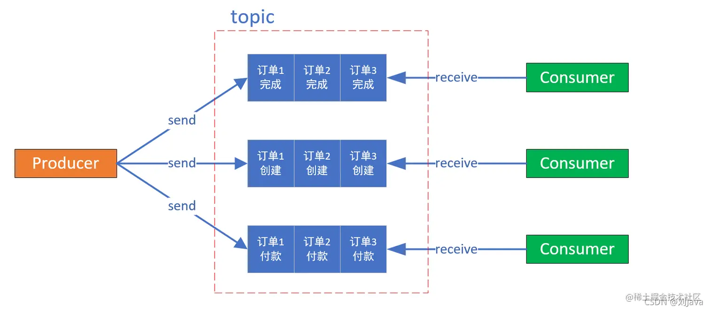
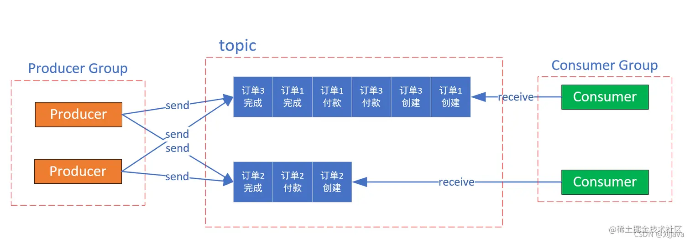

## 一、RocketMQ安装
   ### 1、在RocketMQ官网下载，解压后修改配置文件
   
   
   

   ### 2、启动 RocketMQ
   > ##### 2.1、启动 Name Server 
   > ##### 进入RocketMQ解压路径：nohup sh bin/mqnamesrv & tail -f ~/logs/rocketmqlogs/namesrv.log  
   > ①、nohup 命令用于在后台运行程序，并忽略 SIGHUP（终端关闭）信号。这意味着即使终端关闭，程序仍然会继续运行。  
     ②、sh bin/mqnamesrv：运行bin目录下的mqnamesrv文件  
     ③、& 符号用于将前面的命令放入后台执行。   
     ④、tail -f ~/logs/rocketmqlogs/namesrv.log：是用于实时查看指定日志文件的最新内容。-f 参数表示持续监视文件，并实时输出新增的日志内容。  

   > ##### 2.2、启动 Broker  
   > ##### 进入RocketMQ解压路径：nohup sh bin/mqbroker -n localhost:9876 & tail -f ~/logs/rocketmqlogs/broker.log  
   > ①、nohup 命令用于在后台运行程序，并忽略 SIGHUP（终端关闭）信号。这意味着即使终端关闭，程序仍然会继续运行。  
     ②、sh bin/mqbroker：运行bin目录下的mqbroker文件   
     ③、-n localhost:9876：指定了 Name Server 的地址。  
     ④、& 符号用于将前面的命令放入后台执行。  
     ⑤、tail -f ~/logs/rocketmqlogs/broker.log：是用于实时查看指定日志文件的最新内容。-f 参数表示持续监视文件，并实时输出新增的日志内容。

   ### 3、RocketMQ可视化工具：rocketmq-dashboard
   > 在GitHub上下载解压后，使用IDEA打开项目，进行可视化服务的相关配置。配置完后使用jar包方式运行。

   > 
   > 
   > 
     
## 二、RocketMQ介绍和使用
   消息队列中间件是分布式系统中重要的组件，主要解决应用耦合，异步消息，流量削锋等问题 实现高性能，高可用，可伸缩和最终一致性架构。
   RocketMQ是阿里研发的一个纯Java、分布式、队列模型的开源消息中间件，支持事务消息、顺序消息、批量消息、定时消息、消息回溯等。
   现在开源给apache基金会成为了apache的顶级开源项目，具有高性能、高可靠、高实时、分布式特点。
   
   ### 1、RocketMQ应用场景
   > #### ①、应用解耦: 一个简单的用户下单后根据支付金额增加用户积分的场景，传统模式下需要订单模块调用积分模块接口，这样的话订单模块与积分模块就形成了系统耦合，一旦积分模块有修改或出现异常就会影响订单模块功能。引入消息队列方案后, 用户下单成功后，将消息写入消息队列就可以了。积分模块只需要订阅下单消息，从消息队列中获取数据进行消费，这样订单模块和积分模块都只要专注实现自己的功能实现，实现解耦。
   > #### ②、数据分发：用户下单后日志模块要记录下单日志，库存模块需要减少相应库存，积分模块需要增加用户积分等由下单成功引起的其余模块的业务操作，这个时候可以通过消息队列可以让数据在多个系统更加之间进行流通。数据的产生方不需要关心谁来使用数据，只需要将数据发送到消息队列，数据使用方直接在消息队列中直接获取数据即可。
   > #### ③、削峰填谷：双十一期间系统受到的请求流量猛增，有可能会将系统压垮。传统做法是为了保证系统的稳定性，一般是增加服务器配置、新增服务器做负载均衡这样的话在正常时间段都能满足服务的情况下采用这种做法无疑是对服务器性能的一种浪费，并不划算！另一种做法是如果系统负载超过阈值，就会阻止用户请求，但在流量高峰时这会影响用户体验。通过消息队列就可以完美解决这个问题，引入消息队列方案后可以将大量请求缓存起来，分散到很长一段时间处理，这样可以大大提到系统的稳定性和用户体验。

  ```
  <!--rocketmq包-->
  <dependency>
      <groupId>org.apache.rocketmq</groupId>
      <artifactId>rocketmq-client</artifactId>
      <version>5.1.3</version>
  </dependency>
  ```
   ### 2、RocketMQ 优势  
     目前主流的 MQ 主要是 RocketMQ、kafka、RabbitMQ，其主要优势有：  
     ①、支持事务型消息（消息发送和 DB 操作保持两方的最终一致性，RabbitMQ 和 Kafka 不支持）  
     ②、支持结合 RocketMQ 的多个系统之间数据最终一致性（多方事务，二方事务是前提）  
     ③、支持 18 个级别的延迟消息（Kafka 不支持）  
     ④、支持指定次数和时间间隔的失败消息重发（Kafka 不支持，RabbitMQ 需要手动确认）  
     ⑤、支持 Consumer 端 Tag 过滤，减少不必要的网络传输（即过滤由MQ完成，而不是由消费者完成。RabbitMQ 和 Kafka 不支持）  
     ⑥、支持重复消费（RabbitMQ 不支持，Kafka 支持）  

### 三、RocketMQ 基本组成以及工作流程
   #### RocketMQ主要有四大核心组成部分：NameServer、Broker、Producer以及Consumer四部分。
   - #### 1. NameServer：是整个 RocketMQ 的“大脑” ，它是 RocketMQ 的服务注册中心，所以 RocketMQ 需要先启动 NameServer 再启动 Rocket 中的 Broker。
      
   - #### 2. Broker：消息服务器（Broker）是消息存储中心，主要作用是接收来自 Producer 的消息并存储，Consumer 从这里取得消息。它还存储与消息相关的元数据，包括用户组、消费进度偏移量、队列信息等。从部署结构图中可以看出 Broker 有 Master 和 Slave 两种类型，Master 既可以写又可以读，Slave不可以写只可以读。

   - #### 3. 生产者（Producer）也称为消息发布者，负责生产并发送消息至 Topic。生产者向brokers发送由业务应用程序系统生成的消息。RocketMQ提供了发送：同步、异步和单向（one-way）的多种范例。

   - #### 4. 消费者（Consumer）也称为消息订阅者，负责从 Topic 接收并消费消息。 消费者从brokers那里拉取信息并将其输入应用程序。
     
   - > 
     > #### RocketMQ工作流程
     > ①、NameServer 先启动  
       ②、Broker 启动时向 NameServer 注册  
       ③、生产者在发送某个主题的消息之前先从 NameServer 获取 Broker 服务器地址列表（有可能是集群），
          然后根据负载均衡算法从列表中选择一台Broker 进行消息发送。  
       ④、NameServer 与每台 Broker 服务器保持长连接，并间隔 30S 检测 Broker 是否存活，如果检测到Broker 宕机
         （使用心跳机制， 如果检测超120S），则从路由注册表中将其移除。  
       ⑤、消费者在订阅某个主题的消息之前从 NameServer 获取 Broker 服务器地址列表（有可能是集群），
          但是消费者选择从 Broker 中 订阅消息，订阅规则由 Broker 配置决定  


### 四、RocketMQ 基本概念
    1、消息模型（Message Model）
       RocketMQ主要由 Producer、Broker、Consumer 三部分组成，其中Producer 负责生产消息，Consumer 负责消费消息，Broker 负责存储消息。
       Broker 在实际部署过程中对应一台服务器，每个 Broker 可以存储多个Topic的消息，每个Topic的消息也可以分片存储于不同的 Broker。
       Message Queue用于存储消息的物理地址，每个Topic中的消息地址存储于多个 Message Queue 中。ConsumerGroup 由多个Consumer 实例构成。

    2、消息（Message）
       消息系统所传输信息的物理载体，生产和消费数据的最小单位，每条消息必须属于一个主题。
       RocketMQ中每个消息拥有唯一的Message ID，且可以携带具有业务标识的Key。系统提供了通过Message ID和Key查询消息的功能。

    3、主题（Topic）
       表示一类消息的集合，每个主题包含若干条消息，每条消息只能属于一个主题，是RocketMQ进行消息订阅的基本单位。
       比如一个电商系统可以分为：交易消息、物流消息等，一条消息必须有一个 Topic 。

    4、标签（Tag）
       为消息设置的标志，用于同一主题下区分不同类型的消息。来自同一业务单元的消息，可以根据不同业务目的在同一主题下设置不同标签。
       比如交易消息又可以分为：交易创建消息、交易完成消息等，一条消息可以没有 Tag 。标签能够有效地保持代码的清晰度和连贯性，并优化RocketMQ提供的查询系统。

    5、生产者组（Producer Group）
       同一类Producer的集合，这类Producer发送同一类消息且发送逻辑一致。如果发送的是事务消息且原始生产者在发送之后崩溃，
       则Broker服务器会联系同一生产者组的其他生产者实例以提交或回溯消费。

    6、消费者组（Consumer Group）
       同一类Consumer的集合，这类Consumer通常消费同一类消息且消费逻辑一致。消费者组使得在消息消费方面，实现负载均衡和容错的目标变得非常容易。
       要注意的是，消费者组的消费者实例必须订阅完全相同的Topic。RocketMQ 支持两种消息模式：集群消费（Clustering）和广播消费（Broadcasting）。

    7、支持拉（Pull）和推（Push）两种消息模式
       Pull其实就是消费者主动从MQ中去拉消息，Push 表面看似MQ推送消息。
       而在 Push 消费时，消费者是在不断轮询 Broker，询问是否有新消息可供消费。一旦有新消息到达，马上拉取该消息。
       也就是说 Push 模式内部使用了 Pull 消息的模式，这样就可以立即消费到最新的消息。
         那么 Push 模式或 Pull 模式如何进行消息的查询？
               能够想到的比较笨的方法是，每隔一定的时间（如1ms）就向 Broker 发送一个查询请求，如果没有新消息则立刻返回。
           可想而知这种方法非常浪费网络资源。
               RocketMQ 为了提高网络性能，在拉取消息时如果没有新消息，不会马上返回，而是会将该查询请求挂起一段时间，然后再重试查询。
           如果一直没有新消息，直到轮询时间超过设定的阈值才会返回。
               根据轮询设定的超时阈值大小的不同，RocketMQ 有两种轮询方式，分别为长轮询（默认）和短轮询。
           短轮询：longPollingEnable=false，轮询时间为 shortPollingTimeMills ，默认为 1s
           长轮询：longPollingEnable=true，轮询时间为 5s。
           拉取请求挂起时间：受 DefaultMQPullConsumer 的 brokerSuspendMaxTimeMillis 控制，默认push模式固定15s，pull模式固定20s。

    8、消费模式
       集群消费（Clustering）模式下，相同Consumer Group的每个Consumer实例平均分摊消息。
       广播消费（Broadcasting）模式下，相同Consumer Group的每个Consumer实例都接收全量的消息。

- ### > 消费顺序  
- > ①、例如：一个订单产生了三条消息分别是订单创建、订单付款、订单完成。消费时要按照这个顺序消费才能有意义，
    但是同时订单之间是可以并行消费的。RocketMQ可以严格的保证消息有序。  
    ②、顺序消息分为全局顺序消息与部分顺序消息，全局顺序是指某个Topic下的所有消息都要保证顺序；部分顺序消息只要保证每一组消息被顺序消费即可。  
    ③、如果想要实现全局顺序消息，那么只能使用一个队列，以及单个生产者，这是会严重影响性能。
  > 
  > 
  > 
  > ④、因此我们常说的顺序消息通常是指的部分顺序消息，就上面的例子来说，我们不用管不同的订单ID的消息之间的总体消费顺序，
  >    只需要保证同样订单ID的消息能按照订单创建、订单付款、订单完成这个顺序消费就可以了。  
  > ⑤、实现局部顺序消费实际上有两个核心点，一个是生产者有序存储，另一个是消费者有序消费。

- ### > 生产者有序发送
- > ①、普通发送消息的模式下，生产者会采用轮询的方式将消费均匀的分发到不同的队列中，然后被不同的消费者消费，
  > 因为一组消息在不同的队列，此时就无法使用 RocketMQ 带来的队列有序特性来保证消息有序性了。
  > 
  > 
  > 
  > ②、这个问题很好解决，因为RocketMQ支持生产者在投放消息的时候自定义投放策略，
  > 我们实现一个MessageQueueSelector接口，使用Hash取模法来保证同一个订单在同一个队列中就行了，
  > 即通过订单ID%队列数量得到该ID的订单所投放的队列在队列列表中的索引，然后该订单的所有消息都会被投放到这个队列中。
  > 
  > 

- ### > 消费者有序消费
- > ①、RockerMQ的MessageListener回调函数提供了两种消费模式，有序消费模式MessageListenerOrderly和并发消费模式MessageListenerConcurrently。  
  > ②、这个时候小曹就会想说：我生产者实现有序发送，我消费者为什么还要保持顺序消费呢？就算消费者不是有序消费，我的相同订单业务应该是遵循队列先进先出的特点，不影响最终的局部顺序消费啊。  
  > 真的是这样吗？实则不然。RocketMQ的每一个消费者的的消费端都是采用线程池实现多线程消费的模式，即消费端是多线程消费。这个时候RocketMQ可没有RabbitMQ的消息确认机制，
  > 所以在多线程情况下，每个线程消费者处理消息的速度会有所不同，就很有可能会导致同队列中后发送的消息先被消费，这就违背了消息顺序消费的初心了。  
  > ③、因此在消费的时候，消费者需要注册MessageListenerOrderly类型的回调接口实现单线程顺序消费。如果消费者采用Concurrently并行消费，则仍然不能保证消息消费顺序。

2. NameServer与zookeeper的区别  
   Name Server和ZooKeeper的作用大致是相同的，从宏观上来看，Name Server做的东西很少，就是保存一些运行数据，
   Name Server之间不互连，这就需要broker端连接所有的Name Server，运行数据的改动要发送到每一个Name Server来保证运行数据的一致性（这个一致性确实有点弱），
   这样就变成了Name Server很轻量级，但是broker端就要做更多的东西了。而ZooKeeper呢，broker只需要连接其中的一台机器，运行数据分发、一致性都交给了ZooKeeper来完成。

      1. Broker部署方式  
        Broker部署相对复杂，Broker分为Master与Slave，一个Master可以对应多个Slave，但是一个Slave只能对应一个Master，
        Master与Slave的对应关系通过指定相同的Broker Name，不同的BrokerId来定义，BrokerId为0表示Master，非0表示Slave。Master也可以部署多个。
        从物理结构上看 Broker 的集群部署方式有四种：单 Master 、多 Master 、多 Master 多Slave（同步刷盘）、多 Master多 Slave（异步刷盘）。
     2. 单 Master  
        这种方式一旦 Broker 重启或宕机会导致整个服务不可用，这种方式风险较大，所以显然不建议线上环境使用。
     3. 多 Master  
        所有消息服务器都是 Master ，没有 Slave 。这种方式优点是配置简单，单个 Master 宕机或重启维护对应用无影响。
        缺点是单台机器宕机期间，该机器上未被消费的消息在机器恢复之前不可订阅，消息实时性会受影响。
     4. 多 Master 多 Slave（异步复制）  
        每个 Master 配置一个 Slave，所以有多对 Master-Slave，消息采用异步复制方式，主备之间有毫秒级消息延迟。
        这种方式优点是消息丢失的非常少，且消息实时性不会受影响，Master 宕机后消费者可以继续从 Slave 消费，中间的过程对用户应用程序透明，
        不需要人工干预，性能同多 Master 方式几乎一样。 缺点是 Master 宕机时在磁盘损坏情况下会丢失极少量消息。
     5. 多 Master 多 Slave（同步双写）  
        每个 Master 配置一个 Slave，所以有多对 Master-Slave ，消息采用同步双写方式，主备都写成功才返回成功。
        这种方式优点是数据与服务都没有单点问题，Master 宕机时消息无延迟，服务与数据的可用性非常高。缺点是性能相对异步复制方式略低，发送消息的延迟会略高。


