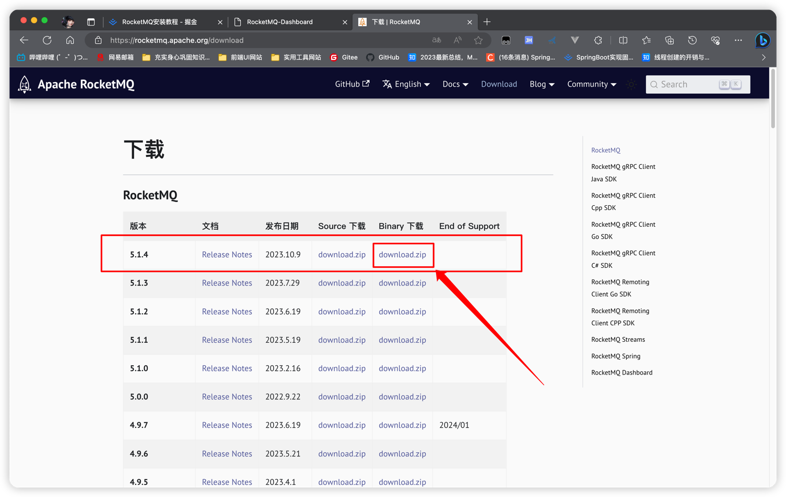
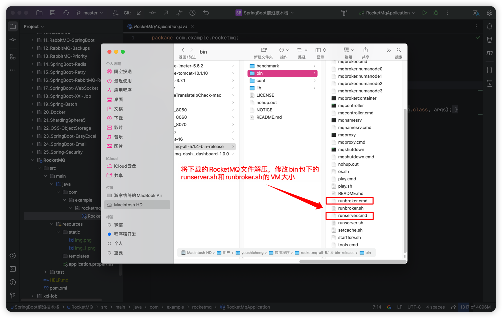
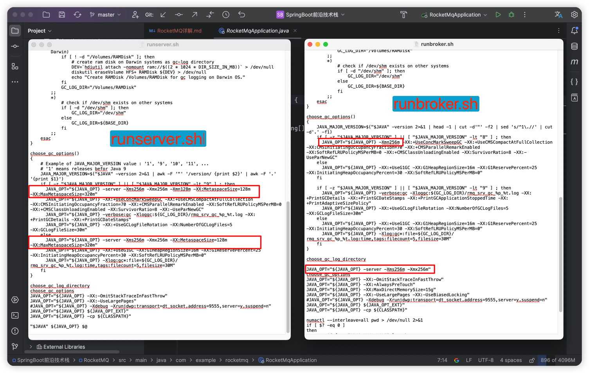
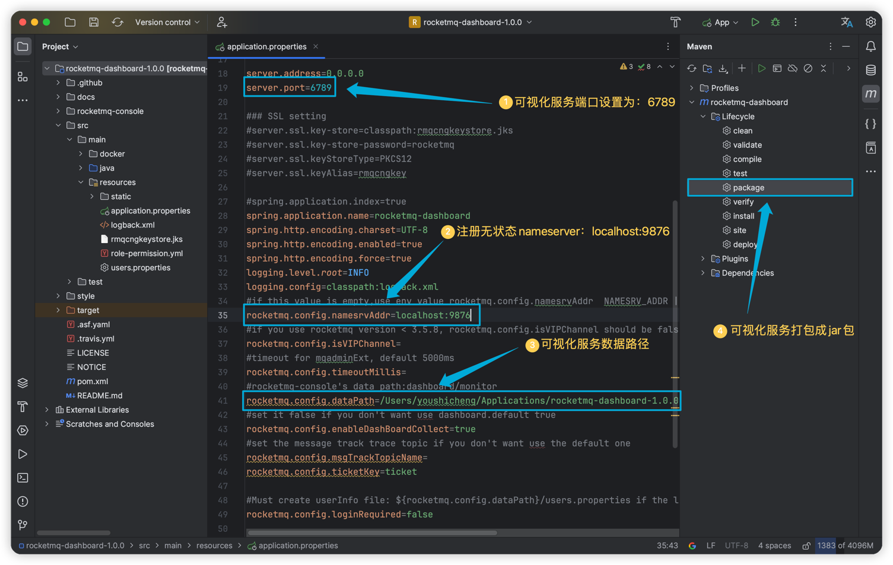
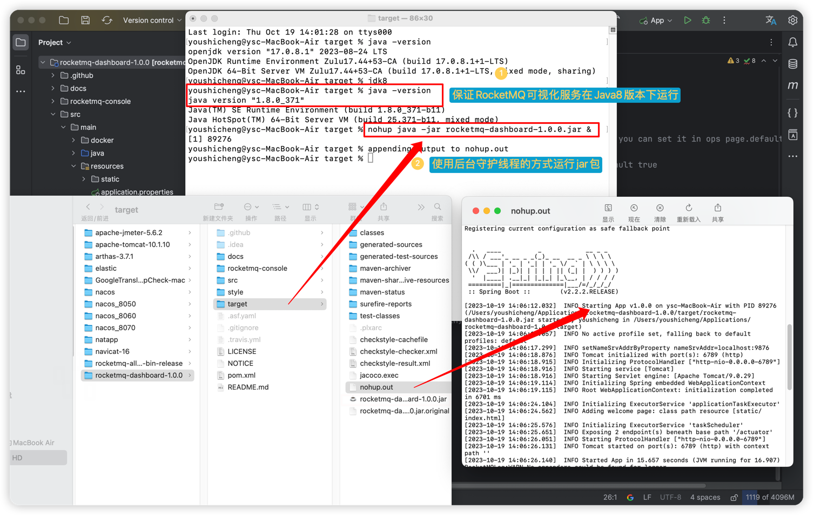
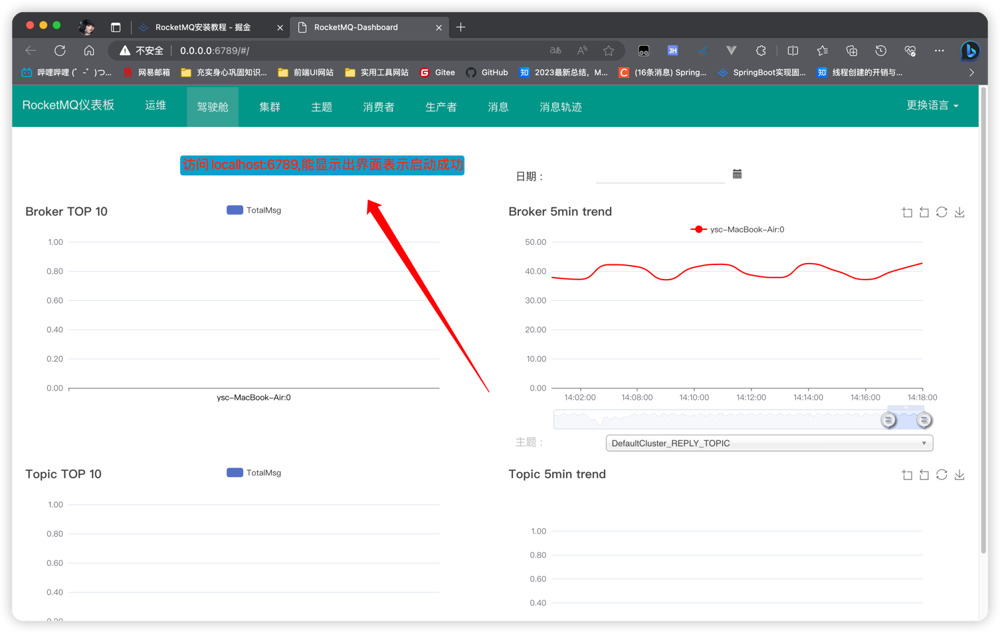

## 一、RocketMQ安装
   ### 1、在RocketMQ官网下载，解压后修改配置文件
   
   
   

   ### 2、启动 RocketMQ
   > ##### [1]、启动 Name Server 
   > 进入RocketMQ解压路径：nohup sh bin/mqnamesrv & tail -f ~/logs/rocketmqlogs/namesrv.log  
     nohup 命令用于在后台运行程序，并忽略 SIGHUP（终端关闭）信号。这意味着即使终端关闭，程序仍然会继续运行。  
     sh bin/mqnamesrv：运行bin目录下的mqnamesrv文件  
     & 符号用于将前面的命令放入后台执行。   
     tail -f ~/logs/rocketmqlogs/namesrv.log：是用于实时查看指定日志文件的最新内容。-f 参数表示持续监视文件，并实时输出新增的日志内容。  

   > ##### [2]、启动 Broker  
   > 进入RocketMQ解压路径：nohup sh bin/mqbroker -n localhost:9876 & tail -f ~/logs/rocketmqlogs/broker.log  
     nohup 命令用于在后台运行程序，并忽略 SIGHUP（终端关闭）信号。这意味着即使终端关闭，程序仍然会继续运行。  
     sh bin/mqbroker：运行bin目录下的mqbroker文件   
     -n localhost:9876：指定了 Name Server 的地址。  
     & 符号用于将前面的命令放入后台执行。  
     tail -f ~/logs/rocketmqlogs/broker.log：是用于实时查看指定日志文件的最新内容。-f 参数表示持续监视文件，并实时输出新增的日志内容。

   ### 3、RocketMQ可视化工具：rocketmq-dashboard
   > 在GitHub上下载解压后，使用IDEA打开项目，进行可视化服务的相关配置。配置完后使用jar包方式运行。

   > 
   > 
   > 
     
## 二、RocketMQ介绍和使用
   消息队列中间件是分布式系统中重要的组件，主要解决应用耦合，异步消息，流量削锋等问题 实现高性能，高可用，可伸缩和最终一致性架构。
   RocketMQ是阿里研发的一个纯Java、分布式、队列模型的开源消息中间件，后开源给apache基金会成为了apache的顶级开源项目，具有高性能、高可靠、高实时、分布式特点。
   
  > #### 应用解耦: 一个简单的用户下单后根据支付金额增加用户积分的场景，传统模式下需要订单模块调用积分模块接口，这样的话订单模块与积分模块就形成了系统耦合，一旦积分模块有修改或出现异常就会影响订单模块功能。引入消息队列方案后, 用户下单成功后，将消息写入消息队列就可以了。积分模块只需要订阅下单消息，从消息队列中获取数据进行消费，这样订单模块和积分模块都只要专注实现自己的功能实现，实现解耦。
  > #### 数据分发：用户下单后日志模块要记录下单日志，库存模块需要减少相应库存，积分模块需要增加用户积分等由下单成功引起的其余模块的业务操作，这个时候可以通过消息队列可以让数据在多个系统更加之间进行流通。数据的产生方不需要关心谁来使用数据，只需要将数据发送到消息队列，数据使用方直接在消息队列中直接获取数据即可。
  > #### 削峰填谷：双十一期间系统受到的请求流量猛增，有可能会将系统压垮。传统做法是为了保证系统的稳定性，一般是增加服务器配置、新增服务器做负载均衡这样的话在正常时间段都能满足服务的情况下采用这种做法无疑是对服务器性能的一种浪费，并不划算！另一种做法是如果系统负载超过阈值，就会阻止用户请求，但在流量高峰时这会影响用户体验。通过消息队列就可以完美解决这个问题，引入消息队列方案后可以将大量请求缓存起来，分散到很长一段时间处理，这样可以大大提到系统的稳定性和用户体验。

  ```
  <!--rocketmq包-->
  <dependency>
      <groupId>org.apache.rocketmq</groupId>
      <artifactId>rocketmq-client</artifactId>
      <version>4.8.0</version>
  </dependency>
  ```


