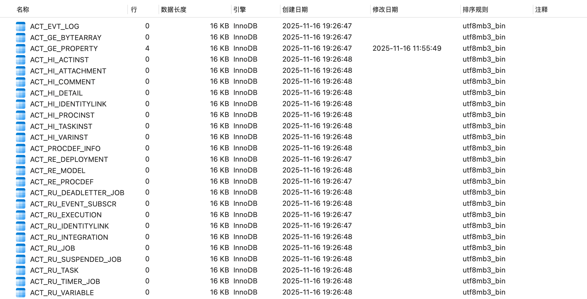

### Activiti的25张表介绍
启动SpringBoot后会在指定的数据库中自动创建activiti的25张表！！！

Activiti 使用到的表都是 ACT_ 开头的，表名的第二部分表示用途。

  ACT_GE_ （GE） 表示 general 全局通用数据及设置，各种情况都使用的数据。
  ACT_HI_ （HI） 表示 history 历史数据表，包含着流程执行的历史相关数据。如结束的流程实例，变量，任务，等等
  ACT_RE_ （RE） 表示 repository 存储，包含的是静态信息。如：流程定义，流程的资源（图片，规则等）。
  ACT_RU_ （RU） 表示 runtime 运行时，运行时的流程变量，用户任务，变量，职责（job）等运行时的数据。Activiti 只存储实例执行期间的运行时数据，当流程实例结束时，将删除这些记录。这就保证了这些运行时的表小且快。

# Activiti 工作流引擎数据库表分类

## 一般数据

| 表名 | 解释 |
|------|------|
| ACT_GE_BYTEARRAY | 二进制数据表，存储通用的流程定义和流程资源 |
| ACT_GE_PROPERTY | 系统相关属性，属性数据表存储整个流程引擎级别的数据，初始化表结构时，会默认插入三条记录 |

## 流程历史记录

| 表名 | 解释 |
|------|------|
| ACT_HI_ACTINST | 历史节点表 |
| ACT_HI_ATTACHMENT | 历史附件表 |
| ACT_HI_COMMENT | 历史的说明性信息 |
| ACT_HI_DETAIL | 历史的流程运行中的细节信息 |
| ACT_HI_IDENTITYLINK | 历史的流程运行过程中用户关系 |
| ACT_HI_PROCINST | 历史的流程实例 |
| ACT_HI_TASKINST | 历史的任务实例 |
| ACT_HI_VARINST | 历史的流程运行中的变量信息 |

## 流程定义表

| 表名 | 解释 |
|------|------|
| ACT_RE_DEPLOYMENT | 部署单元信息 |
| ACT_RE_MODEL | 模型信息 |
| ACT_RE_PROCDEF | 已部署的流程定义 |

## 运行实例表

| 表名 | 解释 |
|------|------|
| ACT_RU_EVENT_SUBSCR | 运行时事件 |
| ACT_RU_EXECUTION | 运行时流程执行实例 |
| ACT_RU_IDENTITYLINK | 运行时用户关系信息，存储任务节点与参与者的相关信息 |
| ACT_RU_JOB | 运行时作业 |
| ACT_RU_TASK | 运行时任务 |
| ACT_RU_VARIABLE | 运行时变量表 |
