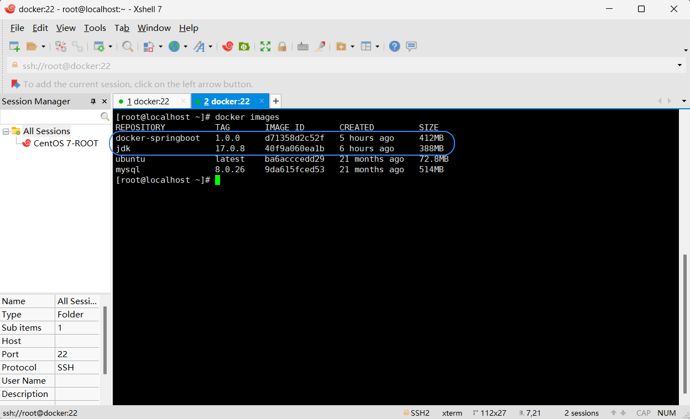
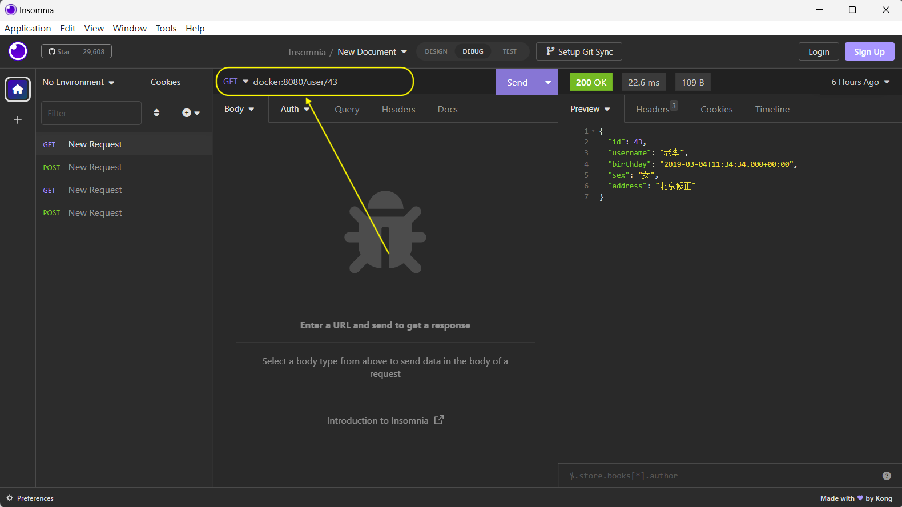
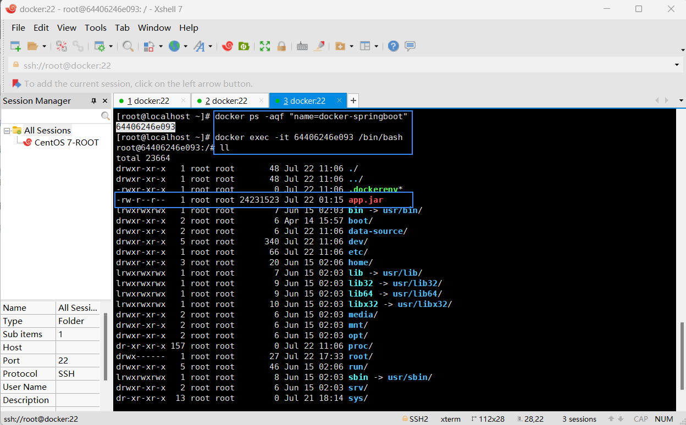

## 一、构建Java运行环境镜像

- ### 1.1 拉取ubuntu镜像

  ```
  docker pull ubuntu:23.04
  ```

***

- ### 1.2 拉取mysql镜像

  ```
  docker pull mysql:8.0.26
  docker images
  ```

  - #### 1.2.1 运行mysql镜像

    > **docker run -d -p 3306:3306 --name docker-mysql -v /mydata:/var/lib/mysql -e MYSQL_ROOT_PASSWORD=131474 mysql:8.0.26**
    >
    > - -d : 表示以守护进程（后台）模式启动容器。
    > - -p 3306:3306 : 第一个3306是指mysql这个服务的端口为3306；第二个3306是容器里运行环境开放的端口
    > - --name docker-mysql : 表示取的运行容器的名字
    > - -v /mydata:/var/lib/mysql : 将本机的/mydata下文件跟容器中/var/lib/mysql文件同步。      
                                    这是一个数据卷挂载选项。它将宿主机上的 /mydata 目录挂载到容器内的 /var/lib/mysql 目录。   
                                    这样做的好处是可以持久化 MySQL 数据库的数据，即使容器停止或删除后，数据仍然保留在宿主机上。
    > - -e MYSQL_ROOT_PASSWORD=131474 : 设置mysql初始密码
    > - mysql:8.0.26 : 就是容器运行的来源镜像

    ```
    # 显示所有docker容器
    docker ps
    ```
***

- ### 1.3 下载jdk17安装包
  - #### 1.3.1 下载

    ``` 
    # 通过wget命令下载jdk17
    wget https://download.oracle.com/java/17/latest/jdk-17_linux-x64_bin.tar.gz
    
    # 浏览器查看当前下载的jdk版本
    https://www.oracle.com/java/technologies/downloads/#jdk17-linux
    ```
  - #### 1.3.2 配置Dockerfile来制作jdk17镜像
    ```
    # 进入当前路径的Dockerfile配置文件中
    vim dockerfile
    ```

    ```
    # 指定基础镜像 ubuntu:23.04
    FROM ubuntu:23.04
    
    # 设置环境变量
    ENV JAVA_HOME=/usr/local/jdk-17.0.8
    ENV JRE_HOME=$JAVA_HOME/jre
    ENV PATH=${JAVA_HOME}/bin:$PATH
    
    # 复制当前路径下的jdk-17_linux-x64_bin.tar.gz文件或目录到容器的指定路径/usr/local/
    ADD jdk-17_linux-x64_bin.tar.gz /usr/local/
    # 运行指定的命令
    RUN javac --version \
        && java --version
    ```
  - #### 1.3.3 构建我们的jdk17镜像
    ```
    # 镜像名：java；版本：17.0.8
    docker build -t java:17.0.8 .
    
    -- 需要注意的是命令最后面一定要空格之后接一个.符号。表示的是通过当前路径下的Dockerdile构建jdk17镜像；
    -- 如果是docker build -t /opt/java:17.0.8 . 则表示通过路径/opt下的Dockerfile构建jdk17镜像)
    ```

     > 查看构建完成的jdk17镜像：docker images

     - 

***

- ### 1.4 部署SpringBoot项目

  - #### 1.4.1 上传我们的SpringBoot项目并进行Dockerfile配置

    > 新建一个目录
      注意：一开始路径是~，我们想要进入docker路径需要先 cd / 回车一下
      mkdir /opt/dockerfiles
    >
    > 将我们的SpringBoot项目上传到服务器，可以通过Xshell直接拖进我们想存放的目录/dockerfiles下，并在该目录下进行启动容器步骤配置  
     vim dockerfile
    ```
    # 指定基础镜像：仓库是java，tag是17.0.8
    FROM java:17.0.8
    # 定义匿名数据卷。相当于数据存档点，可以有多个，方便回到想要的数据存档点
    VOLUME "/data-source"
    # 当前路径下通配符匹配的jar包改名并复制到容器里为app.jar
    ADD *.jar app.jar
    # 暴露服务端口
    EXPOSE 8080
    # 容器启动时要执行的命令--启动Java命令
    CMD ["java", "-jar", "/app.jar", "-Dfile.encoding=utf-8"]
    ```
  - #### 1.4.2 构建名为docker-springboot的镜像
    ```
    # 后面的为镜像版本(可写可不写，不写的话就默认为latest)
    docker build -t docker-springboot:1.0.0 .
    docker build -t docker-springboot .
    
    docker images
    ```
    
     - 

  - #### 1.4.3 运行镜像docker-springboot，并取名容器名为docker-springboot
    > docker run -d -p 8080:8080 --name docker-springboot docker-springboot:1.0.0
    >
    > - -d : 作为守护进程
    > - -p 8080:8080 : 第一个8080是指镜像的端口为8080；第二个8080是容器里运行环境开放的端口
    > - --name docker-springboot : 表示取的运行容器的名字
    > - docker-springboot:1.0.0 : 就是容器运行的来源镜像

    *项目成功运行，我们现在来测试一下吧。这里的path路径被我使用switchHosts做了域名映射（192.168.2.128 docker)*
     
       - 

  - #### 1.4.4 进入容器目录
    ```
    # 查看容器Id
    docker ps -aqf "name=docker-springboot"
    
    # 进入docker-springboot容器目录：方法一
    docker exec -it docker-springboot /bin/bash
    # 进入docker-springboot容器目录：方法二
    docker exec -it 容器Id /bin/bash
    ```
     - 

***

- ### 1.5 命令
  ```
  # 删除镜像
  docker rmi [image镜像名]:[版本号.可不写，默认就是latest]
  
  # 启动容器运行
  docker start [container容器名]
  # 重启容器运行
  docker restart [container容器名]
  # 停止容器运行
  docker stop [container容器名]
  
  # 删除容器
  docker rm [container容器名]
  
  # 查看所有(包括启动失败)的容器
  docker ps -a
  
  # 删除文件
  rm -rf [文件名]
  ```