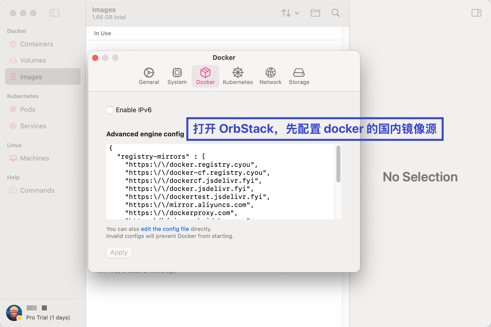
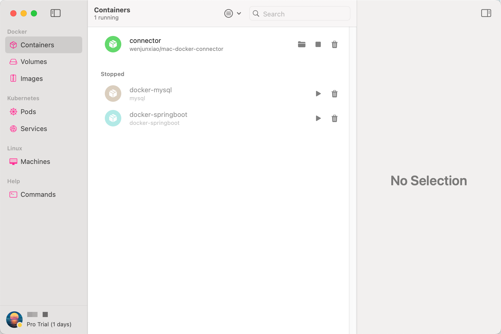
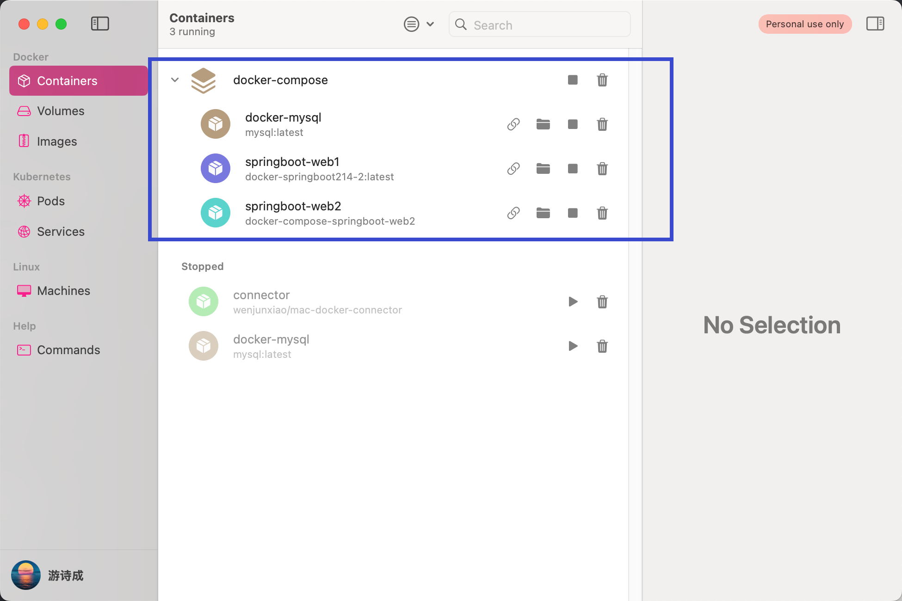

## OrbStack 官方地址：https://orbstack.dev/

   ### MacOS上的Docker Desktop原本就是饱受诟病：慢、重、资源消耗巨大。OrbStack的出现就是为了解决这个问题。
   ### 安装OrbStack【该软件包含了docker】：brew install orbstack

   <h3>
     1、简介
     <figure>
       OrbStack是一款零配置就能够轻松进行使用的虚拟机容器软件，能够免费的提供给个人使用，相对于Mac上面的其他虚拟机来说更为的简单,
       对于喜欢在Mac上面运行Linux个人来说更为的实用。
     </figure>
   </h3>

   <h3>
     2、配置国内 docker 加速镜像源
     <figure>
       自 2024年 6 月份，国内的 docker 镜像地址因监管要求被下架后，许多的开源地址都无法正常使用。
       <br/>
       截止目前 24年 10月，配置国内镜像源(比如阿里的docker镜像源)是对 'docker search [镜像名称]' 命令没有用的，
       因为docker的 search 命令最后还是通过他自己的地址搜索官方 Docker Hub 镜像，导致请求超时，无法正常响应。
       <br/>
       但是配置了国内镜像源可以去加快 pull 拉取镜像的速度。（只要不影响拉取镜像，个人觉得问题不大）
     </figure>
   </h3>

## OrbStack 的使用步骤

### 1、配置 docker 国内镜像源
  - 

### 2、拉取可能需要的镜像
   ```dockerignore
   docker pull mysql:latest
   docker pull redis:latest
   docker pull nginx:latest
   docker pull openjdk:23    
   
   # 打包 mysql 容器
   docker run -d -p 3306:3306 --name docker-mysql -v /mydata:/var/lib/mysql  -e MYSQL_ROOT_PASSWORD=123456 mysql:latest
     -d : 表示以守护进程（后台）模式启动容器。
     -p 3306:3306 : 第一个3306是指mysql这个服务的端口为3306；第二个3306是容器里运行环境开放的端口
     --name docker-mysql : 表示取的运行容器的名字
     -v /mydata:/var/lib/mysql : 将本机的/mydata下文件跟容器中/var/lib/mysql文件同步,这是一个数据卷挂载选项。   
                                 它将宿主机上的 /mydata 目录挂载到容器内的 /var/lib/mysql 目录。   
                                 这样做的好处是可以持久化 MySQL 数据库的数据，即使容器停止或删除后，数据仍然保留在宿主机上。
     -e MYSQL_ROOT_PASSWORD=123456 : 设置mysql初始密码
     mysql:latest : 就是容器运行的来源镜像
     
     在docker内有个“数据卷持久化”的概念，也就是我们常说的“数据挂载”。
     它的作用是，将宿主机上的数据与容器内的数据形成映射，实现数据的共享或者数据的保存；
     当删除容器的时候，在宿主机上仍然能够保留文件目录，这就是Volume，数据卷。
   ```
### 3、SpringBoot项目Docker打包部署

#### 3.1、查看 mysql 容器的ip地址
   ```dockerignore
   # 查看ip地址的目的在于，通常我们会在SpringBoot项目的yml配置文件中配置redis、mysql等参数，因此需要获取到它们在容器内的ip地址。
   
   方法一：docker inspect [容器名称] | grep IPAddress
   方法二：docker exec -it [容器名称] /bin/bash
          cat /etc/hosts
   ```

#### 3.2、将 SpringBoot 项目利用 Maven 等工具打成 Jar 包(docker-springboot.jar)。并将 Jar 包移动到自定义的数据卷目录下【这个数据卷目录可随意，例如：/tmp】

#### 3.3_1、制作 Dockerfile 文件（在项目目录(即：数据卷目录)下创建Dockerfile文件）
   ```dockerignore
   # 指定基础镜像：仓库是java，tag是23
   FROM openjdk:23
   # 定义匿名数据卷。相当于数据存档点，可以有多个，方便回到想要的数据存档点
   VOLUME /tmp
   # 暴露服务端口
   EXPOSE 8080
   # 当前路径下通配符匹配的jar包改名并复制到容器里为app.jar
   ADD *.jar app.jar
   # 容器启动时要执行的命令 -- 启动Java命令
   # 这里使用的脚本关键字 'CMD'、'ENTRYPOINT' 都能达到相同效果，但还是有差异语法的存在
   # CMD	    指定容器创建时的默认命令。（可以被覆盖）
   # ENTRYPOINT	设置容器创建时的主要命令。（不可被覆盖）
   ENTRYPOINT ["java", "-jar", "/app.jar", "-Dfile.encoding=utf-8"]
   ```

#### 3.3_2、Dockerfile 中 ARG 与 ENV 指令的区别
   ```dockerignore
   # ARG指令用于定义构建参数。它允许在构建映像时从外部传递参数。
   # 使用ARG指令来声明参数，还可以在后续的Dockerfile指令中使用这些参数。
   ARG VAR_A=5
   # 可以引用 ARG 指令定义的参数
   # 或者直接重新定义VAR_A值： CMD ["java", "-jar", "/app.jar", "-DVAR_A=8"]
   
   # ENV指令用于设置环境变量。它允许在构建映像时定义环境变量（不能从外部传递），并在容器运行时保持这些变量的值。
   # 这些变量在容器运行时是可用的，并且可以在容器内部的任何进程中使用
   ENV VAR_B $VAR_A
   
   # 场景：希望在容器运行时也可以获取到从外部传递的参数：结合 ARG、ENV 指令来实现
   docker build --build-arg VAR_A=yunsheng -t argtest:4.0.0 .
   CMD echo "My variable is $VAR_B"
   
   ARG指令定义的参数仅在构建映像期间可用，而ENV指令定义的环境变量在容器运行时可用。
   ARG指令可以在FROM指令之前使用，但ENV指令则不能。
   这是因为FROM指令之前的任何指令都在构建上下文中执行，而FROM指令之后的指令则在新的构建阶段中执行。
   ```

#### 3.4、把制作 Dockerfile 文件放入 Jar 包的同级目录（即项目目录[数据卷目录]），并制作镜像
   ```dockerignore
   # 执行完毕后直接就在 docker images 中看到这个SpringBoot项目的镜像。
   docker build -f Dockerfile -t docker-springboot .
   
     docker build：这是用于构建Docker镜像的命令。
     -f Dockerfile：-f 参数用于指定要使用的Dockerfile的位置。在本例中，Dockerfile就在当前工作目录下，因此你只需要指定文件名Dockerfile。
                    如果你的Dockerfile位于其他位置，可以指定完整的路径，如 -f /path/to/Dockerfile。
     -t docker-springboot：-t 参数用于给构建的镜像打标签（tag）。标签有两个组成部分：镜像名称和可选的冒号后跟版本号或别名。
                          在这个例子中，标签被设为docker-springboot，没有指定版本号或别名。
                          如果你想要加上版本号或其他标识符，可以这样做：-t docker-springboot:v1。
     .：这个点表示构建上下文的路径。构建上下文是指Docker需要用来构建镜像的源代码和文件所在的目录。
        在本例中，当前工作目录（.）作为构建上下文。
   ```

#### 3.5、创建容器并启动
   ```dockerignore
   docker run --name docker-springboot -p 8080:8080 -d docker-springboot
   
     --name docker-springboot : 表示取的运行容器的名字
     -p 8080:8080 : 第一个8080是指镜像的端口为8080；第二个8080是容器里运行环境开放的端口
     -d : 作为守护进程
     docker-springboot : 就是容器运行的来源镜像
   ```

### 4、MacOS无法连接docker容器解决方案
   4.1. 首先 Mac 端通过 brew 安装 docker-connector
   ```dockerignore
   brew install wenjunxiao/brew/docker-connector
   ```

   4.2. 然后执行以下命令把 docker 的所有 bridge 网络都添加到路由中
   ```dockerignore
   # 注意：/tmp/docker-connector.conf 是宿主机的可自定义路径地址
   docker network ls --filter driver=bridge --format "{{.ID}}" | xargs docker network inspect --format "route {{range .IPAM.Config}}{{.Subnet}}{{end}}" >> /tmp/docker-connector.conf
   ```

   4.3. 配置完成，直接启动服务（需要 sudo，路由配置启动之后仍然可以修改，并且无需重启服务立即生效）
   ```dockerignore
   sudo brew services start docker-connector
   ```
   4.4. 然后使用以下命令在 docker 端运行 wenjunxiao/mac-docker-connector，需要使用 host 网络，并且允许 NET_ADMIN
   ```dockerignore
   docker run -it -d --restart always --net host --cap-add NET_ADMIN --name connector wenjunxiao/mac-docker-connector
   ```
- 


### 5、docker-compose
#### 5.1 Compose 简介
    Compose 可以在单个主机上建立多个隔离环境，每个环境都可以配置多个所需的容器。这样就能一键启动环境的服务，避免手动一个一个启动服务。
    Compose 使用项目名称将环境彼此隔离。默认项目名称是项目目录的基本名称。可以使用-p 命令行选项或 COMPOSE_PROJECT_NAME 环境变量设置自定义项目名称。
    还可以使用 --project-directory 命令行选项自定义项目目录。
    通过 Compose，您可以使用 YML 文件来配置应用程序需要的所有服务。然后，使用一个命令，就可以从 YML 文件配置中创建并启动所有服务。

    总结：docker-compose 就是用来整合多个容器在一个环境中，便于启动管理。

#### 5.2 Compose 安装
   ```dockerignore
   # 安装 docker-compose
   brew install docker-compose
   
   # 查看版本
   docker-compose --version 
   ```


#### 5.3 Compose 简单使用语法
   ```dockerignore
   # 创建 docker-compose.yml 文件
   
   # 使用当前支持的最新版本
   # version: '3'    # 这个不是Docker Compose工具本身的版本，而是Docker Compose文件格式的版本。目前使用不需要再声明了，可以注释不写。
   services:          # 定义的服务列表，每个服务对应一个容器
     # 服务名称，这里自定义了一个名为 springboot-web1 的服务
     springboot-web1: 
       # 基于已有的镜像来制作容器
       image: docker-springboot214-2:latest 
       # container_name: docker-compose-springboot # 直接使用容器
       ports: # 端口映射
        - "8080:8080"
       # 容器数据卷映射
       volumes:
         - ../Docker-Volumes/project-volume:/tmp/data
       # depends_on 标签解决了从上到下启动容器的依赖先后的问题。但并不保证其依赖的服务完全初始化完成，只是保证先启动。
       depends_on:
         - docker-mysql
       #command: ['echo', 'hello world']
       container_name: Docker214
   
     # 服务名称，这里自定义了一个名为 springboot-web2 的服务
     springboot-web2: 
       # 除了可以基于指定的镜像，还可以基于一份Dockerfile。需要指定 Dockerfile所在文件夹的路径
       build:         
         context: ../Docker-Images/docker-compose-build
         dockerfile: Dockerfile
         args:
          - buildno=1
          - password=secret
       ports: # 端口映射
        - "8081:8081"
       # 容器数据卷映射
       volumes:
         - ../Docker-Volumes/project-volume:/tmp/data
       # depends_on 标签解决了从上到下启动容器的依赖先后的问题。但并不保证其依赖的服务完全初始化完成，只是保证先启动。
       depends_on:
         - docker-mysql
       #command: ['echo', 'hello world']
       container_name: Docker215
   
     docker-mysql:
       image: mysql:latest
       ports:
         - "3306:3306"
       environment:
         MYSQL_ROOT_PASSWORD: '123456'
         MYSQL_ALLOW_EMPTY_PASSWORD: 'no'
       # 定义该服务网络
       networks: 
         mynet:
           ipv4_address: 192.168.214.2  # 指定Ip

   # 配置 docker 服务列表网络
   networks: 
     mynet:  # mynet是自定义的网络名称
       ipam:
         config:
           - subnet: "192.168.214.0/24" # subnet是网络号段
   ```
   > ### 进入 docker-compose.yml 文件所在目录的终端执行命令
   > #### 启动 Compose： docker-compose up -d   
   > #### 查看启动状态：docker-compose ps   
   > #### 查看服务启动日志：docker-compose logs [服务名]
   
   - 


## 扩展知识

   #### 1、不使用 docker-compose 也能定义网桥，并指定容器的运行Ip
   ```dockerignore
   # 创建名称为'netBridgeName'的自定义网桥
   docker network create --subnet=x.x.x.0/24 netBridgeName   
   # 运行容器并指定IP地址 
   docker run -itd --network=netBridgeName --ip x.x.x.x --name [容器名] [镜像名]
   ```

   #### 2、当镜像为 latest 时，如何知道该镜像的具体版本号
   ```dockerignore
   # 使用以下命令查看镜像的具体版本号
   docker image inspect [镜像名称]:latest | grep -i version
   ```
