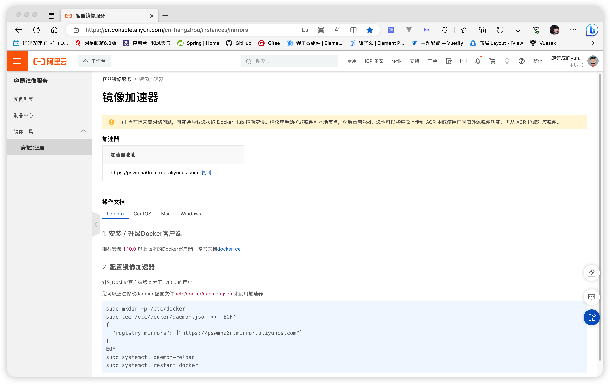
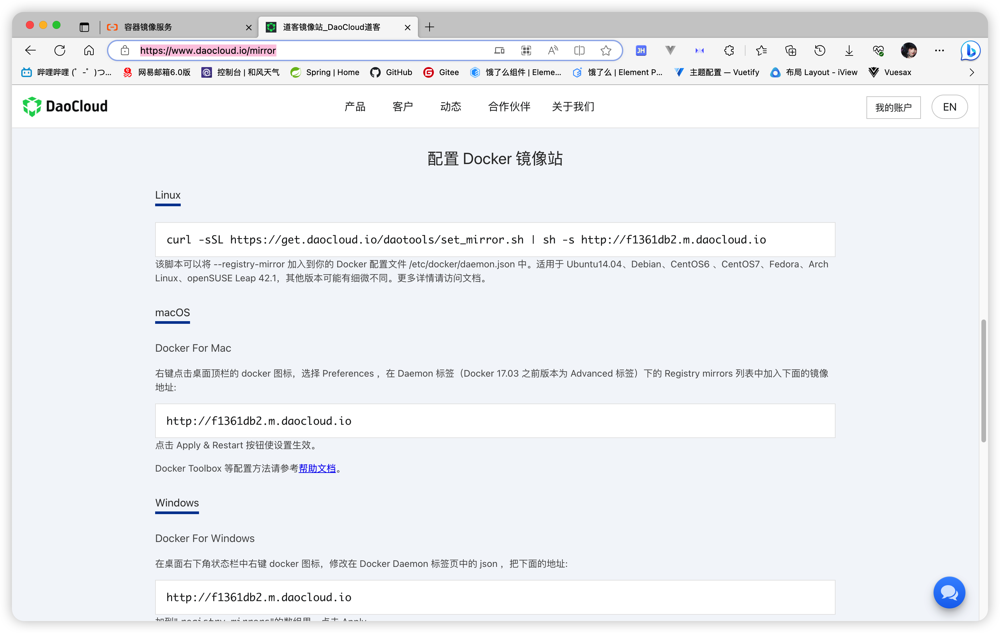

## 一、安装docker-ce社区版

- 配置repo源

  ``` 
  curl -o /etc/yum.repos.d/Centos-7.repo http://mirrors.aliyun.com/repo/Centos-7.repo
  curl -o /etc/yum.repos.d/docker-ce.repo http://mirrors.aliyun.com/docker-ce/linux/centos/docker-ce.repo
  
  yum clean all && yum makecache
  ```

- 查看可下载版本

  ```
  yum list docker-ce --showduplicates | sort -r
  ```

- 安装

  ```
  # 最新版
  yum install -y docker-ce
  # 指定版本
  yum install -y docker-ce-23.0.6
  ```

## 二、启动docker-ce社区版
- ### 2.1.1 设置开机启动
  ```
  systemctl enable docker
  ```

- ### 2.1.2 启动docker

  ```
  # 启动
  systemctl start docker
  # 重启
  systemctl restart docker
  ```

- ### 2.1.3 停止docker

  ```
  systemctl stop docker
  ```

- ### 2.1.4 其他

  ```
  # 查看docker版本
  docker version
  
  # 查看docker信息
  docker info
  
  # docker-client
  # 列出本地主机上已有镜像的基本信息
  docker images
  # 搜索docker有哪有ubuntu版本
  docker search ubuntu
  ```

- ### 2.2 配置镜像加速
  - 启动docker后需要安装ubuntu(乌邦图)系统，由于下载地址在国外，速度会非常缓慢。因此我们需要在国内找一个镜像下载

    [阿里云容器镜像服务 (aliyun.com)](https://cr.console.aliyun.com/cn-hangzhou/instances/mirrors)
    

    [道客镜像站_DaoCloud道客](https://www.daocloud.io/mirror)
    

- ### 2.2.1 在命令行中进行镜像配置

  ```
  sudo mkdir -p /etc/docker
  ```

  ```
  # 添加镜像路径到配置文件
  sudo tee /etc/docker/daemon.json <<-'EOF'
  {
    "registry-mirrors": [
      "https://pswmha6n.mirror.aliyuncs.com",
      "http://f1361db2.m.daocloud.io"
    ]
  }
  EOF

  # 查看镜像是否添加成功
  cat /etc/docker/daemon.json
  ```

  ```
  # 镜像添加成功，我们需要加载一下让镜像生效
  sudo systemctl daemon-reload
  ```

  ```
  # 然后再重启一下docker
  sudo systemctl restart docker
  ```

- ### 2.3 下载ubuntu操作系统镜像(Docker 容器需要一个基础的操作系统层来运行这些应用程序和服务)

  ```
  # 查看docker有哪些容器
  docker ps
  
  # 搜索有哪些ubuntu版本
  docker search ubuntu
  
  # docker拉取ubuntu, 版本为23.04
  docker pull ubuntu:23.04
  ```

- ### 2.4 宿主机网卡转发
  - 我们的docker中有许多的容器，每一个容器中可能有不同的服务。
    例如ubuntu+redis、ubuntu+mysql、ubuntu+kafka.....
  - 所以我们在请求这些服务的时候，需要通过转发才能把合适的请求打给我们想要的服务上面。因此我们需要进行一些转发配置

  ```
  cat <<EOF > /etc/sysctl.d/docker.conf
  net.bridge.bridge-nf-call-ip6tables = 1
  net.bridge.bridge-nf-call-iptables = 1
  net.ipv4.conf.default.rp_filter = 0
  net.ipv4.conf.all.rp_filter = 0
  net.ipv4.ip_forward = 1
  EOF
  ```

  ```
  sysctl -p /etc/sysctl.d/docker.conf
  ```