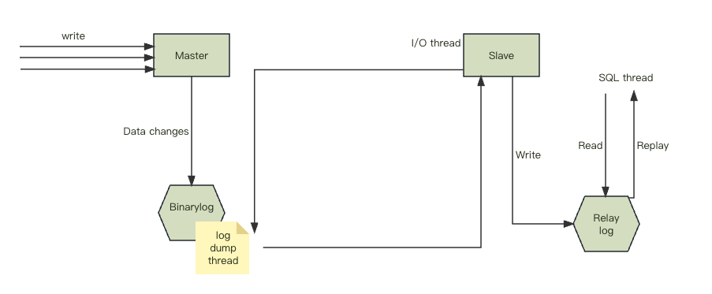

##  一、MySql 主从同步
 ### 1. 为什么要做主从复制
   - 在业务复杂的系统中，有这么一个情景，有一句sql语句需要锁表，导致暂时不能使用读的服务，那么就很影响运行中的业务，使用主从复制，让主库负责写，从库负责读，这样，即使主库出现了锁表的情景，通过读从库也可以保证业务的正常运行。  
   - 做数据的热备，主库宕机后能够及时替换主库，保证业务可用性。
   架构的扩展。业务量越来越大，I/O访问频率过高，单机无法满足，此时做多库的存储，降低磁盘I/O访问的频率，提高单个机器的I/O性能

 ### 2. MySQL主从复制的流程
   -   
   （1） 主库db的更新事件(update、insert、delete)被写到binlog  
   （2）主库创建一个binlog dump thread，把binlog的内容发送到从库  
   （3）从库启动并发起连接，连接到主库  
   （4）从库启动之后，创建一个I/O线程，读取主库传过来的binlog内容并写入到relay log  
   （5）从库启动之后，创建一个SQL线程，从relay log里面读取内容，从Exec_Master_Log_Pos位置开始执行读取到的更新事件，将更新内容写入到slave的db

 ### 3. MySQL主从复制的原理
   - MySQL主从复制是一个异步的复制过程，主库发送更新事件到从库，从库读取更新记录，并执行更新记录，使得从库的内容与主库保持一致。  
   - binlog：binary log，主库中保存所有更新事件日志的二进制文件。binlog是数据库服务启动的一刻起，保存数据库所有变更记录（数据库结构和内容）的文件。在主库中，只要有更新事件出现，就会被依次地写入到binlog中，之后会推送到从库中作为从库进行复制的数据源。  
   - binlog输出线程：每当有从库连接到主库的时候，主库都会创建一个线程然后发送binlog内容到从库。 对于每一个即将发送给从库的sql事件，binlog输出线程会将其锁住。一旦该事件被线程读取完之后，该锁会被释放，即使在该事件完全发送到从库的时候，该锁也会被释放。  
   - 在从库中，当复制开始时，从库就会创建从库I/O线程和从库的SQL线程进行复制处理。  
   - 从库I/O线程：当START SLAVE语句在从库开始执行之后，从库创建一个I/O线程，该线程连接到主库并请求主库发送binlog里面的更新记录到从库上。 从库I/O线程读取主库的binlog输出线程发送的更新并拷贝这些更新到本地文件，其中包括relay log文件。  
   - 从库的SQL线程：从库创建一个SQL线程，这个线程读取从库I/O线程写到relay log的更新事件并执行。  
   
   - 综上所述，可知：  
      - 对于每一个主从复制的连接，都有三个线程。拥有多个从库的主库为每一个连接到主库的从库创建一个binlog输出线程，每一个从库都有它自己的I/O线程和SQL线程。  
      - 从库通过创建两个独立的线程，使得在进行复制时，从库的读和写进行了分离。因此，即使负责执行的线程运行较慢，负责读取更新语句的线程并不会因此变得缓慢。  
      - 比如说，如果从库有一段时间没运行了，当它在此启动的时候，尽管它的SQL线程执行比较慢，它的I/O线程可以快速地从主库里读取所有的binlog内容。这样一来，即使从库在SQL线程执行完所有读取到的语句前停止运行了，I/O线程也至少完全读取了所有的内容，并将其安全地备份在从库本地的relay log，随时准备在从库下一次启动的时候执行语句。

 ### 4. 准备主服务器
- step1：在 docker 中创建并启动Mysql 主服务器：端口 3306
  ```
  docker run -d \
  -p 3306:3306 \
  -v /mysql/master/conf:/etc/mysql/conf.d \ mysql配置文件映射到宿主机上
  -v /mysql/master/data:/var/lib/mysql \ mysql数据映射到宿主机上
  -e MYSQL_ROOT_PASSWORD=131474 \
  --name mysql-master \
  mysql:8.0.26
  ```
- step2:创建 Mysql 主服务器配置文件  
  &emsp;&emsp;默认情况下 Mysql 的 binlog 地址是自动开启的，可以通过如下配置定义一些可选配置
  ```
  vim /mysql/master/conf/my.cnf
  ```

  &emsp;&emsp;配置如下内容
  ```
  [mysqlId]
  # 服务器唯一 ID，默认值 1
  server-id=1
  # 设置日志格式，默认值 ROW
  # binlog_format=STATEMENT：日志记录的是主机数据库的写指令，性能高，但是 now() 之类的函数以及获取系统参数的操作会出现主从数据不同步的问题
  # binlog_format=ROW(默认)：日志记录的是主机数据库的写后的数据，批量操作是性能较差，解决 now() 或者 eceUser() 或者 @@hostname 等操作在主从机器上不一致的问题
  binlog_format=STATEMENT
  
  # 二进制日志名，默认 binlog
  # log-bin=binlog
  # 设置需要复制的数据库，默认复制全部数据库
  # binlog-do-db=mytestdb
  # 设置不需要复制的数据库
  # binlog-ignore-db=mysql
  # binlog-ignore-db=infomation_schema
  ```

  &emsp;&emsp;重启 MySQL 容器  
  &emsp;&emsp;&emsp;&emsp;`docker restart mysql-master`

- step3：使用命令行登录 Mysql 主服务器
  ```
  # 进入容器：env LANG=C.UTF-8避免容器中显示中文乱码
  docker exec -it mysql-master env LANG=C.UTF-8 /bin/bash
  # 进入容器内的 mysql 命令行
  mysql -uroot -p
  # 修改默认密码校验方式（这里修改是使用的 Mysql 自带的可视化连接，可能会出现密码校验方式问题。一般使用自己的 navicat 没问题，所以我自己就没有执行这条一句进行修改）
  ALTER USER 'root'@'%' IDENTIFIED WIHT mysql_native_password BY '131474';
  ``` 

- step4：主机中创建名为 mysql_slave 用户(在 Mysql 命令行中执行命令)
  ```
  -- 创建 mysql_slave 用户,密码为 131474
  CREATE USER 'mysql_slave'@'%' IDENTIFIED BY '131474'; 
  -- 授予复制权限
  GRANT REPLICATION SLAVE ON *.* TO 'mysql_slave'@'%';
  -- 刷新权限
  FLUSH PRIVILEGES;
  ```
- step5：主机中查询 master 状态  
  &emsp;&emsp;执行完此步骤后不要在操作主服务器 MySQL，防止主服务器状态值变化  
  &emsp;&emsp;&emsp;&emsp;`SHOW MASTER STATUS;`  
  &emsp;&emsp;记下 File 和 Position 的值。执行完此步骤后不要再操作主服务器 Mysql，防止主服务器状态值变化。
  

---

### 5. 准备从服务器