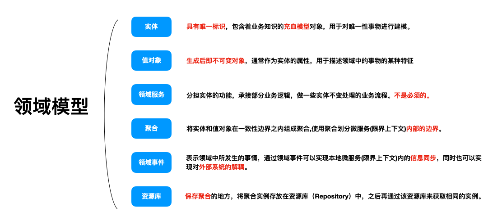
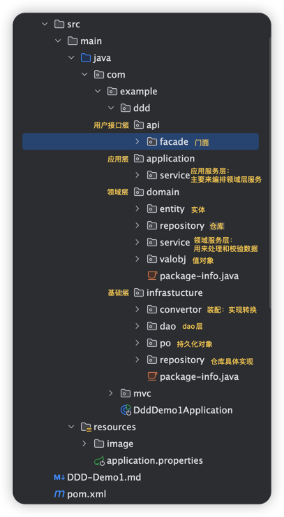

## 一、DDD架构
    说到 DDD，绕不开 MVC，在 MVC 三层架构中，我们进行功能开发之前，拿到需求，解读需求。  
    往往最先做的一步就是先设计表结构，再逐层设计上层 dao，service，controller。  
    对于产品或者用户的需求都做了一层自我理解的转化。
    
    用户需求在被提出之后经过这么多层的转化后，特别是研发需求在数据库结构这一层转化后，将业务以主观臆断行为进行了转化。  
    一旦业务边界划分模糊，考虑不全，大量的逻辑补充堆积到了代码层面，变得越来越难维护。会随着时间需求的增加，逐渐成为屎山。

    比如我们现在要做一个电商订单下单的需求，涉及到用户选定商品，下订单、支付订单、对用户下单时的订单发货：  
    MVC 架构：我们常见的做法是在分析好业务需求之后，就开始设计表结构了，订单表，支付表，商品表等等。  
             然后编写业务逻辑，第一个版本的需求上线后，功能迭代了。  
             现在要求订单支付后我可以取消，下单的商品我们退换货，是不是又需要进行加表，紧跟着对于的实现逻辑也进行修改。  
             功能不断迭代，代码就不断地层层往上叠。    
    DDD 架构：我们先进行划分业务边界。这里面核心是订单，那么订单就是这个业务领域里面的聚合逻辑的体现。
             支付、商品信息、地址等等都是围绕着订单实体。订单本身的属性决定了之后，类似于地址也只是一个属性的体现。
             当你将订单的领域模型构建好之后，后续的逻辑边界与仓储设计也就随之而来了。

## 二、什么是贫血模型与充血模型？
    贫血模型：领域对象（POJO）里只有get和set方法，没有业务逻辑，所有的业务逻辑都放在Business Logic层（Service）
            优点：
                各层单向依赖，结构清楚，易于实现。
                设计简单易行，底层模型非常稳定。
            缺点：
                当业务迭代版本过多，可能会导致业务逻辑代码过量，致使Service层过于厚重。
    充血模型：指数据和对应的业务逻辑被封装到同一个类中。因此，这种充血模型满足面向对象的封装特性，是典型的面向对象编程风格。
            领域对象（POJO）里既有get和set方法，所有的业务逻辑都在领域对象（POJO）里
            优点：
                面向对象，Business Logic符合单一职责，不像在贫血模型里面那样包含所有的业务逻辑太过沉重
            缺点：
                什么样的逻辑应该放在Domain Object中，什么样的业务逻辑应该放在Business Logic中，这是很含糊的。

## 三、DDD领域模型
#### 

## 四、对比分析
    1.为什么基于贫血模型的传统开发模式如此受欢迎？
        基于贫血模型的传统开发模式，将数据与业务逻辑分离，违反了 OOP 的封装特性，实际上是一种面向过程的编程风格。
        但是，现在市场几乎所有的 Web 项目，都是基于这种贫血模型的开发模式。
        
        第一点原因是：大部分情况下，我们开发的系统业务可能都比较简单，简单到就是基于 SQL 的 CRUD 操作，
                    所以，我们根本不需要动脑子精心设计充血模型，贫血模型就足以应付这种简单业务的开发工作。
        第二点原因是：思维已固化，转型有成本。基于贫血模型的传统开发模式经历了这么多年，已经深得人心、习以为常。
                    如果转向用充血模型、领域驱动设计，那势必有一定的学习成本、转型成本。
                    很多人在没有遇到开发痛点的情况下，是不愿意做这件事情的。

    2.什么项目应该考虑使用基于充血模型的 DDD 开发模式？
        相对应的，基于充血模型的 DDD 开发模式，更适合业务复杂的系统开发。
        比如，包含各种“利息计算模型”、“还款模型”等复杂业务的金融系统。
        
        你可能会有一些疑问，这两种开发模式，落实到代码层面。
        区别不就是一个将业务逻辑放到 Service 类中，一个将业务逻辑放到 Domain 领域模型中吗？
        为什么基于贫血模型的传统开发模式，就不能应对复杂业务系统的开发？而基于充血模型的 DDD 开发模式就可以呢？
        
        不夸张地讲，我们平时的MVC架构开发，大部分都是 SQL 驱动（SQL-Driven）的开发模式。
        接到一个后端接口开发需求的时候，就去看接口需要的数据对应到数据库中的哪些表，然后思考如何编写 SQL 语句来获取数据。
        之后就是定义 Entity、BO、VO，然后模板式地往对应的 Repository、Service、Controller 类中添加代码。
        但是当又有新业务开发功能的时候，只能重新写个满足新需求的 SQL 语句，这就可能导致区别很小的 SQL 语句满天飞，复用性差。
        对于简单业务系统来说，这种开发方式问题不大。但对于复杂业务系统的开发来说，这样的开发方式会让代码越来越混乱，最终导致无法维护。
        
        如果我们在项目中，应用基于充血模型的 DDD 的开发模式，那对应的开发流程就完全不一样了。
        在这种开发模式下，我们需要事先理清楚所有的业务，定义领域模型所包含的属性和方法。
        领域模型相当于可复用的业务中间层。新功能需求的开发，都基于之前定义好的这些领域模型来完成。

    3.总结
        不要为了炫技，啥都要搞个 DDD，两者如何选择：

        MVC：上来就可以开干，短平快，前期用起来很香，整体开发效率也更高。
             所以对于紧急，或者不那么重要的项目，我会直接用 MVC 怼。
             不好的地方就是，后面会越来越复杂，可能最后就是一坨屎山。
             但是很多时候，比如老板进度催的紧，我哪想到那么多以后呢？
        DDD：前期需要花大量时间设计好领域模型，对于一些基础组件，或者一些核心服务。
             如果对象模型非常复杂，建议采用 DDD，前期可能会稍微痛苦一些，但是后期维护起来会非常方便。

## 五、DDD项目结构
#### 

