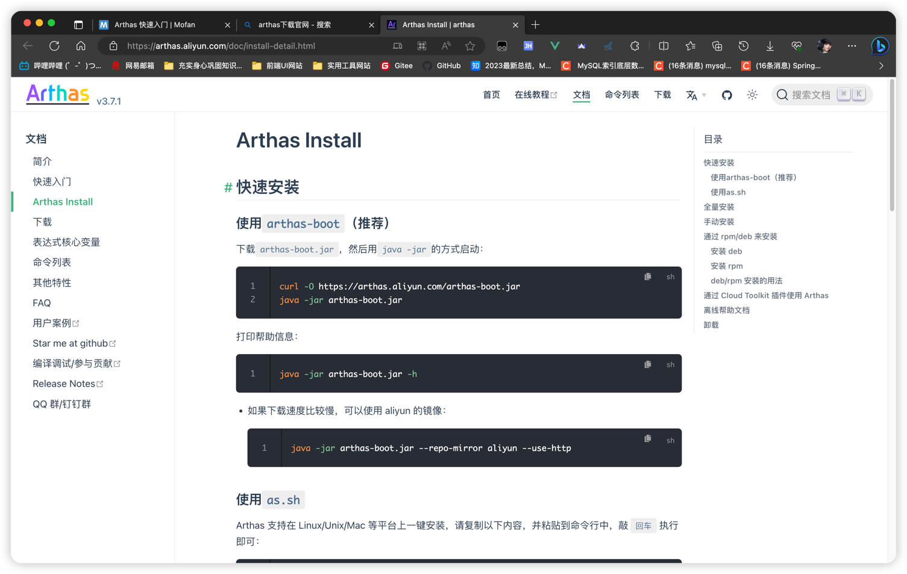

## 使用 Arthas

### 一、Arthas 的简介

- Arthas 是一款线上监控诊断产品，通过全局视角实时查看应用
  Load、内存、GC、线程的状态信息，并能在不修改应用代码的情况下，对业务问题进行诊断，
- 包括查看方法调用的出入参、异常，监测方法执行耗时，类加载信息等，大大提升线上问题排查效率。

### 二、Arthas 能解决什么问题？

Arthas 是阿里巴巴出品的线上 JVM 监控诊断利器，它适用于：

1. 有没有一个全局 JVM 运行时监控？能够显示 CPU、线程、内存、堆栈等信息

2. CPU 飙高是什么原因造成的？

3. 接口没反应、卡住了，是不是死锁了？

4. CTO 说你们这个接口太慢了，要优化一下，如何准确找出耗时的代码？

5. 写的代码没有执行，是部署的分支不对，还是压根没提交？

6. 线上有一个低级错误，改起来很简单，能不能在不重启应用的情况下，进行类替换，达到热部署？

### 三、Arthas快速入门

1. #### 进入Arthas 官网下载 https://arthas.aliyun.com/doc/install-detail.html

2. #### 选择自己合适的下载方式(这里我是选择的手动安装)
   

3. #### 在启动 Arthas 前，需要启动一个 Java 运行的JVM进程。执行ArthasDemo类中的 justRun() 方法

4. #### 启动Arthas的第一种方式
   [1]、 终端输入 java -jar arthas-boot.jar
   
   [2]、 可以发现有四个可以监控的 Java 进程。如果直接回车，发现并不能监控到我们想要的
   Java 进程
   
   [3]、 所以在展示 Arthas的LOGO 之前输入想要的
   Java进程序号，但是这样子会报错。原因在于:我们之前直接回车选择监控的Maven进程并没有结束也没有关闭
   
   [4]、 因此，我们需要先进入Arthas中，执行 stop命令 关闭对Maven进程监控。
   
   [5]、 重新输入启动命令，选择 Java进程序号
   

5. #### 启动Arthas的第二种方式
   [1]、 使用jps命令，查询 Java 进程的 pid。它可以显示Java虚拟机进程的执行主类名称、本地虚拟机唯一ID等信息。
   另外，jps命令只能显示它有访问权限的Java进程的信息。
   
   [2]、 终端输入 java -jar arthas-boot.jar 进程pid （如果出现类似错误：也是使用
   stop 命令）
   

6. #### 执行 seeThread() 方法并重新启动Arthas。输入 dashboard，查看 JVM 运行时监控
   

7. #### 按 Ctrl + C 退出后。输入 thread 命令可以查看当前线程信息、线程的堆栈。
   

8. #### 目标线程的序号是 17，运行下列命令查看 17 号线程对应的信息：
   

9. #### 执行ArthasDemo类中的 seeProductionCode() 方法并重新启动Arthas。jad是最简单的class反编译为java文件的小工具，使用 jad 命令进行反编译查看线上文件（避免中文乱码：java -Dfile.encoding=UTF-8 -jar arthas-boot.jar）
   

10. #### sc 命令功能：查看 JVM 已加载的类信息。
        输入：sc com.example.*
        结果：打印出 com.example 包下的所有类信息

        输入：sc -d com.example.SpringBootArthasApplication
        结果：打印出 SpringBootArthasApplication类详细信息

        输入：sc -d -f com.example.SpringBootArthasApplication
        结果：打印出 SpringBootArthasApplication类详细信息，还有类的 Field 信息

### 四、Arthas进阶使用

1. #### 方法的监测（执行 printCarInfo() 方法）
   [1]、watch 命令用于监测方法执行数据 [不需要记忆，可以使用 IDEA 插件生成命令]
   

   [2]
   、生成的命令就在剪切板里，直接粘贴到终端 [watch 全限定类名 方法名 检测的属性 监测5次 输出的对象属性遍历深度为3]
   

   [3]、trace 命令用于获取方法内部调用路径，并输出方法路径上的每个节点上耗时。(
   耗时占比最高的部分会高亮显示)
   

   [4]、stack 命令用于输出当前方法被调用的调用路径。
   

   [5]、monitor 命令用于方法执行监控。
   

2. #### 错误定位（CPU 及内存飙高的原因）
   [1]、死循环的定位（执行 deadLoop() 方法）
	- 使用 dashboard 查看线程信息与内存信息：main() 线程的 CPU 使用率达到90%多，内存中的
	  nonheap 和 metaspace 使用率非常高。
	  

   [2]、再使用 thread -n 3 查看当前 3 个最忙的线程
   

   [3]、死锁的定位（执行 deadLock() 方法）
	- 利用 thread 全局查看线程信息：
	  

   [4]、利用 thread -b 找出当前阻塞其他线程的线程：
   

3. #### 时空隧道（开启SpringBootArthasApplication启动类,并且启动Arthas监控）
   [1]、tt 命令生成方法执行数据的时空隧道，记录下指定方法每次调用的入参和返回信息，并能对这些不同的时间下调用进行观测。
	- tt -t 类全限定名 方法名 （tt 命令保存调用指定类下方法的所有现场信息）
	  

   [2]、调用SpringBoot 的接口三次
   

   [3]、终端会自动记录下每次调用方法的环境现场
   

   [4]、显示 tt 命令记录的时间片段
	- tt -l
	  

   [5]、查看某次方法的调用信息：
	- tt -i 索引值
	  

   [6]、如果你的方法中逻辑改变并修改了代码，那么想要重新做一次方法现场记录，重头再来的流程比较繁琐，因此有以下命令支持
	- tt -i 索引值 -p
	  

4. #### 生成火焰图
   [1]、profiler start

   [2]、profiler getSamples

   [3]、profiler status

   [4]、profiler stop
