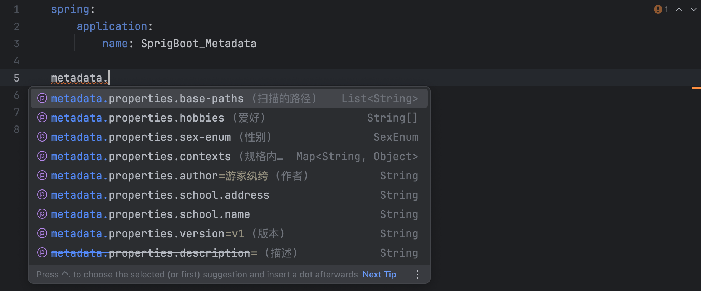
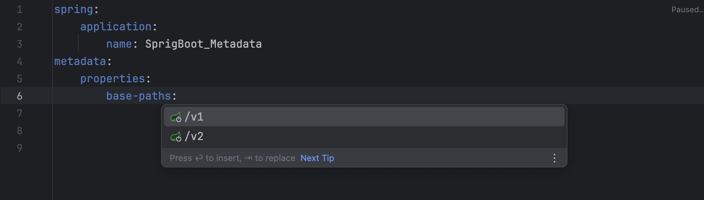

# SpringBoot 配置的提示功能
  

  <h3>
     spring-configuration-metadata.json
     <figure> 
        该文件是 Spring Boot 自动生成的用来描述应用配置元数据的一个文件。
        这个文件包含了应用可以接受的配置属性的描述，包括每个属性的名字、类型以及描述信息。
        Spring Boot 使用这些信息来生成文档以及提供命令行接口的帮助信息等。
     </figure>
     additional-spring-configuration-metadata.json
     <figure> 
        这是一个允许你扩展默认的 Spring Boot 配置元数据的用户自定义文件，
        这意味着你可以在这个文件中添加额外的配置项，以供 Spring Boot 在提供配置建议和生成帮助信息时使用。
     </figure>
  </h3>

  <h4>
      上述两个JSON文件都处于 SpringBoot 源码的 META-INF 包下 
      主要作用：它提供配置元数据，用于IDE中配置文件的智能提示。在编写配置文件 application.* 时，提供自动补全功能。
               &emsp;&emsp;&emsp;&emsp;&emsp;&emsp;&emsp;&emsp;&emsp;&emsp;&emsp;&emsp;&emsp;&emsp;&emsp;&emsp;&emsp;&emsp;
              通过自动生成和注释配置属性类，可以简化Starter的使用并提升开发效率。
  </h4>
  

# spring-configuration-metadata.json 生成操作
  > 1. 添加 spring-boot-configuration-processor 依赖
  > 2. 一个类使用 @ConfigurationProperties
  > 3. 使用 Maven 的 clean 操作后，启动 SpringBoot 项目
  > 4. 在 /target/classes/META-INF 包下生成 spring-configuration-metadata.json 文件

# additional-spring-configuration-metadata.json 生成操作
  > 1. 在 META-INF 包下创建 additional-spring-configuration-metadata.json文件
  > 2. 在 additional-spring-configuration-metadata.json 中添加配置项的描述信息      
       可以将已经生成的 spring-configuration-metadata.json 文件内容复制过来
  > 3. 然后进行修改配置
  

# SpringBoot 配置文件提示说明
  <h3>
     实际使用 IDEA 开发SpringBoot项目经验：
     <h4>
        <figure> 
           1、spring-configuration-metadata.json 文件中的 "hints" 配置项可以配置提示内容，但在 Idea 工具中无法提示
            
           2、additional-spring-configuration-metadata.json 文件中的 "hints" 配置项可以在 Idea 工具配置提示内容    
        </figure>
     </h4>
  </h3>

  - 

  <h4>  
     <figure> 
        3、additional-spring-configuration-metadata.json 配置内容会覆盖 spring-configuration-metadata.json 配置项
     </figure>
  </h4>

