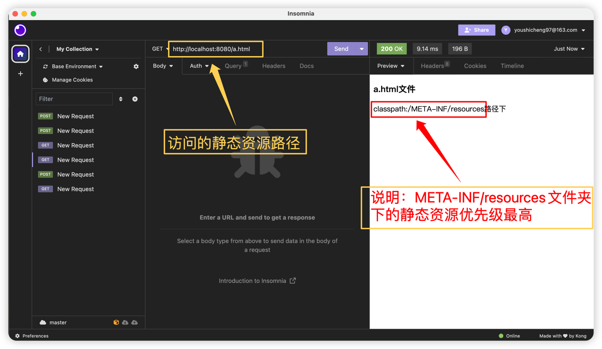

## 一、静态资源访问顺序

    在SpringBoot项目中官方默认访问静态资源是在resources下的这四个文件夹,
    依次访问顺序是：META-INF/resources -> resources -> static -> public,
    也就是先从META-INF/resources中取，访问的时候在端口号后面直接书写资源名称即可。

注意⚠️：在创建文件夹META-INF下面的resources包时，不要使用 META-INF.resources
这种方式建包，
而要通过 META-INF/resources 这种格式建包，其所属包下的资源文件才能正常访问。
还有，Templates包不属于默认静态资源文件包，但是可以通过配置实现。

## 二、不同文件夹下对于相同静态资源访问的优先级

- > 在META-INF/resources、resources、static、public文件夹中都有 a.html资源，  
  我们去访问该资源却只返回了 META-INF/resources 包下的静态资源文件.  
  依次访问:   
  a.html ——> META-INF/resources   
  b.html ——> resources   
  c.html ——> static   
  d.html ——> 报404 (说明Templates包没有定义为静态资源文件访问包)  
  说明以上四个文件夹：是按照访问顺序来排的优先级。  
  相当于说：先访问到包下有资源是所需的，就把该类资源返回，不用再往次级包下去寻找该类资源

	- 

## 三、添加访问默认静态资源路径前缀

   ```
   spring:
     web:
       resources:
         # 官方默认配置 static-locations=classpath:/META-INF/resources, classpath:/resources, classpath:/static, classpath:/public
         static-locations: classpath:/static
     mvc:
       # 添加静态资源文件包访问路径前缀
       static-path-pattern: /resource/prefix/**
   
     # 上述配置解析：
     # spring.web.resources.static-locations=classpath:/static 表示默认的四种静态文件包只保留classpath:/static。
     # spring.mvc.static-path-pattern: /resource/prefix/** 表示为只剩下的classpath:/static资源文件包访问路径添加前缀
   ```
