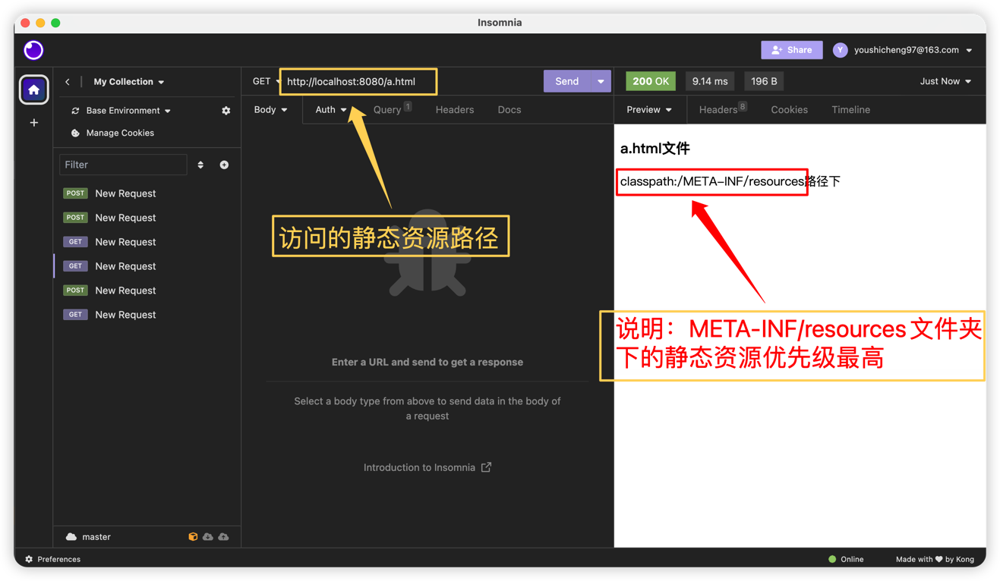

## 一、静态资源访问顺序
    在SpringBoot项目种默认访问静态资源是在resources下的这四个文件夹,
    依次访问顺序是：META-INF/resources -> resources -> static -> public,
    也就是先从META-INF/resources中取，访问的时候在端口号后面直接书写资源名称即可。

   注意⚠️：在创建文件夹META-INF下面的resources包时，不要使用 META-INF.resources 这种方式建包，
          而要通过 META-INF/resources 这种格式建包，其所属包下的资源文件才能正常访问。 
          还有，Templates包不属于静态资源文件包，但是可以通过配置实现。

## 二、不同文件夹下对于相同静态资源访问的优先级
   - > 在META-INF/resources、resources、static、public文件夹中都有 a.html资源，  
       我们去访问该资源却只返回了 META-INF/resources 包下的静态资源文件.  
       依次访问:   
       a.html ——> META-INF/resources   
       b.html ——> resources   
       c.html ——> static   
       d.html ——> 报404 (说明Templates包没有定义为静态资源文件访问包)  
       说明以上四个文件夹：是按照访问顺序来排的优先级。  
                        相当于说：先访问到包下有资源是所需的，就把该类资源返回，不用再往次级包下去寻找该类资源

     - 

## 三、添加访问默认静态资源路径前缀
   ```
   spring:
     web:
       resources:
         # 官方默认配置 static-locations=classpath:/static, classpath:/public, classpath:/resources, classpath:/META-INF/resources
         static-locations: classpath:/static
     mvc:
       # 添加静态资源文件包访问路径前缀
       static-path-pattern: /resource/prefix/**
   
     # 上述配置解析：
     # spring.web.resources.static-locations=classpath:/static 表示默认的四种静态文件包只保留classpath:/static。
     # spring.mvc.static-path-pattern: /resource/prefix/** 表示为只剩下的classpath:/static资源文件包访问路径添加前缀
   ```

## 四、模版文件夹 (templates文件夹下的页面只能通过Controller层进行跳转)
        在Spring Boot中，templates文件夹下的页面只能通过Controller层进行跳转，这是因为Spring Boot默认使用Thymeleaf作为模板引擎，
    而Thymeleaf是服务器端渲染的模板引擎。它将模板文件解析为HTML，并在服务器端生成最终的HTML页面，然后将其返回给客户端。
        当客户端发送请求时，Spring Boot会根据请求的URL路径找到对应的Controller方法，并将其返回的数据与模板文件进行渲染，最终生成HTML页面。
    因此，只有通过Controller层的方法才能触发模板引擎的渲染过程，将页面返回给客户端。

        这种设计方式的好处是可以在Controller层进行业务逻辑处理，并将处理结果传递给模板引擎进行渲染，实现动态页面的生成。
    同时，也可以更好地控制页面的访问权限和数据的展示方式。

## 五、静态资源的Bean配置