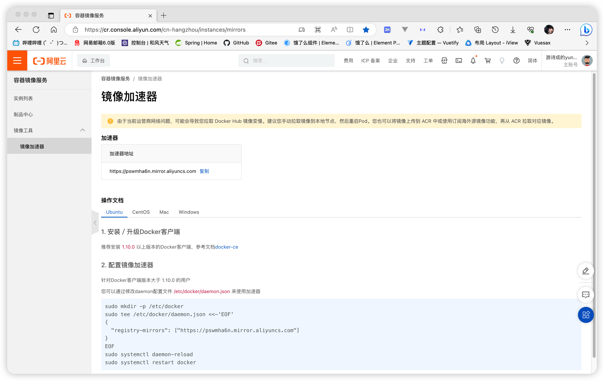
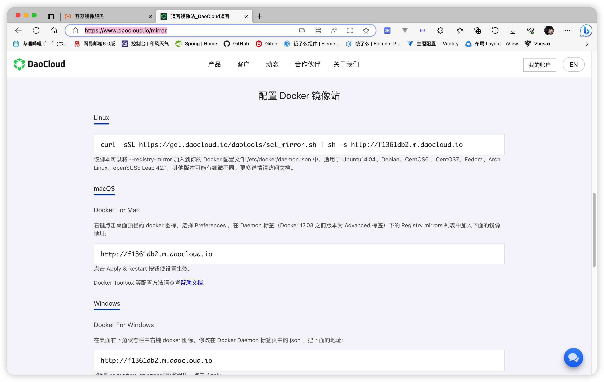

## 一、安装docker-ce社区版

- 配置repo源

  ``` 
  curl -o /etc/yum.repos.d/Centos-7.repo http://mirrors.aliyun.com/repo/Centos-7.repo
  curl -o /etc/yum.repos.d/docker-ce.repo http://mirrors.aliyun.com/docker-ce/linux/centos/docker-ce.repo
  
  yum clean all && yum makecache
  ```

- 查看可下载版本

  ```
  yum list docker-ce --showduplicates | sort -r
  ```

- 安装

  ```
  # 最新版
  yum install -y docker-ce
  # 指定版本
  yum install -y docker-ce-23.0.6
  ```

## 二、启动docker-ce社区版

- 设置开机启动

  ```
  systemctl enable docker
  ```

- 启动docker

  ```
  # 启动
  systemctl start docker
  # 重启
  systemctl restart docker
  ```

- 停止docker

  ```
  systemctl stop docker
  ```

- 其他

  ```
  # 查看docker版本
  docker version
  # 查看docker信息
  docker info
  # docker-client
  ```

- 启动docker后需要安装ubuntu(乌邦图)系统，由于下载地址在国外，速度会非常缓慢。因此我们需要在国内找一个镜像下载

  [阿里云容器镜像服务 (aliyun.com)](https://cr.console.aliyun.com/cn-hangzhou/instances/mirrors)
  

  [道客镜像站_DaoCloud道客](https://www.daocloud.io/mirror)
  

- 然后在命令行中依次输入以下命令,便是设置好了镜像

  ```
  sudo mkdir -p /etc/docker
  ```

  ```
  # 添加镜像路径到配置文件
  sudo tee /etc/docker/daemon.json <<-'EOF'
  {
    "registry-mirrors": [
      "https://pswmha6n.mirror.aliyuncs.com",
      "http://f1361db2.m.daocloud.io"
    ]
  }
  EOF

  # 查看镜像是否添加成功
  cat /etc/docker/daemon.json
  ```
 
  ```
  # 镜像添加成功，我们需要加载一下让镜像生效
  sudo systemctl daemon-reload
  ```

  ```
  # 然后再重启一下docker
  sudo systemctl restart docker
  ```

- 下载ubuntu镜像系统

  ```
  # 查看docker有哪些容器
  docker images
  
  # 搜索有哪些ubuntu版本
  docker search ubuntu
  
  # docker拉取ubuntu
  docker pull ubuntu
  ```

- 启动docker后需要安装ubuntu(乌邦图)系统，由于下载地址在国外，速度会非常缓慢。因此我们需要在国内找一个镜像下载

  [阿里云容器镜像服务 (aliyun.com)](https://cr.console.aliyun.com/cn-hangzhou/instances/mirrors)
  

  [道客镜像站_DaoCloud道客](https://www.daocloud.io/mirror)
  

- 然后在命令行中依次输入以下命令,便是设置好了镜像

  ```
  sudo mkdir -p /etc/docker
  ```

  ```
  # 添加镜像路径到配置文件
  sudo tee /etc/docker/daemon.json <<-'EOF'
  {
    "registry-mirrors": [
      "https://pswmha6n.mirror.aliyuncs.com",
      "http://f1361db2.m.daocloud.io"
    ]
  }
  EOF

  # 查看镜像是否添加成功
  cat /etc/docker/daemon.json
  ```
 
  ```
  # 镜像添加成功，我们需要加载一下让镜像生效
  sudo systemctl daemon-reload
  ```

  ```
  # 然后再重启一下docker
  sudo systemctl restart docker
  ```

- 下载ubuntu镜像系统

  ```
  # 查看docker有哪些容器
  docker images
  
  # 搜索有哪些ubuntu版本
  docker search ubuntu
  
  # docker拉取ubuntu
  docker pull ubuntu
  ```

  