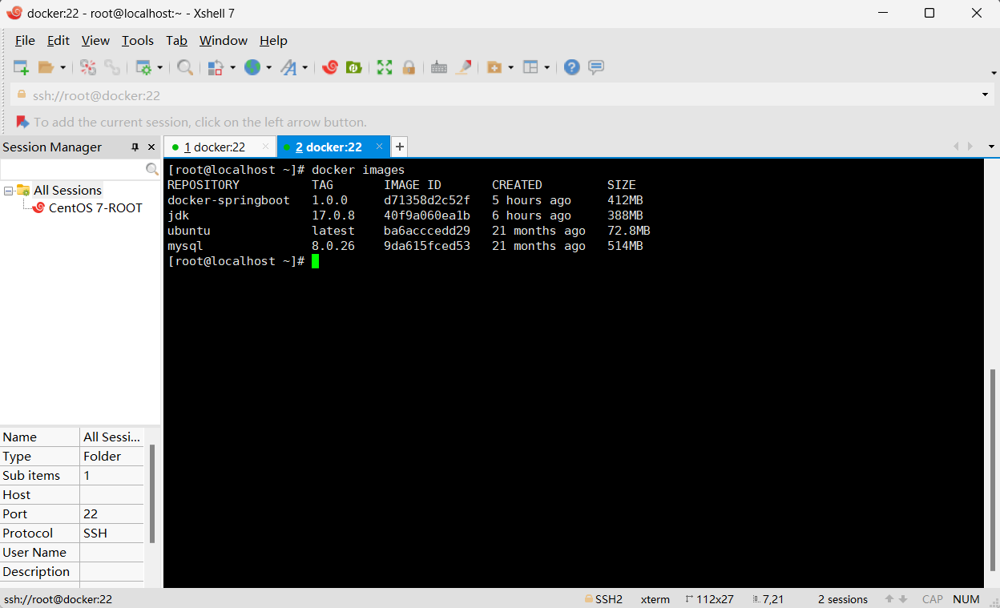
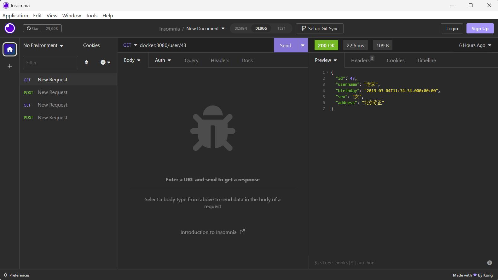

查看当前下载的jdk版本
https://www.oracle.com/java/technologies/downloads/#jdk17-linux
通过wget命令下载jdk17
wget https://download.oracle.com/java/17/latest/jdk-17_linux-x64_bin.tar.gz
下载完需要我们通过配置Dockerfile来制作镜像
vim Dockerfile

# 指定基础镜像 ubuntu:23.04
FROM ubuntu:23.04

# 设置环境变量
ENV JAVA_HOME=/usr/local/jdk-17.0.8
ENV JRE_HOME=$JAVA_HOME/jre
ENV PATH=${JAVA_HOME}/bin:$PATH

# 复制当前路径下的jdk-17_linux-x64_bin.tar.gz文件或目录到容器的指定路径/usr/local/
ADD jdk-17_linux-x64_bin.tar.gz /usr/local/
# 运行指定的命令
RUN javac --version \
    && java --version

构建我们的服务器Java镜像
docker build -t java:17.0.8 .
# 镜像名：java；版本：17.0.8；需要注意的是后面一定要空格之后有一个.符号(表示的是在当前路径下；如果是docker build -t /opt/java:17.0.8 .则表示在路径/opt下的Dockerfile构建镜像)

docker images

将我们的SpringBoot项目上传到服务器，可以通过XSell直接拖进我们想存放的目录下
并在该目录下进行启动容器步骤配置
vim dockerfile

# 指定基础镜像：仓库是java，tag是17.0.8
FROM jdk:17.0.8
# 定义匿名数据卷。相当于数据存档点，可以有多个，方便回到想要的数据存档点
VOLUME "/data-source"
# 当前路径下通配符匹配的jar包改名并复制到容器里为app.jar
ADD *.jar app.jar
# 暴露服务端口
EXPOSE 8082
# 容器启动时要执行的命令--启动Java命令
CMD ["java", "-jar", "/app.jar"]

# 在当前路径下构建名为docker-springboot的镜像，后面的为镜像版本(可写可不写，不写的话就默认为latest)
docker build -t docker-springboot:1.0.0 .
docker images

# 运行镜像docker-springboot，并取名容器名为docker-springboot
docker run -d -p 8080:8080 --name docker-springboot docker-springboot

项目成功运行，我们现在来测试一下吧。
