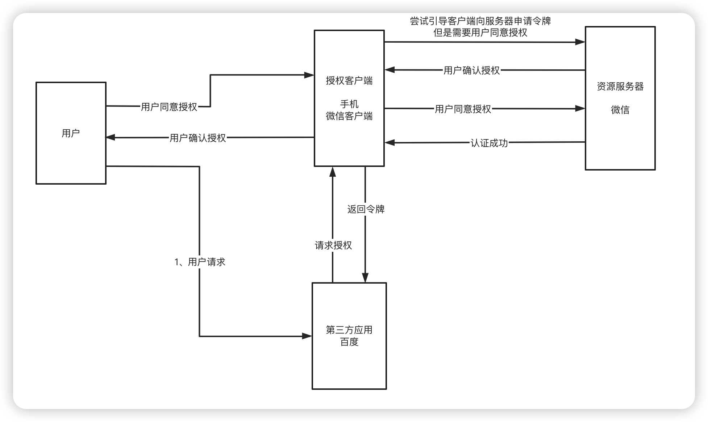

# 记录一下头一次使用MarkDown做笔记

## **SpringSecurity -- OAuth2**

### **一、先理解一下OAuth2的授权机制**

####             *1、场景*

- ####             我住在xxx小区，我在某饿或者某团上点了一份外卖，但是我小区楼栋是有门禁的，进入需要密码。如果我把自己的密码，告诉快递员，他就拥有了与我同样的权限，这样好像不太合适。万一我想取消他进入小区的权力，也很麻烦，我自己的密码也得跟着改了，还得通知其他的外卖员或者快递员。

- ####             有没有一种办法，让外卖员能够自由进入小区，又不必知道小区居民的密码，而且他的唯一权限就是送餐，其他需要密码的场合，他都没有权限？

#### *2、授权机制*

-   #### ①、第一步，门禁系统的密码输入器下面，增加一个按钮，叫做"获取授权"。外卖员需要首先按这个按钮，去申请授权。

-   #### ②、第二步，他按下按钮以后，屋主（也就是我）的手机就会跳出对话框：有人正在要求授权。系统还会显示该外卖员的姓名、工号和所属的快递站点公司。

-   #### 我确认请求属实，就点击按钮，告诉门禁系统，我同意给予他进入小区的授权。

-   #### ③、第三步，门禁系统得到我的确认以后，向快递员显示一个进入小区的令牌（access token）。令牌就是类似密码的一串数字，只在短期内（比如七天）有效。

-   #### ④、第四步，快递员向门禁系统输入令牌，进入小区。

-   #### ⑤、有人可能会问，为什么不是远程为快递员开门，而要为他单独生成一个令牌？这是因为外卖员可能每天都会来送货，第二天他还可以复用这个令牌。另外，有的小区有多重门禁，外卖员可以使用同一个令牌通过它们。

### **二、OAuth2的方式**

#### *1、授权码*

> 授权码模式：常见的第三方平台登录功能基本都是使用这种模式。

#### *2、简化模式*

> 简化模式：不需要让第三方应用与资源服务器进行交互的，直接在浏览器中向资源服务器申请令牌（token），一般如果网站是纯静态页面则可以采用这种方式。

#### *3、密码模式*

> 密码模式：密码模式是用户把用户名密码直接告诉客户端，客户端使用说这些信息向授权服务器申请令牌（token）。这需要用户对客户端高度信任，例如客户端应用和服务提供商就是同一家公司，我们自己做前后端分离登录就可以采用这种模式。

#### *4、客户端模式*

> 客户端模式：是指客户端使用自己的名义而不是用户的名义向服务提供者申请授权，严格来说，客户端模式并不能算作 OAuth 协议要解决的问题的一种解决方案，但是，对于开发者而言，在一些前后端分离应用或者为移动端提供的认证授权服务器上使用这种模式还是非常方便的。

