## 一、获取对应项目版本号
#### 1、Spring官网 Https://spring.io 可以看到 SpringBoot3.0.x、3.1.x版本对应 SpringCloud2022.0.x版本，且当前最新SpringCloud最新版本为 2022.0.4
   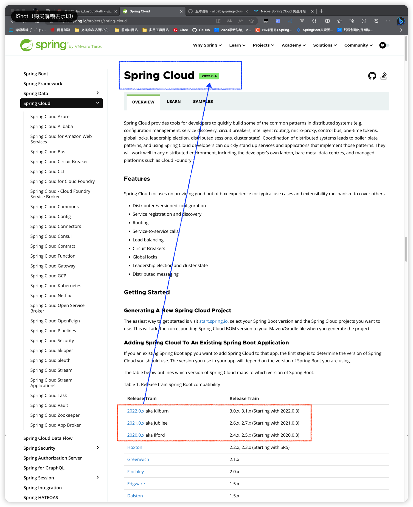

#### 2、GitHub搜索alibaba，进入 spring-cloud-alibaba 的文档版本说明。适配 SpringBoot 3.0 版本及以上的 Spring Cloud Alibaba 版本为 2022.0.0.0
   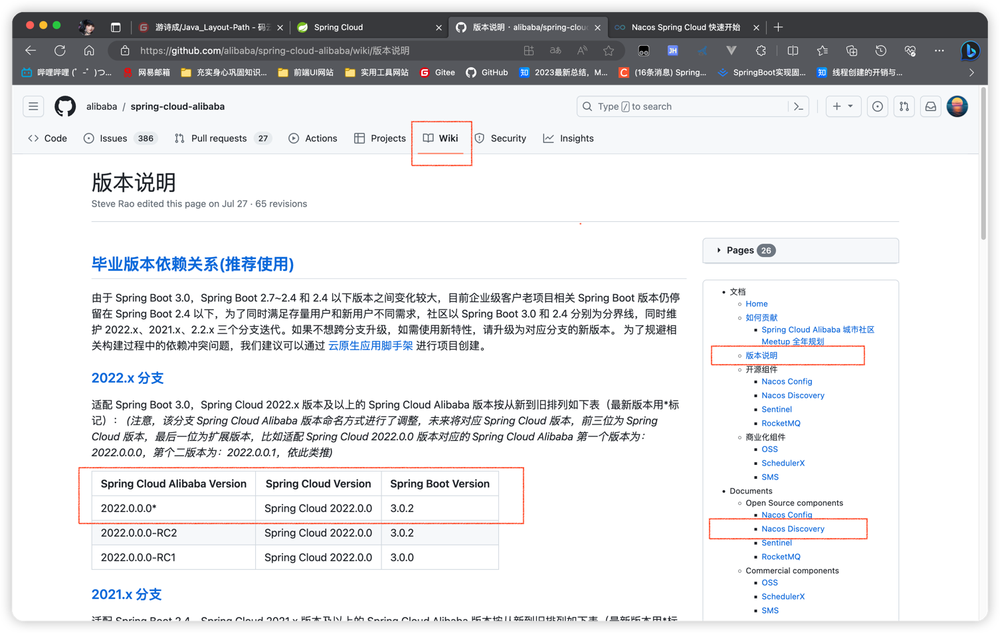

## 二、Nacos（ http://localhost:8848/nacos ）
#### 1. 配置Nacos文件  
- > 外置数据库Mysql：进入nacos文件 ../nacos/conf/application.properties 配置编辑外置MySQL来存储配置数据     
  > 另外需要在建立合适的数据库，以及手动执行 Nacos 提供的建表语句，路径通常为：bin 同级包下 ../conf/**-schema.sql
  > 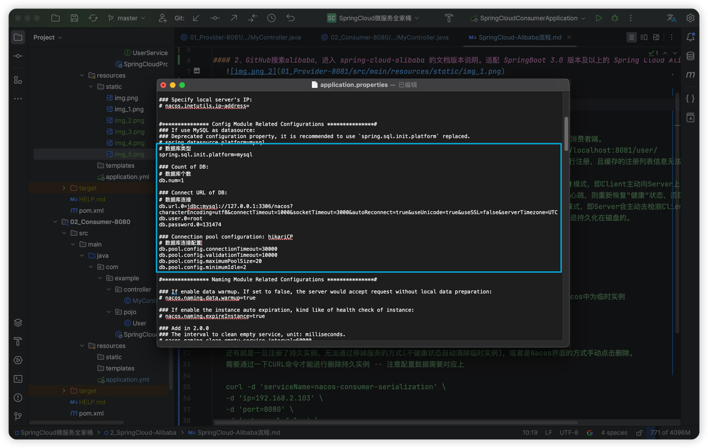

- > Nacos文件配置：进入nacos文件 ../nacos/conf/application.properties
  > 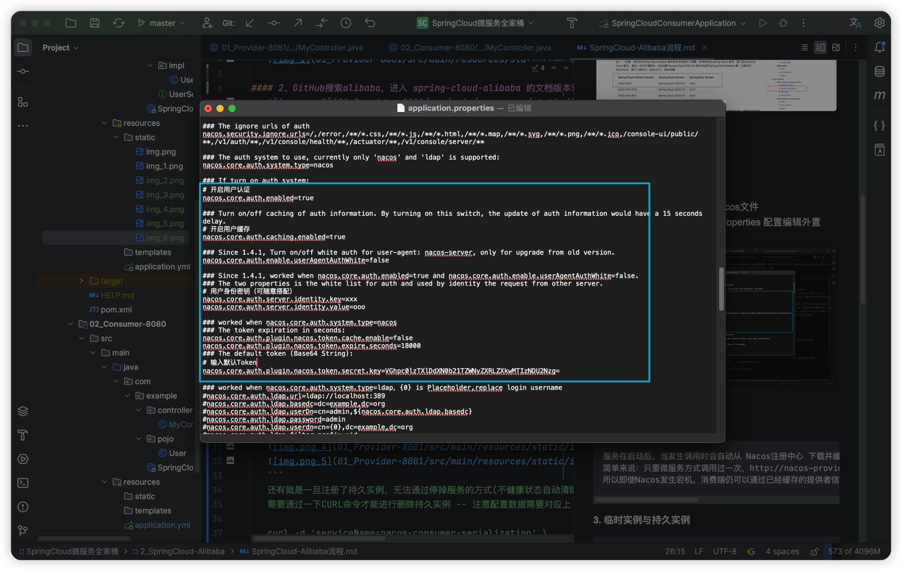

  ```
  # 数据库类型
  spring.datasource.platform=mysql
  spring.sql.init.platform=mysql
  
  # 数据库个数
  db.num=1
  
  # 数据库配置
  db.url.0=jdbc:mysql://127.0.0.1:3306/springcloud?characterEncoding=utf8&connectTimeout=1000&socketTimeout=3000&autoReconnect=true&useUnicode=true&useSSL=false&serverTimezone=Asia/Shanghai
  db.user.0=root
  db.password.0=131474
  
  # 数据库连接配置
  db.pool.config.connectionTimeout=30000
  db.pool.config.validationTimeout=10000
  db.pool.config.maximumPoolSize=20
  db.pool.config.minimumIdle=2
  
  # 开启用户认证
  nacos.core.auth.enabled=true
  # 开启用户认证缓存
  nacos.core.auth.caching.enabled=true
  # 用户身份密钥（可随意搭配）
  nacos.core.auth.server.identity.key=xxx
  nacos.core.auth.server.identity.value=ooo
  # 输入默认token
  nacos.core.auth.plugin.nacos.token.secret.key=VGhpc0lzTXlDdXN0b21TZWNyZXRLZXkwMTIzNDU2Nzg=
  
  ######################## 以下为Nacos3.x.x版本中的配置 ########################
  # Nacos3.x.x控制台端口（默认端口号：8080）
  nacos.console.port=
  # Nacos3.x.x控制台上下文路径（默认上下文：/）
  nacos.console.contextPath=
  ```
#### 2. 启动Nacos命令
- > ①、Windows系统使用命令提示符窗口：  
    >>  启动Nacos命令：startup.cmd -m standalone（standalone代表着单机模式运行，非集群模式）  
        启动Nacos命令：startup.cmd（集群模式，使用这种方式启动）  
        关闭Nacos命令：shutdown.cmd  
        也可以直接点击 startup.cmd 启动Nacos（非集群模式），点击 shutdown.cmd 关闭Nacos服务     
  >
  > ②、Mac系统在Nacos的bin文件夹下进入终端：  
    >>  启动Nacos命令：sh startup.sh -m standalone（standalone代表着单机模式运行，非集群模式）  
        启动Nacos命令：sh startup.sh（集群模式，使用这种方式启动）  
        关闭Nacos命令：sh shutdown.sh   
  > 
  > ③、访问Nacos控制台页面    
    >> Nacos2.x.x版本：http://localhost:8848/nacos    
       Nacos3.x.x版本：http://localhost:8080/index.html   
       Nacos3.x.x版本控制台地址可通过 /nacos/conf/application.properties 文件中进行修改端口和路径前缀
#### 3. 注册表缓存
- > 1️⃣、服务在启动后，当发生调用时会自动从 Nacos注册中心 下载并缓存注册表到本地，将服务的实例信息缓存在消费者端。  
  > 2️⃣、简单来说：只要微服务方式调用过一次，http://nacos-provider/user/ 就会缓存到消费端为 http://localhost:8081/user/  
  > 3️⃣、所以即使Nacos发生宕机，消费端仍可以通过已经缓存的提供者信息来调用接口。只不过此时不能再有服务进行注册，且缓存的注册列表信息无法更新。
#### 4. 临时实例与持久实例
- > 1️⃣、临时实例：  
  > 默认情况。服务实例仅会注册在Nacos内存，不会持久化到Nacos磁盘。其健康监测机制为Client模式，即Client主动向Server上报其健康状态。默认心跳间隔为5秒。
  >         在15秒内Server未收到Client心跳，则会将其标记为"不健康"状态；在30秒内若收到了Client心跳，则重新恢复"健康"状态，否则该实例将从Server端内存清除。  
  > 
  > 2️⃣、持久实例：  
  > 服务实例不仅会注册到Nacos内存，同时也会被持久化到Nacos磁盘。其健康监测机制为Server模式，即Server会主动去检测Client的健康状态，
  > 默认每20秒检测一次。健康检测失败后服务实例会被标记为"不健康"状态，但不会被清除，因为其是持久化在磁盘的。
  >
  >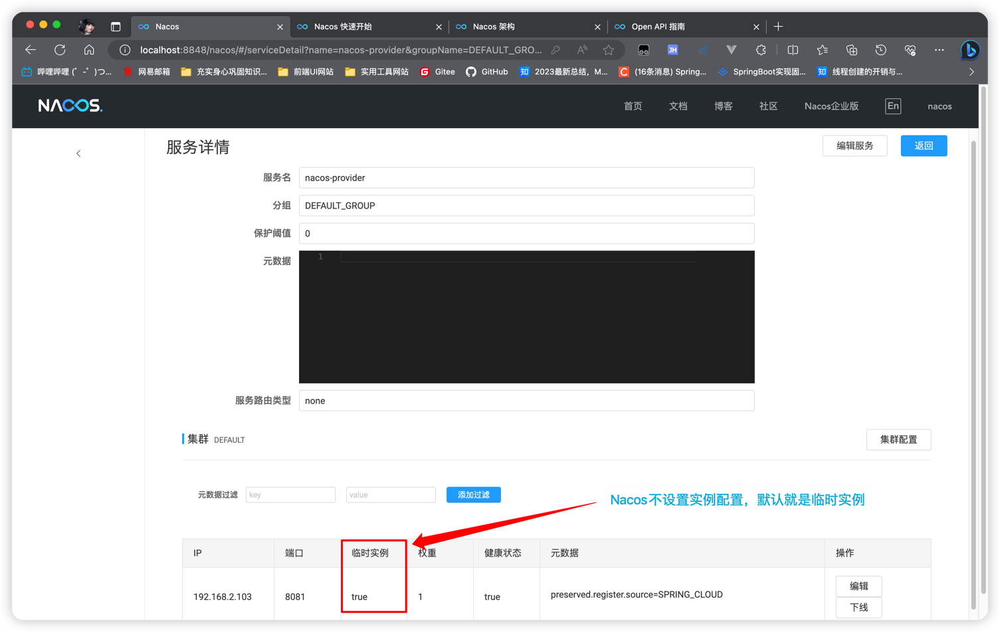

- > ```
  > 注册服务对Nacos实例配置
  > spring:
  >   cloud:
  >     nacos:
  >       discovery:
  >         ephemeral: false  # 是否设置为临时实例：默认为true，表示当前服务注册到Nacos中为临时实例
  > ```
  > 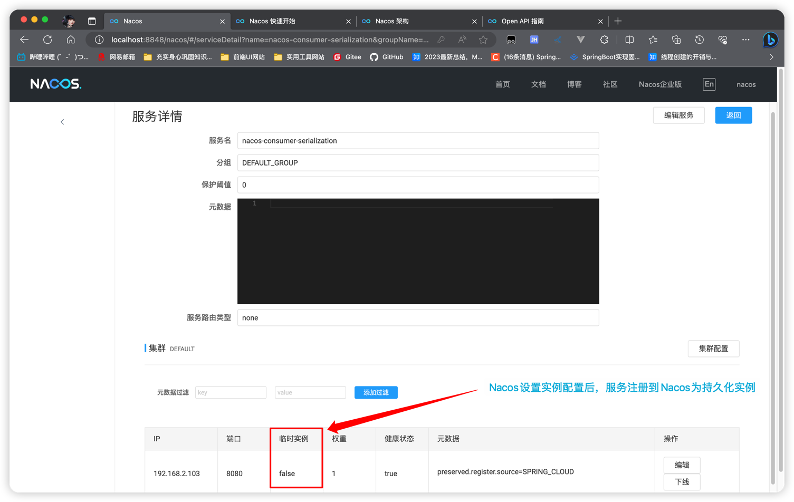

- > 还有就是一旦注册了持久实例，无法通过停掉服务的方式(不健康状态自动清除临时实例)，或者是Nacos界面的方式手动点击删除。  
  > 需要通过一下CURL命令才能进行删除持久实例 -- 注意配置数据需要对应上.具体参考官网 https://nacos.io/zh-cn/docs/v2/guide/user/open-api.html
  > ```
  > curl -d 'serviceName=nacos-consumer-serialization' \
  > -d 'ip=192.168.2.103' \
  > -d 'port=8080' \
  > -d 'ephemeral=false' \
  > -d 'username=nacos' \
  > -d 'password=nacos' \
  > -X DELETE 'http://127.0.0.1:8848/nacos/v2/ns/instance'
  > ```
  > 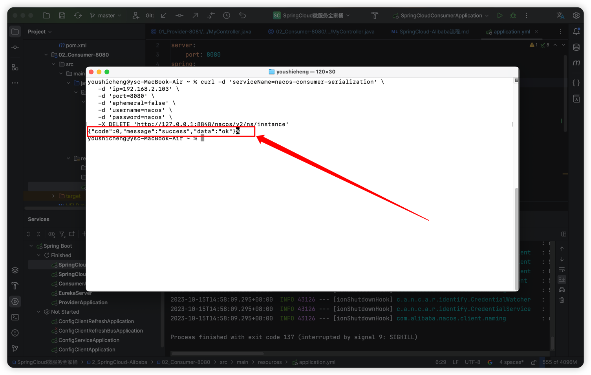
#### 5. Nacos集群搭建
- > ```
  > ①、在各个nacos的解压目录nacos/的conf目录下，将配置文件cluster.conf.example复制一份，重命名为cluster.conf文件，每行配置成ip:port。（请配置3个或3个以上节点）
  >     注意：端口不要连号，因为nacos内部会使用设置端口的下一个端口值，如果连号，启动会失败。
  >          192.168.2.101:8850
  >          192.168.2.101:8860
  >          192.168.2.101:8870
  > ②、并且各个nacos配置文件application.properties改相应端口：server.port=xxxx
  > ③、启动各个nacos服务，注意：不要使用 非集群模式 启动 -- sh startup.sh
  > ④、nacos集群启动后，服务注册到指定的nacos中，可同时注册到集群中多个nacos中心
  >          spring:
  >            cloud:
  >              nacos:
  >                discovery:
  >                  server-addr: 192.168.2.101:8850, 192.168.2.101:8860, 192.168.2.101:8870
  >                    - 192.168.2.101:8850 这种写法不生效，setServerAddr参数为String类型，这样写表示一个数组或者集合
  >                    - 192.168.2.101:8860 这种写法不生效，setServerAddr参数为String类型，这样写表示一个数组或者集合
  >                    - 192.168.2.101:8870 这种写法不生效，setServerAddr参数为String类型，这样写表示一个数组或者集合
  > ```
  > 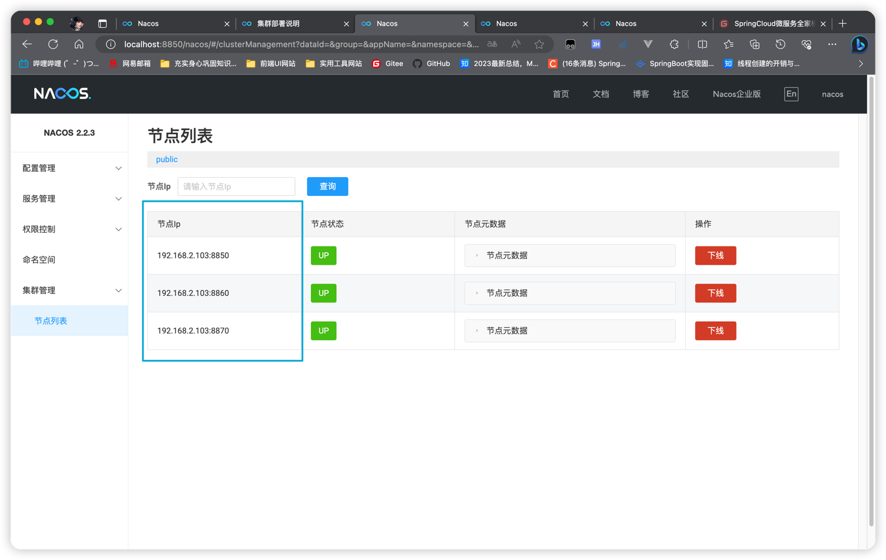
#### 6. Nacos的CAP模式
- > 1、CAP即：Consistency（一致性）、Availability（可用性）、Partition tolerance（分区容忍性）  
    2、这三个性质对应了分布式系统的三个指标：而CAP理论说的就是：一个分布式系统，不可能同时做到这三点。  
       默认情况下，Nacos Discovery集群的数据一致性采用的是AP模式。但其也支持CP模式，需要进行转换。  
    3、若要转换为CP的，可以提交PUT请求，完成AP到CP的转换：http://localhost:8848/nacos/v1/ns/operator/switches?entry=serverMode&value=CP
#### 7. 服务隔离
- > 现如今，在微服务体系中，一个系统往往被拆分为多个服务，每个服务都有自己的配置文件，然后每个系统往往还会准备开发环境、测试环境、正式环境
    那么如果引入Nacos作为配置中心后，如何有效的进行配置文件的管理和不同环境间的隔离区分呢？
  >
  >> 1、首先就是通过配置注册Nacos地址做隔离，比如：A服务注册nacos1中心，B服务注册nacos2中心  
  >> 2、Nacos引入了命名空间(Namespace)的概念来进行多环境配置和服务的管理及隔离，不同命名空间的服务之间是无法调用的。
  >>    需要注意的是：需要提前在Nacos中新建好命名空间，而且这里引用的是 命名空间ID，而不是命名空间名称
  >>    如：spring.cloud.nacos.discovery.namespace=c37aadfa-936b-4d3a-84ca-975caf1d31ed  
  >> 3、Nacos的配置管理还可以通过group来进行分组的。
  >>    spring.cloud.nacos.discovery.group=My_Group
-  > ##### 创建实例测试
   > 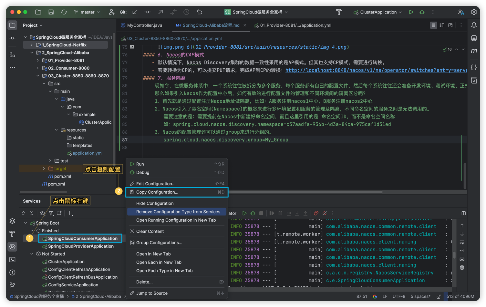
     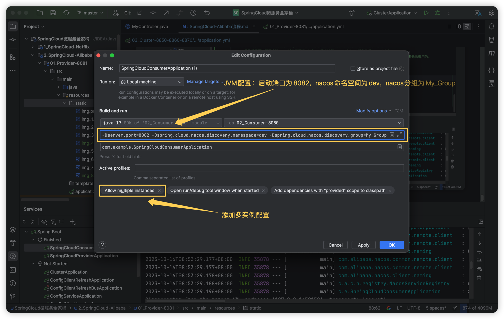
#### 8. Nacos Config配置中心
- > 1、配置中心中的配置数据一般都是持久化在第三方服务器的，例如存放到DBMS、Git远程库等。由于这些配置中心Server中根本就不存放数据，
       所以它们的集群中就不存在数据一致性问题。但像Zookeeper，其作为配置中心，配置数据是存放在自己本地的。所以该集群中的节点是存在数据一致性问题的。
       Zookeeper集群对于数据一致性采用的是CP模式。  
    2、作为注册中心，这些Server集群间是存在数据一致性问题的，它们采用的模式是不同的。
       Zookeeper(CP)、Eureka(AP)、Consul(AP)、Nacos(默认AP，也支持CP)
  >
  >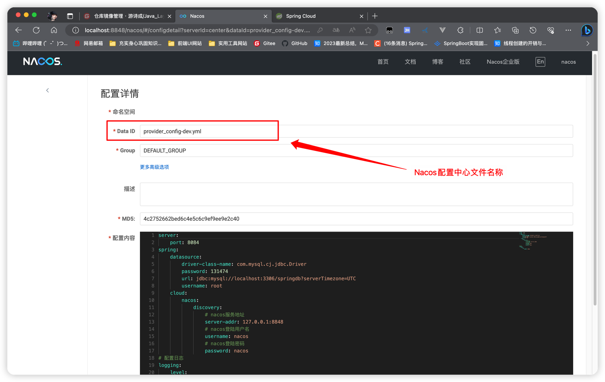

## 二、OpenFeign
-  #### 1、概述：  
   - > 由于Spring Cloud Netflix对Feign不再进行维护，所以 Spring Cloud 推出 OpenFeign 作为对指定的微服务进行消费、访问的组件。  
       OpenFeign具有负载均衡功能 ，老版本的SpringCloud所集成的OpenFeign默认采用了Ribbon负载均衡器。同样因为Netflix已经不再维护Ribbon，
       所以 OpenFeign也弃用了 Ribbon，随后Spring Cloud 采用自行研发的 Spring Cloud LoadBalancer 作为负载均衡器。  
   #### 2、远程调用的底层实现技术：  
   - > Feign 的远程调用底层实现技术默认采用的是JDK的 URLConnection，同时还支持 HttpClient 与OkHttp。  
       由于JDK的 URLConnection 不支持连接池，通信效率很低，所以生产中是不会使用该默认实现的。  
       所以在 Spring Cloud OpenFeign 中直接将默认实现变为了 HttpClient，同时也支持 OkHttp。  
       在单例情况或者需要自定义的使用 HttpClient，其他情况使用 okHttp。URLConnection效率不高。  
   
   -  > Spring Cloud LoadBalancer负载均衡策略默认使用的是 轮询。可以通过自定义配置更换策略为 随机。    
        但Spring Cloud LoadBalancer也就这两种策略，所以大厂里使用的是 Dubbo 来集成到 SpringCloud。经典白学！！！ 

   -  > RPC -- 全称Remote Procedure Call，中文译为远程过程调用。通俗地讲，使用RPC进行通信，调用远程函数就像调用本地函数一样。  
        Dubbo 底层使用谷歌的 grpc 通信，用于淘宝的架构体系，经过双十一检测，性能高还稳定。而gRPC，则是RPC的一种，它是免费且开源的，由谷歌出品。

## 三、Reactor简介 -- WebFlux
- >  Reactor是一种完全基于Reactive Streams规范的、全新的类库。
- > 1️⃣、响应式编程  
       响应式编程，Reactive Programming，是一种新的编程范式、编程思想。  
       响应式编程最早由.Net平台上的Reactive eXtensions(Rx)库来实现。后来被迁移到了Java平台，产生了著名的RxJava。  
       在此之上，后来又产生了Reactive Streams规范。  
    2️⃣、Reactive Streams  
       Reactive Streams是响应式编程的规范，定义了响应式编程的相关接口。只要符合该规范的库，就称为Reactive响应式编程库。  
    3️⃣、RxJava2  
       RxJava2是一个响应式编程类库，产生于Reactive Streams规范之后。但由于其是在RxJava基础之上进行的开发，  
       所以在设计时不仅遵循了Reactive Streams规范，同时为了兼容RxJava，使得RxJava2在使用时非常不方便。  
    4️⃣、Reactor  
       Reactor是一种全新的响应式编程类库，完全遵循Reactive Streams规范，又与RxJava没有任何关系。所以，其使用时非常方便、直观。  
    5️⃣、WebFlux  
       SpringMVC 构建于 Servlet API 之上，同步阻塞I/O模型, 认为应用会阻塞当前线程，所以一个Request对应一个Thread，需要有一个含有大量线程的线程池  
       Spring WebFlux 构建于 Reactive Streams Adapters 之上，异步非阻塞I/O模型，认为应用不会阻塞当前线程，所以只是需要一个包含少数固定线程数的线程池 (event loop workers) 来处理请求  
       WebFlux 并不是 Spring MVC 的替代，它主要应用还是在异步非阻塞编程模型上。如果你的项目并不是该模型 或者你的应用目前本身已经足够应付当前情况，是不需要去切换成 WebFlux 的。  

## 四、Spring Cloud Gateway网关

#### 1、Spring Cloud GetWay 作为Spring Cloud生态系统的网关，目标是为了代替zuul。
- >  1️⃣、Spring Cloud GetWay 是基于webFlux框架实现的，而WebFlux框架底层则使用了高性能的Reactor模式通信框架Netty。  
     因此，当您使用 Spring Cloud Gateway 时，您知道的许多熟悉的同步库（例如 Spring 数据和 Spring 安全性）和模式可能不适用。  
     简单来说：它不能和传统的Servlet容器一起使用（与SpringMVC框架有冲突），也不能打包成一个WAR包。  
     2️⃣、Spring Cloud Gateway的目标，提供统一的路由方式，基于Filter链的方式提供了网关基本的功能，例如：安全，监控/指标，和限流。  
     3️⃣、Zuul：使用的是同步阻塞式的 API，不支持长连接，比如 websockets。  
     Spring Cloud Gateway 提供了异步非阻塞支持，提供了抽象负载均衡，提供了抽象流控，并默认实现了RedisRateLimiter。底层使用了高性能的通信框架Netty。

#### 2、Spring Cloud Gateway 由三部分组成：
- >  1️⃣、Filter（过滤器）： 使用它拦截和修改请求，并且对上游的响应，进行二次处理。  
     2️⃣、Route（路由）： 一个Route模块由一个 ID，一个目标 URI，一组断言和一组过滤器定义。如果断言为真，则路由匹配，目标URI会被访问。  
     3️⃣、Predicate（断言）： 这是一个 Java 8 的 Predicate，可以使用它来匹配来自 HTTP 请求的任何内容，例如 headers 或参数。断言的输入类型是一个 ServerWebExchange。

#### 3、Spring Cloud Gateway 它是如何工作的:   

- > 客户端向Spring Cloud Gateway发出请求。如果网关处理程序映射确定请求与路由匹配，则将其发送给网关Web处理程序。
    该处理程序通过特定于该请求的过滤器链运行请求。过滤器用虚线分隔的原因是，过滤器可以在发送代理请求之前和之后运行逻辑。
    所有“预”过滤器逻辑都会被执行。然后发出代理请求。在发出代理请求之后，将运行“post”过滤器逻辑。

- 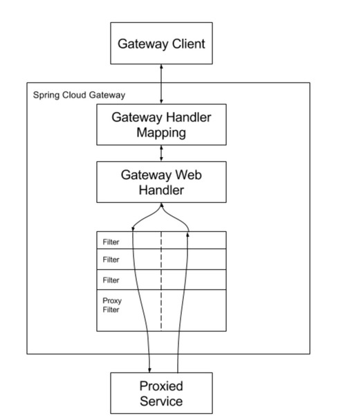

- > 在 07_Gateway-Api 项目中的 OneGatewayFilterFactory、TwoGatewayFilterFactory、ThreeGatewayFilterFactory
  > 都是先进行的 pre预逻辑处理，然后代理请求执行完毕后，才会去执行 post过滤器逻辑
  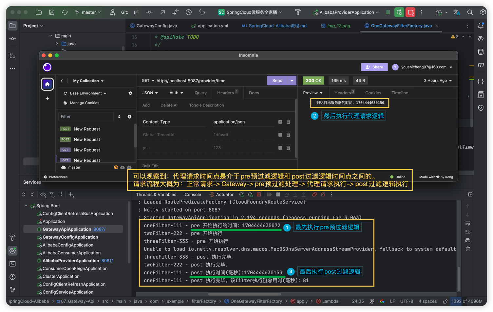

## 五、Sentinel流量防卫兵
#### 1、简介  

       Sentinel 是面向分布式、多语言异构化服务架构的流量治理组件，主要以流量为切入点，
    从流量控制、流量路由、熔断降级、系统自适应保护等多个维度来帮助用户保障微服务的稳定性。

#### 2、介绍

    在Sentinel之前其实就有Hystrix做熔断降级的事情，出现新的事物肯定是原来的东西有不足的地方。
    1️⃣、那Hystrix有什么不足之处呢？
        ①、Hystrix常用的线程池隔离会造成线程上下切换的overhead比较大。
        ②、Hystrix没有监控平台，需要我们自己搭建。
        ③、Hystrix支持的熔断降级维度较少，不够细粒，而且缺少管理控制台。
    2️⃣、Sentinel有哪些组成部分？
        ①、核心库（Java 客户端）不依赖任何框架/库，能够运行于所有 Java 运行时环境，同时对 Dubbo / Spring Cloud 等框架也有较好的支持。
        ②、控制台（Dashboard）基于 Spring Boot 开发，打包后可以直接运行，不需要额外的 Tomcat 等应用容器。
    3️⃣、Sentinel有哪些特征？
        ①、丰富的应用场景: 
               Sentinel承接了阿里巴巴近十年的双十一大促流量的核心场景,例如秒杀(即突发流量控制在系统容量可以承受的范围),
               消息削峰填谷,集群流量控制,实时熔断下游不可用应用等
        ②、完美的实时监控:
               Sentinel同事提供实时的监控功能,您可以在控制台看到接入应用的单台机器秒级数据,甚至500台一下规模的集群的汇总运行情况
        ③、广泛的开源生态:
               Sentinel提供开箱即用的与其他框架/库的整合模块,例如与SpringCloud,Dubbo,gRPC的整合,
               您只需要引入响应的依赖并进行简单的配置即可快速接入Sentinel.
        ④、完美的SPI扩展点:
               Sentinel提供简单易用的,完美的SPI扩展接口,可以通过实现扩展接口来快速定制逻辑,例如定制规则管理,适配动态数据源等.

#### 3、启动
    
 ```
 启动Sentinel控制台需要JDK版本为1.8及以上版本。在Sentinel控制jar包所在目录中打开cmd窗口，执行启动命令:
 java -Dserver.port=8888 \
 -Dsentinel.dashboard.auth.username=sentinel \ # 这一段设置登陆Sentinel账号密码，可以不写，默认用户名和密码就是sentinel
 -Dsentinel.dashboard.auth.password=123456 \
 -jar sentinel-dashboard-1.8.8.jar
 ```

#### 4、Sentinel的使用  
    @SentinelResource 注解用来标识资源是否被限流、降级。    
    @SentinelResource 还提供了其它额外的属性如 blockHandler，blockHandlerClass，fallback 用于表示限流或降级的操作
 
   
  ```application.yml
  配置控制台信息
  spring:
    cloud:
      sentinel:
        transport:
          port: 8719
          dashboard: localhost:8888
  
      这里的 spring.cloud.sentinel.transport.port 端口配置会在应用对应的机器上启动一个 Http Server，
  该Server会与 Sentinel控制台做交互。比如 Sentinel控制台添加了一个限流规则，会把规则数据push给这个Http Server接收，
  Http Server 再将规则注册到 Sentinel 中。
      这里的 spring.cloud.sentinel.transport.dashboard 设置就是Sentinel仪表盘路径
  ```
  - 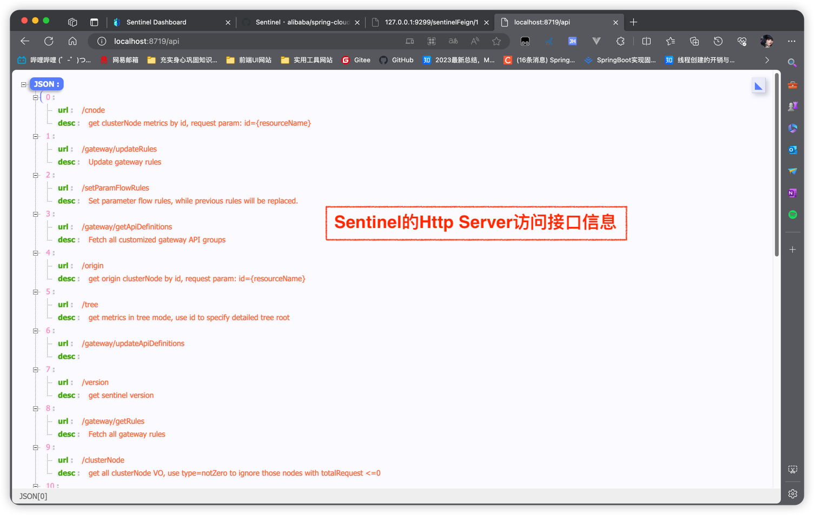

  - 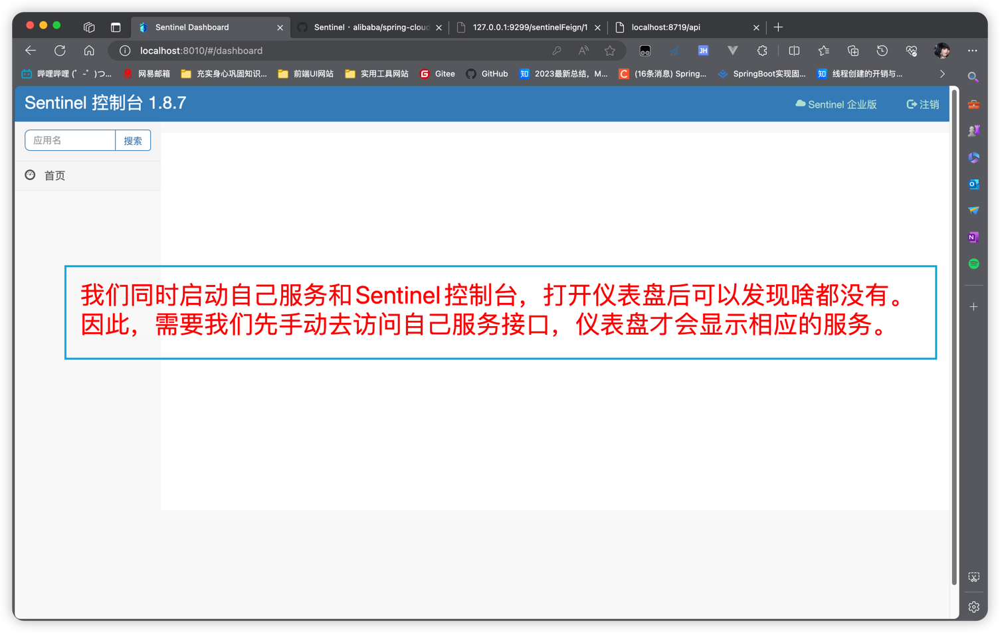

  - ```
    当然，以上这种还需要手动操作的话，体验是不理想的，因此，我们可以在配置上去取消懒加载。
    这样就可以在启动服务和Sentinel时，保证仪表盘内显示对应服务配置
    spring:
      cloud:
        sentinel:
          eager: true
    ```

  - 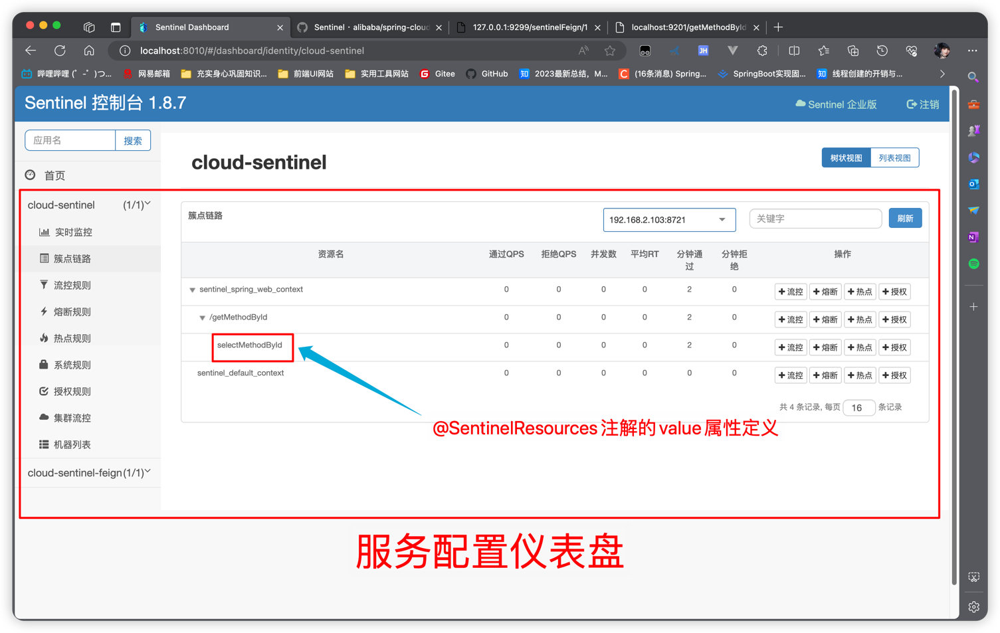
  - 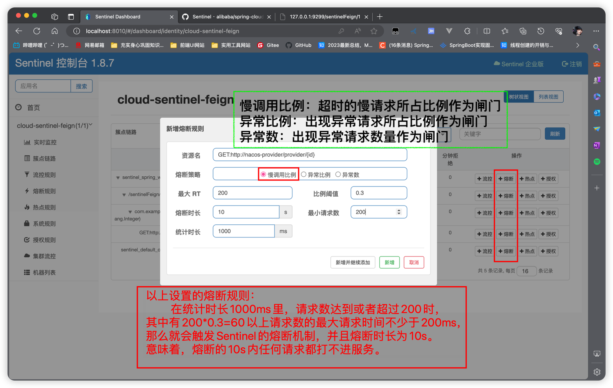

  ```
  注意点：
        在Sentinel仪表盘中手动配置流控、熔断等规则，其对应资源的服务要是宕机等原因被重启，那么这些在仪表盘中定义的规则会被清除，
    并不会在重启后继续生效。如果想实现那种持久化的规则，则需要在代码里去实现规则。
  ```

#### 5、Sentinel不同限流方式的差异
 > ##### 第一种情况：基于 URL资源 作为限流
 > - 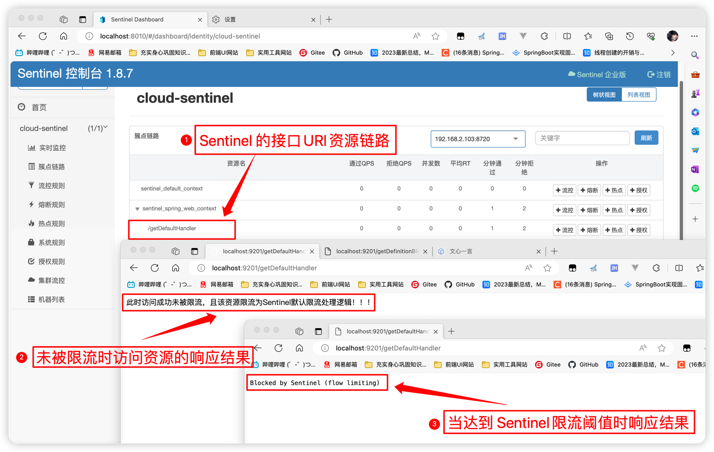

 > ##### 第二种情况：基于 资源名称 作为限流
 > - 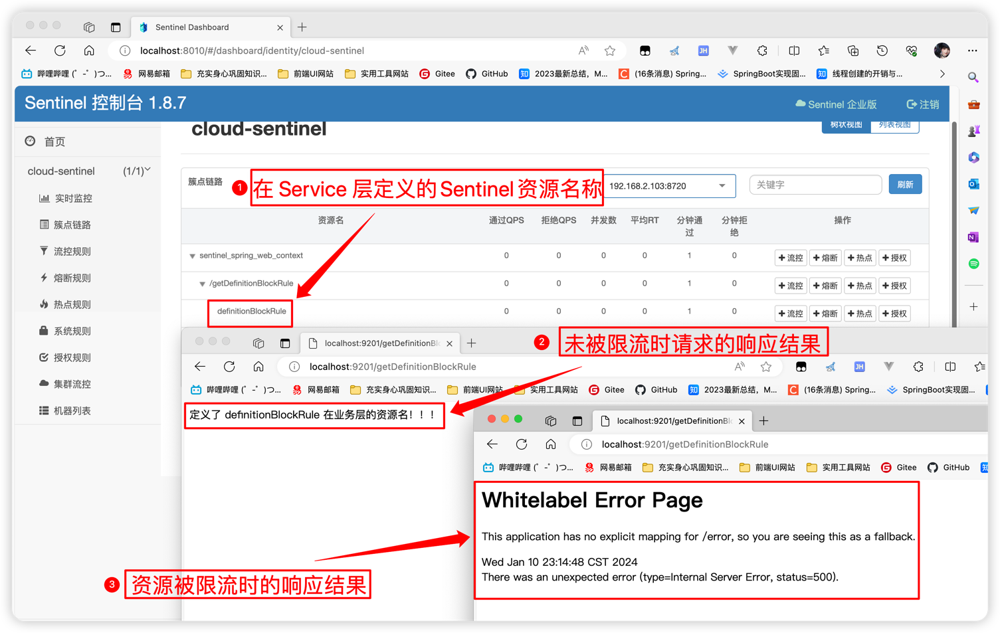

> ##### 结合以上两种结果：
> ##### 1、接口URL限流超过阈值时的行为：  
> &emsp;&emsp;&emsp;&emsp;&emsp;&emsp;&emsp;&emsp;当某个接口的访问超过了设定的阈值，Sentinel 会按照其默认的策略进行处理。对于限流超过阈值的情况，请求会抛出BlockException异常，
> Sentinel 捕获到该异常后，执行 BlockExceptionHandler 的实现类 DefaultBlockExceptionHandler 逻辑，默认的行为是返回状态码 429，并输出“Blocked by Sentinel (flow limiting)”，表示请求过于频繁。
> 当然，我们也可以自定义限流时的状态码以及输出资源格式，只需要通过重写BlockExceptionHandler抽象类的抽象方法并注入容器即可。
> ##### 2、在所需资源上只定义 @SentinelResource 的 value 属性：
> &emsp;&emsp;&emsp;&emsp;&emsp;&emsp;&emsp;&emsp;在所需资源上只定义 @SentinelResource 的value属性，blockHandler、fallback等注解属性未被配置，这意味着你只是为该方法定义了一个资源名称。
> Sentinel 会根据这个名称来识别这个资源，并进行相应的流量控制。但这种情况下，当访问该资源被限流时，由于未定义该资源的异常处理逻辑，默认的行为是直接报错 500。
> 
> ##### Tips：简单理解就是，在接口URL资源上可以不需要自己定义异常处理逻辑，当然也可以重写。而通过@SentinelResource注解定义的资源则必须配置异常处理逻辑。
> ##### 想一想也是，万一你服务原本有几千条接口，这时候突然要集成Sentinel实现流量防卫，那岂不要一个一个的配置接口异常处理逻辑，猝死！
  
#### 6、定义流控规则
> 流控模式：  
   1、直接：对当前指定的资源访问进行限流  
   2、关联：当对别人的访问达到自己设置的阈值时，将开启对自己的限流。  
>          确切的说是，当对“关联资源”的访问达到了“单机阈值”指定的阈值时，会对当前的资源访问进行限流。  
>          比方说：其中一个A资源关联B资源，那么访问B资源达到设置的阈值时，就会对A资源进行限流。  
   3、链路：当对一个资源有多种访问路径时，可以对某一路径的访问进行限流，而其他访问路径不限流。  
>          比如：有两个Controller方法（/list，/info）调用同一个Service资源，这时对Service资源设置链路后的入口资源为 /info
>               那么，Sentinel就会对超过阈值的 /info 接口资源进行限流处理，而/list接口资源不做限制
  
> 流控效果：  
>  1、快速失败：  
>  2、Warm Up：即预热/冷启动方式。通过“冷启动”，让通过的流量缓缓增加，在一定时间内逐渐增加到阈值上限，给冷系统一个预热的时间，避免冷系统被压垮。
>              比如：设置Sentinel的阈值为QPS=10，初始化的默认阈值为10/3（冷加载因子，默认为3），即为3，
>                   也就是刚开始的时候阈值只有3，当经过5s后，阈值才慢慢提高到10；
>              应用场景：秒杀系统的开启瞬间，会有很多流量上来，很可能会把系统打挂，预热方式就是为了保护系统，
>                       可以慢慢的把流量放进来，慢慢的把阈值增长到设定值；  
>  3、排队等待：匀速排队。该方式会严格控制请求通过的间隔时间，让请求以均匀的速度通过，其是漏斗算法的改进。
>             不同的是，当流量超过设定阈值时，漏斗算法会直接将再来的请求丢弃，而排队等待算法则是将请求缓存起来，后面慢慢处理。
>             但是，如果请求超过了设置的超时时间，Sentinel还是会丢弃该请求，并不会一直缓存起来慢慢处理，资源会浪费掉。
>             不过，该算法目前暂不支持QPS超过1000的场景。其适合处理间隔性突发流量场景。

> 来源流控：  
>   1、简介  
>         来源流控是针对请求发出这的来源名称所进行的流控。在流控规则中可以直接指定该规则仅用于限制指定来源的请求，
>         一条规则仅可以制定一个限流的来源。  
>   2、原理  
>         来源名称可以在请求参数、请求头或Cookie中通过key-value形式指定，而sentinel提供了一个RequestOriginParser的请求解析器，
>         Sentinel可以从该解析器中获取到请求中携带的来源，然后将流控规则应用于获取到的请求来源之上。    
>   3、类型  
>         1️⃣、default：当设置流控来源为default时，不区分调用来源，意思就是任何来源即可匹配流控规则  
>         2️⃣、自定义：只有符合指定的自定义流控来源时，其资源才能匹配流控规则  
>         3️⃣、other：比如某一个资源已经设置了有多个流控来源（A，B，C，other），然后我们访问该资源时的来源为D，  
>                   实际上没有设置指定的D流控来源，但是设置了流控来源other(即除开A，B，C以外的来源)

#### 7、授权规则：  
>   1、简介  
          授权规则是一种通过对请求来源进行甄别的鉴权规则。规则规定了哪些请求可以通过访问，而哪些请求则是被拒绝访问的。
>         而这些请求的设置是通过黑白名单来完成的。无论是黑名单还是白名单，其实就是一个请求来源名称列表。
>         出现在来源黑名单中的请求将被拒绝访问，而其它来源的请求则可以正常访问；
>         出现在来源白名单中的请求是可以正常访问的，而其它来源的请求则将被拒绝。


#### 8、热点规则：  
>   1、简介  
>         热点规则是用于实现热点参数限流的规则。热点参数限流指的是，在流控规则中指定对某方法参数的QPS限流后，  
>         当所有对该资源的请求URL中携带有该指定参数的请求QPS达到了阈值，则发生限流。


#### 9、系统规则：  
>   1、简介  
>         Sentinel 系统自适应过载保护从整体维度对应用入口流量进行控制，结合应用的 Load、CPU 使用率、总体平均 RT、入口 QPS 
>         和并发线程数等几个维度的监控指标，通过自适应的流控策略，让系统的入口流量和系统的负载达到一个平衡，
>         让系统尽可能跑在最大吞吐量的同时保证系统整体的稳定性。


#### 10、网关流控：  
>   1、简介  
>         从 1.6.0 版本开始，Sentinel 提供了 Spring Cloud Gateway 的适配模块，可以提供两种资源维度的限流：  
>         route 维度：即在 Spring 配置文件中配置的路由条目，资源名为对应的 routeId  
>         自定义 API 维度：用户可以利用 Sentinel 提供的 API 来自定义一些 API 分组  
 

#### 11、动态规则：  
>   原始模式:  
>>    通过在客户端中通过代码的方式定义规则，并直接更新到内存中；  
>>    通过 Sentinel控制台页面 手动添加规则     
> 
>   Pull模式:  
>>    客户端主动向本地文件数据源定时轮询文件的变更，读取规则。  
>>    Sentinel控制台页面手动通过 API 将规则推送至客户端并更新到内存中，接着注册的写数据源会将新的规则保存到本地文件数据源中  
>>    这样我们既可以在应用本地直接修改文件来更新规则，也可以通过 Sentinel 控制台推送规则。  
>>    优点：实现方法简单，不引入新的依赖；规则持久化；  
>>    缺点：不保证一致性；实时性不保证，拉取过于频繁也可能会有性能问题。   
> 
>   Push模式:  
>>    规则中心统一推送，客户端通过注册监听器的方式时刻监听变化，比如使用 Nacos、Zookeeper 等配置中心。  
>>    这种方式有更好的实时性和一致性保证。生产环境下一般采用 push 模式的数据源。   
>>    优点：规则持久化；一致性；快速  
>>    缺点：引入第三方依赖 
> 
> Sentinel的Push模式是比较推荐在生产环境中使用的。但是，官方提供的Push模式功能是有缺陷的：  
> 通俗地讲：我们修改Nacos配置文件中的规则数据，能够实时读取到Sentinel上；  
>          而通过Dashboard页面手动修改规则，却不能实时的持久化写到Nacos配置文件里  
> 因此我们需要对Sentinel源码进行改造，实现Sentinel Dashboard与Nacos的双向一致。


#### 12、源码改造：  
>  原因：参考动态规则中的Push模式    
    1、 需要添加以下两个Nacos依赖  
        <dependency>
            <groupId>com.alibaba.nacos</groupId>
            <artifactId>nacos-api</artifactId>
            <version>1.4.2</version>
        </dependency>  
        <dependency>
            <groupId>com.alibaba.nacos</groupId>
            <artifactId>nacos-client</artifactId>
            <version>1.4.2</version>
        </dependency>  
    2、sentinel-dashboard 项目test目录下 com.alibaba.csp.sentinel.dashboard.rule.nacos包  
        即为Sentinel为我们提供的自定义配置集成Nacos代码示例。  
    3、将代码示例拷贝到 src.main.java/com.alibaba.csp.sentinel.dashboard.rule 下。  
    4、以下源码改造只是针对流控规则，还有熔断、热点、授权、系统规则可参考其改造写法   
    5、改造完成后将 sentinel-dashboard 项目打成jar包(也可以通过源码的启动类直接启动项目),
       运行启动后Sentinel动态规则中的Push模式将会实现Sentinel Dashboard与Nacos的双向一致。  

```java
@Configuration
public class NacosConfig {

    @Value("${nacos.serverAddr}")
    private String serverAddr;
    @Value("${nacos.username}")
    private String username;
    @Value("${nacos.password}")
    private String password;

    // 生成一个转换器实例：将流控规则实体列表转换为Json串
    @Bean
    public Converter<List<FlowRuleEntity>, String> flowRuleEntityEncoder() {
        return JSON::toJSONString;
    }

    // 生成一个转换器实例：将Json串转换为流控规则实体列表
    @Bean
    public Converter<String, List<FlowRuleEntity>> flowRuleEntityDecoder() {
        return s -> JSON.parseArray(s, FlowRuleEntity.class);
    }

    // 创建Nacos配置中心服务器
    @Bean
    public ConfigService nacosConfigService() throws Exception {
        Properties properties = new Properties();
        properties.put(PropertyKeyConst.SERVER_ADDR, serverAddr);
        properties.put(PropertyKeyConst.USERNAME, username);
        properties.put(PropertyKeyConst.PASSWORD, password);
        return ConfigFactory.createConfigService(properties);
    }
}
```

```java
在sentinel dashboard项目中的V2/FlowControllerV2中修改注入名称
public class FlowControllerV2 {

    // 这里注入的应用名称要更改为 flowRuleNacosProvider
    @Autowired
    @Qualifier("flowRuleNacosProvider")
    private DynamicRuleProvider<List<FlowRuleEntity>> ruleProvider;
    // 这里注入的应用名称要更改为 flowRuleNacosPublisher
    @Autowired
    @Qualifier("flowRuleNacosPublisher")
    private DynamicRulePublisher<List<FlowRuleEntity>> rulePublisher;

}
```

```javascript
resources/app/scripts/directives/sidebar/sidebar.html

<li ui-sref-active="active" ng-if="entry.appType==0">
    // 这里的dashboard.flowV1 改为 dashboard.flow
    <a ui-sref="dashboard.flow({app: entry.app})">
    <i class="glyphicon glyphicon-filter"></i>&nbsp;&nbsp;流控规则 V2</a>
</li>
```
