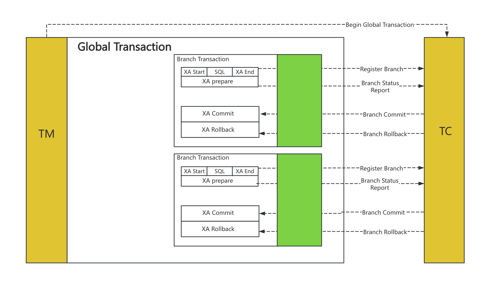

## Seata 是什么?
Seata 是一款开源的分布式事务解决方案，致力于提供高性能和简单易用的分布式事务服务。
Seata 将为用户提供了 AT、TCC、SAGA 和 XA 事务模式，为用户打造一站式的分布式解决方案。

对于分布式事务，通俗地说就是，一次操作由若干分支操作组成，这些分支操作分属不同应用，分布在不同服务器上。
分布式事务需要保证这些分支操作要么全部成功，要么全部失败。
能够实现分布式事务的解决方案很多，但阿里 Seata 则是一个非常成熟的分布式事务产品，SpringCloudAlibaba 推荐使用 Seata作为分布式事务解决方案。
 
Seata的三大角色
在 Seata 的架构中，一共有三个角色：
TC (Transaction Coordinator) - 事务协调者
维护全局和分支事务的状态，驱动全局事务提交或回滚。
TM (Transaction Manager) - 事务管理器
定义全局事务的范围：开始全局事务、提交或回滚全局事务。
RM (Resource Manager) - 资源管理器
管理分支事务处理的资源，与TC交谈以注册分支事务和报告分支事务的状态，并驱动分支事务提交或回滚。
其中，TC 为单独部署的 Server 服务端，TM 和 RM 为嵌入到应用中的 Client 客户端。

XA缺陷：
XA prepare 后，分支事务进入阻塞阶段，收到 XA commit 或 XA rollback 前必须阻塞等待。
事务资源长时间得不到释放，锁定周期长，而且在应用层上面无法干预，性能差。

XA 模式存在两个问题：
回滚日志无法自动清理，需要手工清理
多线程下对同一个 RM 中的数据进行修改，存在 ABA 问题

XA 模式介绍

3. AT 模式介绍 由 XA 模式演变过来，支持自动清理会滚日志
   AT 模式是一种无侵入的分布式事务解决方案。阿里 Seata 框架，实现了该模式。
   在 AT 模式下，用户只需关注自己的“业务 SQL”，用户的 “业务 SQL” 作为一阶段，Seata 框架会自动生成事务的二阶段提交和回滚操作。

3.1 AT模式实现说明
一阶段：

Seata 会拦截" 业务SQL"，解析 SQL 语义
查询 “业务SQL” 要更新的业务数据，在业务数据被更新前，将其保存成 “before image”
执行 “业务SQL” ，更新业务数据
查询更新后的数据，将其保存成 “after image”
将 before image 和 after image 保存至 Undo Log 表中
生成行锁
以上操作全部在一个数据库事务内完成，这样保证了一阶段操作的原子性。

TCC 就是手动提交全局事务的 AT 模式，二阶段提交和回滚操作需要手动实现。

2PC（two phase commit protocol，2PC）即两阶段提交协议，是将整个事务流程分为两个阶段，即 准备阶段（Prepare phase）、提交阶段（Commit phase）。2指两个阶段，P指准备阶段，C指提交阶段。
整个事务过程由事务管理器和参与者组成，事务管理器负责决策整个分布式事务的提交和回滚，事务参与者负责自己本地事务的提交和回滚。在计算机中部分关系数据库如 Oracle、MySQL 都支持两阶段提交协议。
下面是计算机数据库进行两阶段提交的说明：
【1】准备阶段（Prepare phase）：事务管理器给每个参与者 Prepare 消息，每个数据库参与者在本地执行事务，并写本地的 Undo/Redo 日志，此时事务没有提交。（Undo 日志是记录修改的数据，用于数据回滚，Redo 日志是记录修改后的数据，用于提交事务后写入数据文件）
【2】提交阶段（Commit phase）：如果事务管理器收到了参与者的执行失败或者超时消息，直接给每个参与者发送回滚（Rollback）消息；否则，发送提交（Commit）消息；参与者根据事务管理器的执行提交或者回滚操作，并释放事务处理过程中使用的锁资源。注意：必须在最后阶段释放资源。

2PC 的优点是保证了分布式事务的一致性，缺点是性能较差，容错性较差，且存在单点问题。2PC 的缺点主要体现在以下几个方面：
【1】同步阻塞：在 2PC 的准备阶段，如果有一个参与者无法完成准备操作，那么整个事务会被阻塞，直到该参与者完成准备操作。这样会导致整个系统的性能下降。
【2】单点问题：2PC 协议中的协调者是单点，一旦协调者发生故障，整个系统将无法提供服务。
【3】数据不一致：在 2PC 的提交阶段，如果协调者发生故障，那么就无法通知参与者进行提交操作，导致数据不一致。
【4】性能问题：2PC 协议中的准备阶段需要所有参与者都进行 Prepare 操作，这个操作需要等待所有参与者都完成，才能进入提交阶段，这样会导致整个系统的性能下降。
【5】可扩展性问题：2PC 协议中的协调者是单点，一旦协调者发生故障，整个系统将无法提供服务，这样会导致整个系统的可扩展性问题。
2PC 最大的特点是简单（原理简单、实现简单）
但也存在先天的缺陷：同步阻塞、中心化问题、数据不一致。。。。。
