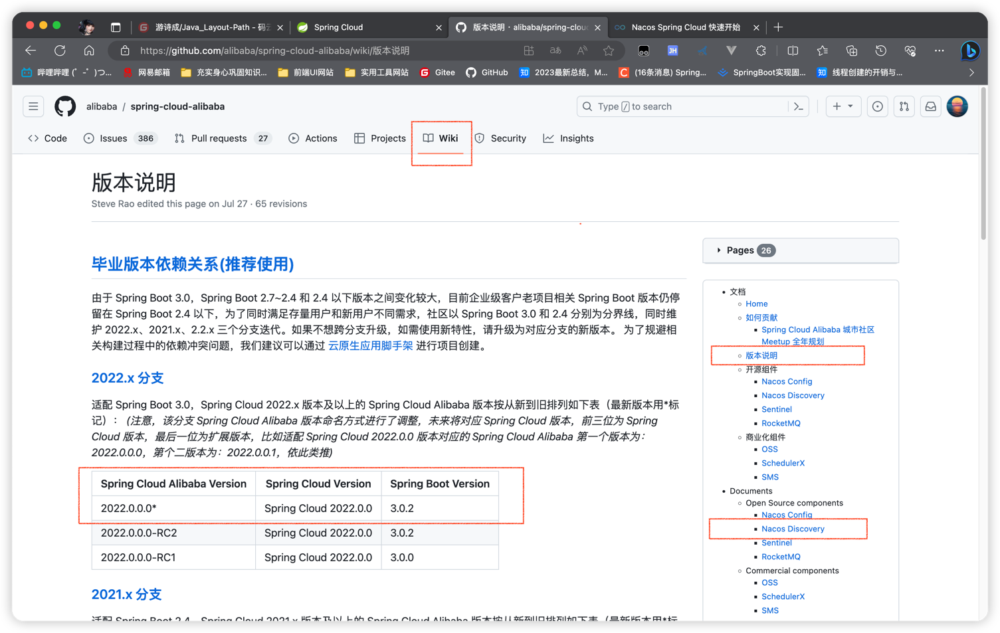

## 一、获取对应项目版本号
   
   #### 1、上图：Spring官网Https://spring.io 可以看到 SpringBoot3.0.x、3.1.x版本对应 SpringCloud2022.0.x版本，且当前最新SpringCloud最新版本为 2022.0.4
   
   
   #### 2、上图：GitHub搜索alibaba，进入 spring-cloud-alibaba 的文档版本说明。适配 SpringBoot 3.0 版本及以上的 Spring Cloud Alibaba 版本为 2022.0.0.0