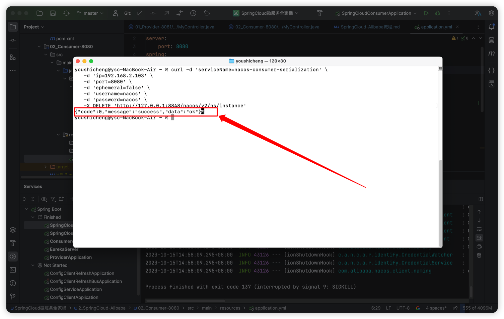

## 一、获取对应项目版本号
#### 1、Spring官网Https://spring.io 可以看到 SpringBoot3.0.x、3.1.x版本对应 SpringCloud2022.0.x版本，且当前最新SpringCloud最新版本为 2022.0.4
   

#### 2、GitHub搜索alibaba，进入 spring-cloud-alibaba 的文档版本说明。适配 SpringBoot 3.0 版本及以上的 Spring Cloud Alibaba 版本为 2022.0.0.0
   

## 二、Nacos（ http://localhost:8848/nacos ）
#### 1. 配置Nacos文件
   - 用户鉴权：进入nacos文件 ../nacos/conf/application.properties 配置编辑鉴权信息。具体规则也可参考官网：https://nacos.io/zh-cn/docs/v2/guide/user/auth.html
     
   - 外置数据库Mysql：进入nacos文件 ../nacos/conf/application.properties 配置编辑外置MySQL来存储配置数据
     
#### 2. 启动Nacos命令
    ①、Windows系统使用命令提示符窗口：启动Nacos命令：sh startup.sh -m standalone（standalone代表着单机模式运行，非集群模式）
                                  启动Nacos命令：sh startup.sh（集群模式，使用这种方式启动）
                                  关闭Nacos命令：sh shutdown.sh
       也可以直接点击 startup.cmd 启动Nacos（非集群模式），点击 shutdown.cmd 关闭Nacos服务
    ②、Mac系统在Nacos的bin文件夹下进入终端，启动Nacos命令：sh startup.sh -m standalone(standalone代表着单机模式运行，非集群模式)
                                        启动Nacos命令：sh startup.sh（集群模式，使用这种方式启动）
                                        关闭Nacos命令：sh shutdown.sh
    ③、访问Nacos地址：http://localhost:8848/nacos
#### 3. 注册表缓存
   - 服务在启动后，当发生调用时会自动从 Nacos注册中心 下载并缓存注册表到本地，将服务的实例信息缓存在消费者端。
   - 简单来说：只要微服务方式调用过一次，http://nacos-provider/user/ 就会缓存到消费端为 http://localhost:8081/user/
   - 所以即使Nacos发生宕机，消费端仍可以通过已经缓存的提供者信息来调用接口。只不过此时不能再有服务进行注册，且缓存的注册列表信息无法更新。
#### 4. 临时实例与持久实例
   - 临时实例：默认情况。服务实例仅会注册在Nacos内存，不会持久化到Nacos磁盘。其健康监测机制为Client模式，即Client主动向Server上报其健康状态。默认心跳间隔为5秒。
     在15秒内Server未收到Client心跳，则会将其标记为"不健康"状态；在30秒内若收到了Client心跳，则重新恢复"健康"状态，否则该实例将从Server端内存清除。
   - 持久实例：服务实例不仅会注册到Nacos内存，同时也会被持久化到Nacos磁盘。其健康监测机制为Server模式，即Server会主动去检测Client的健康状态，
     默认每20秒检测一次。健康检测失败后服务实例会被标记为"不健康"状态，但不会被清除，因为其是持久化在磁盘的。
   
   - ```
     注册服务对Nacos实例配置
     spring:
          cloud:
              nacos:
                  discovery:
                      ephemeral: false  # 是否设置为临时实例：默认为true，表示当前服务注册到Nacos中为临时实例
     ```
   - 
   - ```
     还有就是一旦注册了持久实例，无法通过停掉服务的方式(不健康状态自动清除临时实例)，或者是Nacos界面的方式手动点击删除。
     需要通过一下CURL命令才能进行删除持久实例 -- 注意配置数据需要对应上.具体参考官网 https://nacos.io/zh-cn/docs/v2/guide/user/open-api.html
     
     curl -d 'serviceName=nacos-consumer-serialization' \
     -d 'ip=192.168.2.103' \
     -d 'port=8080' \
     -d 'ephemeral=false' \
     -d 'username=nacos' \
     -d 'password=nacos' \
     -X DELETE 'http://127.0.0.1:8848/nacos/v2/ns/instance'
     ```
   - 
#### 5. Nacos集群搭建