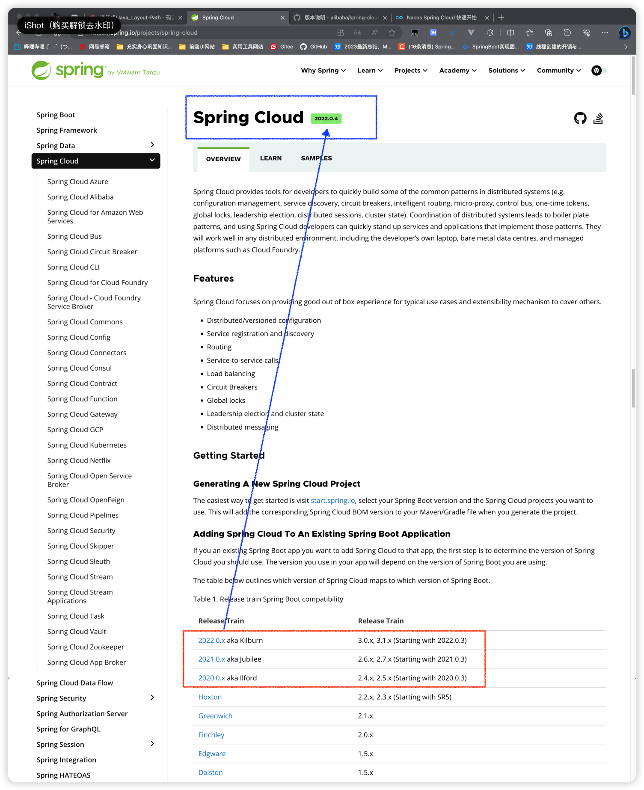
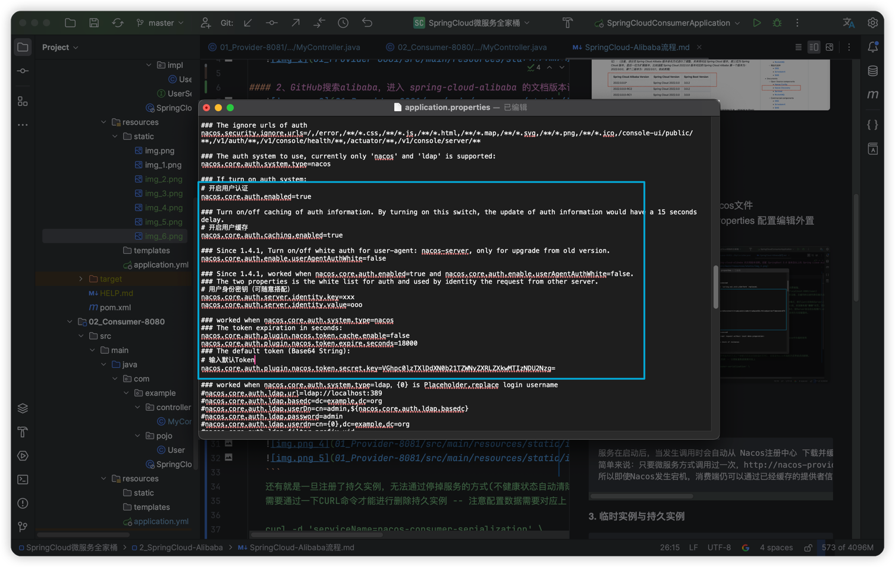
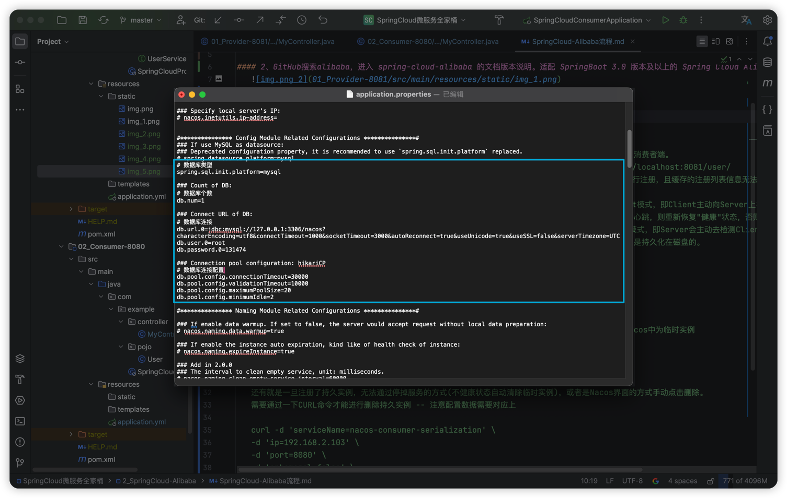
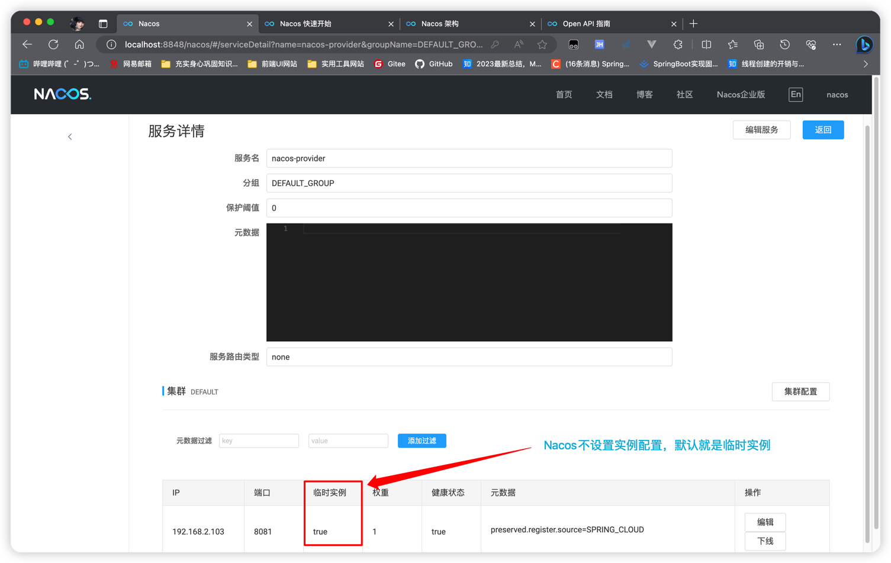
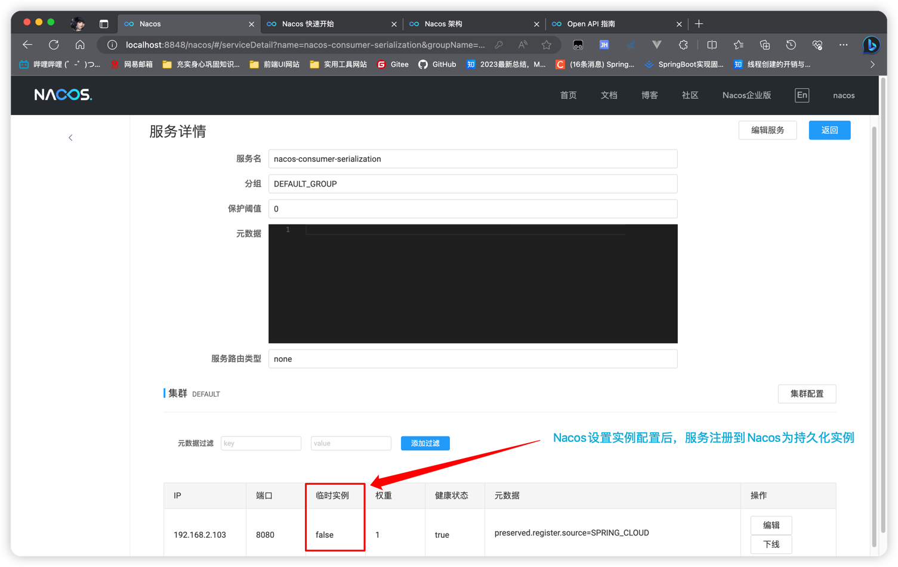
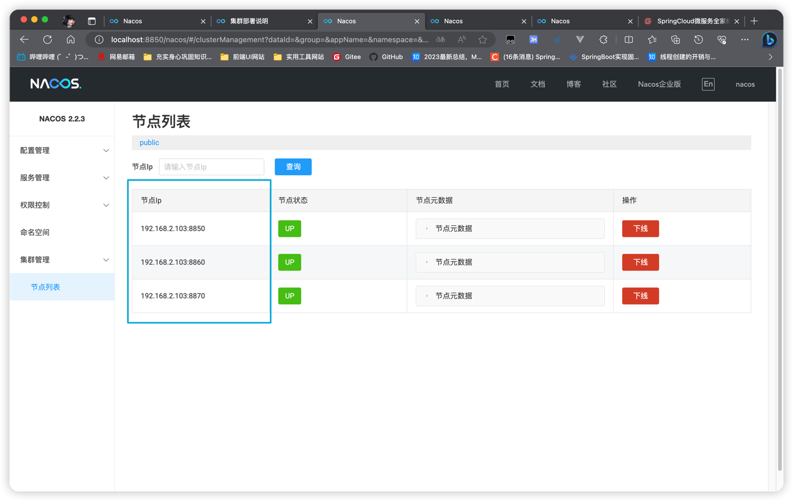
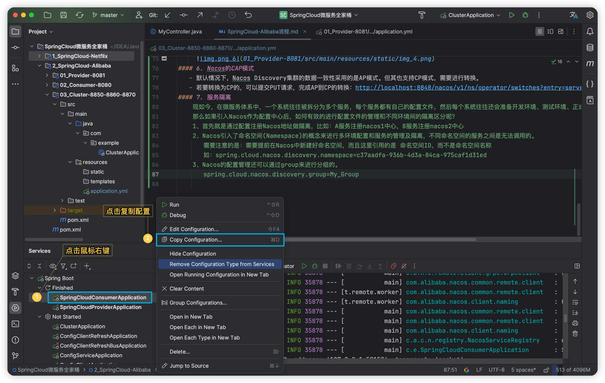
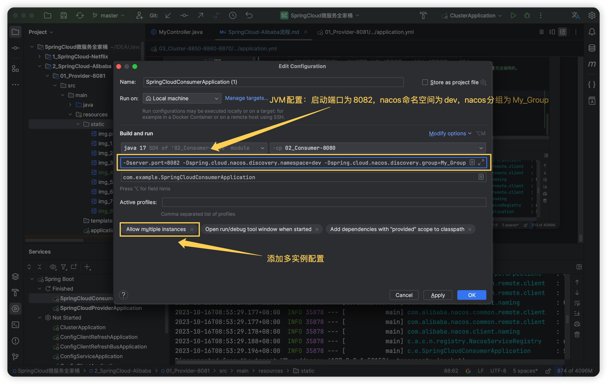
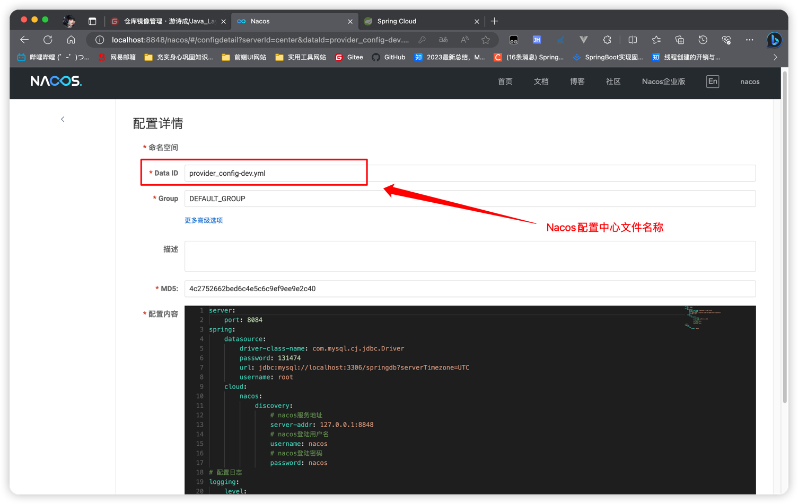

## 一、获取对应项目版本号
#### 1、Spring官网Https://spring.io 可以看到 SpringBoot3.0.x、3.1.x版本对应 SpringCloud2022.0.x版本，且当前最新SpringCloud最新版本为 2022.0.4
   

#### 2、GitHub搜索alibaba，进入 spring-cloud-alibaba 的文档版本说明。适配 SpringBoot 3.0 版本及以上的 Spring Cloud Alibaba 版本为 2022.0.0.0
   

## 二、Nacos（ http://localhost:8848/nacos ）
#### 1. 配置Nacos文件
- > 用户鉴权：进入nacos文件 ../nacos/conf/application.properties 配置编辑鉴权信息。具体规则也可参考官网：https://nacos.io/zh-cn/docs/v2/guide/user/auth.html
  >
  > 
  
- > 外置数据库Mysql：进入nacos文件 ../nacos/conf/application.properties 配置编辑外置MySQL来存储配置数据
  >
  > 
#### 2. 启动Nacos命令
- > ①、Windows系统使用命令提示符窗口：  
    >>  启动Nacos命令：sh startup.sh -m standalone（standalone代表着单机模式运行，非集群模式）  
        启动Nacos命令：sh startup.sh（集群模式，使用这种方式启动）  
        关闭Nacos命令：sh shutdown.sh  
        也可以直接点击 startup.cmd 启动Nacos（非集群模式），点击 shutdown.cmd 关闭Nacos服务     
  >
  > ②、Mac系统在Nacos的bin文件夹下进入终端：  
    >>  启动Nacos命令：sh startup.sh -m standalone(standalone代表着单机模式运行，非集群模式)  
        启动Nacos命令：sh startup.sh（集群模式，使用这种方式启动）  
        关闭Nacos命令：sh shutdown.sh   
  > 
  > ③、访问Nacos地址：http://localhost:8848/nacos
#### 3. 注册表缓存
- > 1️⃣、服务在启动后，当发生调用时会自动从 Nacos注册中心 下载并缓存注册表到本地，将服务的实例信息缓存在消费者端。  
  > 2️⃣、简单来说：只要微服务方式调用过一次，http://nacos-provider/user/ 就会缓存到消费端为 http://localhost:8081/user/  
  > 3️⃣、所以即使Nacos发生宕机，消费端仍可以通过已经缓存的提供者信息来调用接口。只不过此时不能再有服务进行注册，且缓存的注册列表信息无法更新。
#### 4. 临时实例与持久实例
- > 1️⃣、临时实例：  
  > 默认情况。服务实例仅会注册在Nacos内存，不会持久化到Nacos磁盘。其健康监测机制为Client模式，即Client主动向Server上报其健康状态。默认心跳间隔为5秒。
  >         在15秒内Server未收到Client心跳，则会将其标记为"不健康"状态；在30秒内若收到了Client心跳，则重新恢复"健康"状态，否则该实例将从Server端内存清除。  
  > 
  > 2️⃣、持久实例：  
  > 服务实例不仅会注册到Nacos内存，同时也会被持久化到Nacos磁盘。其健康监测机制为Server模式，即Server会主动去检测Client的健康状态，
  > 默认每20秒检测一次。健康检测失败后服务实例会被标记为"不健康"状态，但不会被清除，因为其是持久化在磁盘的。
  >
  >

- > ```
  > 注册服务对Nacos实例配置
  > spring:
  >      cloud:
  >          nacos:
  >              discovery:
  >                  ephemeral: false  # 是否设置为临时实例：默认为true，表示当前服务注册到Nacos中为临时实例
  > ```
  > 

- > 还有就是一旦注册了持久实例，无法通过停掉服务的方式(不健康状态自动清除临时实例)，或者是Nacos界面的方式手动点击删除。  
  > 需要通过一下CURL命令才能进行删除持久实例 -- 注意配置数据需要对应上.具体参考官网 https://nacos.io/zh-cn/docs/v2/guide/user/open-api.html
  > ```
  > curl -d 'serviceName=nacos-consumer-serialization' \
  > -d 'ip=192.168.2.103' \
  > -d 'port=8080' \
  > -d 'ephemeral=false' \
  > -d 'username=nacos' \
  > -d 'password=nacos' \
  > -X DELETE 'http://127.0.0.1:8848/nacos/v2/ns/instance'
  > ```
  > 
#### 5. Nacos集群搭建
- > ```
  > ①、在各个nacos的解压目录nacos/的conf目录下，将配置文件cluster.conf.example复制一份，重命名为cluster.conf文件，每行配置成ip:port。（请配置3个或3个以上节点）
  >     注意：端口不要连号，因为nacos内部会使用设置端口的下一个端口值，如果连号，启动会失败。
  >          192.168.2.103:8850
  >          192.168.2.103:8860
  >          192.168.2.103:8870
  > ②、并且各个nacos配置文件application.properties改相应端口：server.port=xxxx
  > ③、启动各个nacos服务，注意：不要使用 非集群模式 启动 -- sh startup.sh
  > ④、nacos集群启动后，服务注册到指定的nacos中，可同时注册到集群中多个nacos中心
  >          spring:
  >              cloud:
  >                  nacos:
  >                      discovery:
  >                          server-addr: 192.168.2.103:8850,192.168.2.103:8860,192.168.2.103:8870
  >                              - 192.168.2.103:8850 这种写法不生效，暂时不清楚原因
  >                              - 192.168.2.103:8860 这种写法不生效，暂时不清楚原因
  >                              - 192.168.2.103:8870 这种写法不生效，暂时不清楚原因
  > ```
  > 
#### 6. Nacos的CAP模式
- > 1、CAP即：Consistency（一致性）、Availability（可用性）、Partition tolerance（分区容忍性）  
    2、这三个性质对应了分布式系统的三个指标：而CAP理论说的就是：一个分布式系统，不可能同时做到这三点。  
       默认情况下，Nacos Discovery集群的数据一致性采用的是AP模式。但其也支持CP模式，需要进行转换。  
    3、若要转换为CP的，可以提交PUT请求，完成AP到CP的转换：http://localhost:8848/nacos/v1/ns/operator/switches?entry=serverMode&value=CP
#### 7. 服务隔离
- > 现如今，在微服务体系中，一个系统往往被拆分为多个服务，每个服务都有自己的配置文件，然后每个系统往往还会准备开发环境、测试环境、正式环境
    那么如果引入Nacos作为配置中心后，如何有效的进行配置文件的管理和不同环境间的隔离区分呢？
  >
  >> 1、首先就是通过配置注册Nacos地址做隔离，比如：A服务注册nacos1中心，B服务注册nacos2中心  
  >> 2、Nacos引入了命名空间(Namespace)的概念来进行多环境配置和服务的管理及隔离，不同命名空间的服务之间是无法调用的。
  >>    需要注意的是：需要提前在Nacos中新建好命名空间，而且这里引用的是 命名空间ID，而不是命名空间名称
  >>    如：spring.cloud.nacos.discovery.namespace=c37aadfa-936b-4d3a-84ca-975caf1d31ed  
  >> 3、Nacos的配置管理还可以通过group来进行分组的。
  >>    spring.cloud.nacos.discovery.group=My_Group
-  > ##### 创建实例测试
   > 
     
#### 8. Nacos Config配置中心
- > 1、配置中心中的配置数据一般都是持久化在第三方服务器的，例如存放到DBMS、、Git远程库等。由于这些配置中心Server中根本就不存放数据，
       所以它们的集群中就不存在数据一致性问题。但像Zookeeper，其作为配置中心，配置数据是存放在自己本地的。所以该集群中的节点是存在数据一致性问题的。
       Zookeeper集群对于数据一致性采用的是CP模式。  
    2、作为注册中心，这些Server集群间是存在数据一致性问题的，它们采用的模式是不同的。
       Zookeeper(CP)、Eureka(AP)、Consul(AP)、Nacos(默认AP，也支持CP)
  >
  >

## 二、OpenFeign
-  #### 1、概述：  
   - > 由于Spring Cloud Netflix对Feign不再进行维护，所以 Spring Cloud 推出 OpenFeign 作为对指定的微服务进行消费、访问的组件。  
       OpenFeign具有负载均衡功能 ，老版本的SpringCloud所集成的OpenFeign默认采用了Ribbon负载均衡器。同样因为Netflix已经不再维护Ribbon，
       所以 OpenFeign也弃用了 Ribbon，随后Spring Cloud 采用自行研发的 Spring Cloud LoadBalancer 作为负载均衡器。  
   #### 2、远程调用的底层实现技术：  
   - > Feign 的远程调用底层实现技术默认采用的是JDK的 URLConnection，同时还支持 HttpClient 与OkHttp。  
       由于JDK的 URLConnection 不支持连接池，通信效率很低，所以生产中是不会使用该默认实现的。  
       所以在 Spring Cloud OpenFeign 中直接将默认实现变为了 HttpClient，同时也支持 OkHttp。  
       在单例情况或者需要自定义的使用 HttpClient，其他情况使用 okHttp。URLConnection效率不高。  
   
   -  > Spring Cloud LoadBalancer负载均衡策略默认使用的是 轮询。可以通过自定义配置更换策略为 随机。    
        但Spring Cloud LoadBalancer也就这两种策略，所以大厂里使用的是 Dubbo 来集成到 SpringCloud。经典白学！！！ 

   -  > RPC -- 全称Remote Procedure Call，中文译为远程过程调用。通俗地讲，使用RPC进行通信，调用远程函数就像调用本地函数一样。  
        Dubbo 底层使用谷歌的 grpc 通信，用于淘宝的架构体系，经过双十一检测，性能高还稳定。而gRPC，则是RPC的一种，它是免费且开源的，由谷歌出品。

## 三、Reactor简介
- >  Reactor是一种完全基于Reactive Streams规范的、全新的库。
- > 1、响应式编程  
       响应式编程，Reactive Programming，是一种新的编程范式、编程思想。  
       响应式编程最早由.Net平台上的Reactive eXtensions(Rx)库来实现。后来被迁移到了Java平台，产生了著名的RxJava。  
       在此之上，后来又产生了Reactive Streams规范。  
    2、Reactive Streams  
       Reactive Streams是响应式编程的规范，定义了响应式编程的相关接口。只要符合该规范的库，就称为Reactive响应式编程库。  
    3、RxJava2  
       RxJava2是一个响应式编程库，产生于Reactive Streams规范之后。但由于其是在RxJava基础之上进行的开发，  
       所以在设计时不仅遵循了Reactive Streams规范，同时为了兼容RxJava，使得RxJava2在使用时非常不方便。  
    4、Reactor  
       Reactor是一种全新的响应式编程库，完全遵循Reactive Streams规范，又与RxJava没有任何关系。所以，其使用时非常方便、直观。  
    5、WebFlux  
       SpringMVC 构建于 Servlet API 之上，同步阻塞I/O模型, 认为应用会阻塞当前线程，所以一个Request对应一个Thread，需要有一个含有大量线程的线程池  
       Spring WebFlux 构建于 Reactive Streams Adapters 之上，异步非阻塞I/O模型，认为应用不会阻塞当前线程，所以只是需要一个包含少数固定线程数的线程池 (event loop workers) 来处理请求  
       WebFlux 并不是 Spring MVC 替代，它主要应用还是在异步非阻塞编程模型上。如果你的项目并不是该模型 或者你的应用目前本身已经足够应付当前情况，是不需要去切换成 WebFlux 的。  
