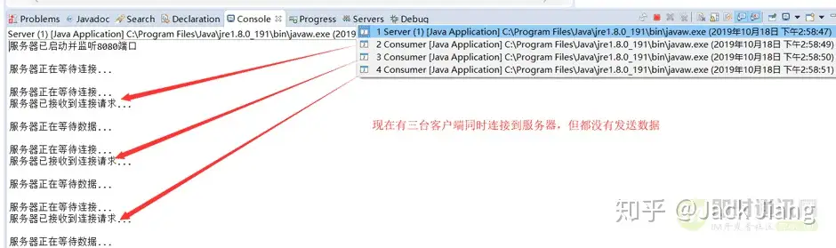

## 一、BIO

    1、特点：BIO会产生两次阻塞，这就是BIO的非常重要的一个特点。

      服务端从启动到收到客户端数据的这个过程，将会有两次阻塞的过程：
        （1）第一次在等待连接时阻塞；
        （2）第二次在等待数据时阻塞。

## 二、BIO的客户端发送消息

### 1、使用代码方法连接服务端发送消息

   ```
   try {
       Socket socket = new Socket("127.0.0.1", 8080);
       String message;
       Scanner sc = new Scanner(System.in);
       message = sc.next();
       socket.getOutputStream().write(message.getBytes());
       socket.close();
       sc.close();
   } catch(IOException e) {
       // TODO Auto-generated catch block
       e.printStackTrace();
   }
   ```

### 2、使用终端作为客户端发送消息



## 三、多线程BIO服务器的优缺点

    优点：
        简单易用： BIO模型的编程方式相对简单，易于理解和使用。
        可靠性高： 由于阻塞特性，IO操作的结果是可靠的。
    缺点：
        阻塞等待： 当一个IO操作被阻塞时，线程会一直等待，无法执行其他任务，导致资源浪费。
        并发能力有限： 每个连接都需要一个独立的线程，当连接数增加时，线程数量也会增加，造成资源消耗和性能下降。
        由于I/O操作是同步的，客户端的连接需要等待服务器响应，会降低系统的整体性能。

    多线程BIO服务器的状态就是一个线程对应一个请求，换言之，服务器为每一个连接请求都创建了一个线程来处理。
    虽然解决了单线程BIO无法处理并发的弱点，但是也带来一个问题：
       如果有大量的请求连接到我们的服务器上，但是却不发送消息，
       那么我们的服务器也会为这些不发送消息的请求创建一个单独的线程，
       那么如果连接数少还好，连接数一多就会对服务端造成极大的压力。

    所以：如果这种不活跃的线程比较多，我们应该采取单线程的一个解决方案，但是单线程又无法处理并发，
         这就陷入了一种很矛盾的状态，于是就有了NIO。

## 四、场景

    BIO适合一些简单的、低频的、短连接的通信场景，例如HTTP请求。
