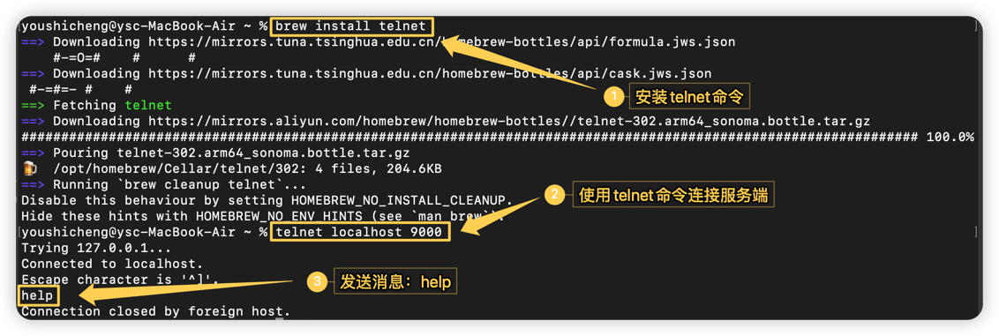

## 一、BIO

    1、特点：BIO会产生两次阻塞，这就是BIO的非常重要的一个特点。

      服务端从启动到收到客户端数据的这个过程，将会有两次阻塞的过程：
        （1）第一次在等待连接时阻塞；
        （2）第二次在等待数据时阻塞。

## 二、BIO的客户端发送消息

### 1、使用代码方法连接服务端发送消息

   ```
   try{
       // 连接服务端
       Socket socket = new Socket("127.0.0.1", 9000);
       String message;
       Scanner sc = new Scanner(System.in);
       message = sc.next();
       // 向服务端发送消息
       socket.getOutputStream().write(message.getBytes());
       socket.close();
       sc.close();
   } catch(IOException e) {
       // TODO Auto-generated catch block
       e.printStackTrace();
   }
   ```

### 2、使用终端作为客户端发送消息



## 三、在单线程条件下BIO的优缺点

    优点：
        简单易用： BIO模型的编程方式相对简单，易于理解和使用。
        可靠性高： 由于阻塞特性，IO操作的结果是可靠的。
    缺点：
        阻塞等待： 当一个IO操作被阻塞时，线程会一直等待，无法执行其他任务，导致资源浪费。
        并发能力有限： 每个连接都需要一个独立的线程，当连接数增加时，线程数量也会增加，造成资源消耗和性能下降。
        由于I/O操作是同步的，客户端的连接需要等待服务器响应，会降低系统的整体性能。

    当我们的服务器在单线程BIO下接收到一个连接后，并且没有接收到客户端发送的数据时，是会阻塞在read()方法中的，
    那么此时如果再来一个客户端的请求，服务端是无法进行响应的。换言之：在不考虑多线程的情况下，BIO是无法处理多个客户端请求的。

## 四、场景

    BIO适合一些简单的、低频的、短连接的通信场景，例如HTTP请求。
