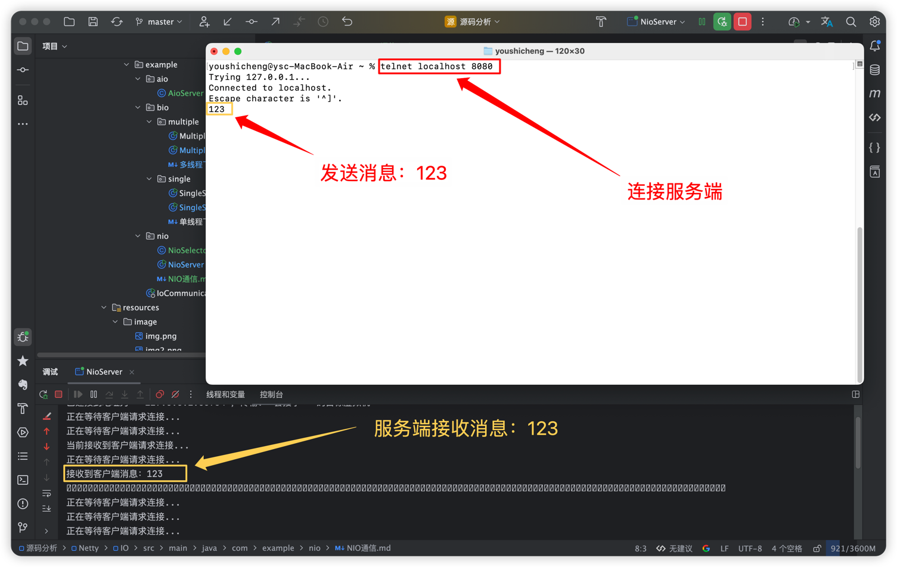

## 一、NIO

    NIO是Java 1.4引入的新IO模型，也称为同步非阻塞IO，它提供了一种基于事件驱动的方式来处理I/O操作。
    对于NIO，如果从特性来看，它是非阻塞式IO，N是Non-Blocking的意思；
    如果从技术角度，NIO对于BIO来说是一个新技术，N的意思是New的意思。所以NIO也常常被称作Non-Blocking I/O或New I/O。

    特点：NIO需要解决的最根本的问题就是存在于BIO中的两个阻塞，分别是等待连接时的阻塞和等待数据时的阻塞。

    NIO被称为"非阻塞I/O"主要是因为：
        1、Channel的非阻塞操作：当没有数据可读或缓冲区已满时，read()/write()不会阻塞，而是返回0或抛出异常。
        2、单线程处理多连接：不需要为每个连接创建线程，避免了线程上下文切换的开销。
        3、可选的阻塞行为：您可以通过selectNow()实现完全不阻塞的行为，或者通过select(timeout)控制阻塞时间。

## 二、NIO的组成

    NIO中3个非常重要的组件，选择器（Selector）、缓冲区（Buffer） 和 通道（Channel）：

    通道（Channel）:    Channel是NIO中用于数据读写的双向通道，可以从通道中读取数据，也可以将数据写入通道。
                       与传统的IO不同，Channel是双向的，可以同时进行读写操作，而传统的IO只能通过InputStream或OutputStream进行单向读写。
                       Java NIO中常见的Channel有：FileChannel（文件读写）、DatagramChannel（UDP协议）、SocketChannel（TCP协议）和ServerSocketChannel（监听TCP连接请求）等。
    缓冲区（Buffer）:   Buffer是NIO中用于存储数据的缓冲区，可以理解为一个容器，可以从中读取数据，也可以将数据写入其中。
                       Buffer具有一组指针来跟踪当前位置、限制和容量等属性。
                       Java NIO中提供了多种类型的Buffer，例如ByteBuffer、CharBuffer、ShortBuffer、IntBuffer等。
                       每种类型的Buffer都有自己特定的读写方法，可以使用get()和put()等方法来读写缓冲区中的数据。
    选择器（Selector）: Selector是NIO中用于监控多个Channel的选择器，可以实现单线程管理多个Channel。
                       Selector可以检测多个Channel是否有事件发生，包括连接、接收、读取和写入等事件，并根据不同的事件类型进行相应处理。
                       Selector可以有效地减少单线程管理多个Channel时的资源占用，提高程序的运行效率。

## 三、NIO的客户端发送消息

- ### 使用终端作为客户端发送消息

## 四、NIO存在的问题

    优点：
        高并发性： 使用选择器（Selector）和通道（Channel）的NIO模型可以在单个线程上处理多个连接，提供更高的并发性能。
        节省资源： 相对于BIO，NIO需要更少的线程来处理相同数量的连接，节省了系统资源。
        灵活性： NIO提供了多种类型的Channel和Buffer，可以根据需要选择适合的类型。NIO允许开发人员自定义协议、编解码器等组件，从而提高系统的灵活性和可扩展性。
        高性能： NIO采用了基于通道和缓冲区的方式来读写数据，这种方式比传统的流模式更高效。可以减少数据拷贝次数，提高数据处理效率。
        内存管理：NIO允许用户手动管理缓冲区的内存分配和回收，避免了传统I/O模型中的内存泄漏问题。
    缺点：
        编程复杂： 相对于BIO，NIO的编程方式更加复杂，需要理解选择器和缓冲区等概念，也需要考虑多线程处理和同步问题。
        可靠性较低： NIO模型中，一个连接的读写操作是非阻塞的，无法保证IO操作的结果是可靠的，可能会出现部分读写或者错误的数据。

    1、NIO的客户端发送消息，在接收消息的方式上可能有些许不妥，我们采用了一个轮询的方式来接收消息，每次都轮询所有的连接，
       看消息是否准备好，测试用例中只是三个连接，所以看不出什么问题来，但是我们假设有1000万连接，甚至更多，
       采用这种轮询的方式效率是极低的。

       另外，1000万连接中，我们可能只会有100万会有消息，剩下的900万并不会发送任何消息，
       那么这些连接程序依旧要每次都去轮询，这显然是不合适的。

## 四、真实NIO中如何解决

    在真实NIO中，并不会在Java层上来进行一个轮询，而是将轮询的这个步骤交给我们的操作系统来进行，
    他将轮询的那部分代码改为操作系统级别的系统调用（select函数，在linux环境中为epoll），
    在操作系统级别上调用select函数，主动地去感知有数据的socket。

## 场景

    NIO适合一些复杂的、高频的、长连接的通信场景，例如聊天室、网络游戏等。
